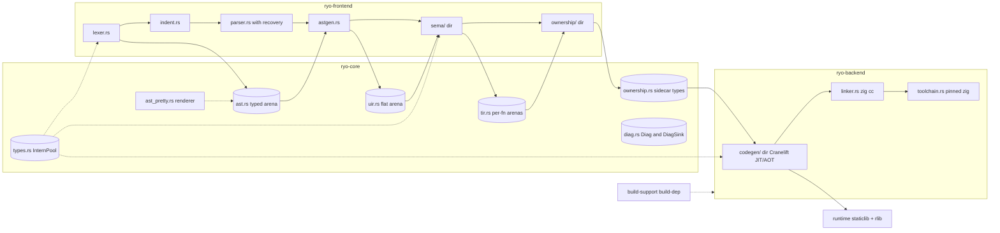

**Status:** Complete (codebase snapshot 2026-08-24, branch `fix/file-length-gate` @ `333dbca`)

# Architecture Analysis — 2026-08-24

Refresh of the 2026-08-20 snapshot (`c24a224`, branch `fix/i-089-param-mode-decode`; previous snapshots were deleted — see git history). Every module was re-verified at HEAD; claims from the previous analysis are marked **fixed**, **open**, or **stale**. Issue references (`I-xxx`) point to [ISSUES.md](../../ISSUES.md) — resolved entries are removed from that file.

The delta splits in two: `main` landed #114 (strict `ParamMode` decode), #115 (integer div/mod-by-zero guards, I-023), #116 (parser-recovery block-header fix, I-130), #117 (AST flattened into a typed arena, I-126), and #118 (hot-path bookkeeping removal + lint-policy tightening); the snapshot branch then executed the §4 file-length plan from the previous analysis almost verbatim (I-137): `ownership.rs`/`sema.rs`/`codegen.rs` became module directories, `integration_tests.rs` became six per-area test binaries, and a file-length gate now runs locally (`scripts/check_file_length.sh`) and in CI (`tidy` job) with **no allowlist** — initially 3000 lines, tightened to **2000** the same day after the views-test split and `tir.rs` test extraction.

Scale: ~36.5k lines of Rust source across 7 workspace crates, ~860 `#[test]` (previous snapshot: ~29k lines, 811 tests). A macOS `cargo test --workspace` run at HEAD: **828 passed, 0 failed** (valgrind smoke suite skips without valgrind installed).

---

## 1. Crate Map & Pipeline

Dependency direction remains acyclic: `ryo` (CLI) → `ryo-driver` → `ryo-frontend` + `ryo-backend` → `ryo-core`. The pipeline keeps the full M8.1+ shape (ownership between sema and codegen, positional sidecar). Structural change since the snapshot: the three largest compiler files are now module directories, and the AST is a typed arena (#117), not a Box tree.

| Crate | Files (lines) | Role |
|---|---|---|
| `ryo-core` | tir 1712 (+ tir/tests 309), uir 1529, ast 1047, types 892, ast_pretty 503, diag 347, ownership 112, errors 69 | IRs, AST arena, InternPool, diagnostics, sidecar types |
| `ryo-frontend` | parser 1982, lexer 1014, astgen 854, indent 287, builtins 233; **sema/** = tests 1945, expr 721, mod 525, stmt 521, builtins 501, call 272; **ownership/** = walk 1263, loops 877, mod 717, views 567, frees 351, merge 346, diag_fmt 55, tests 5444 (9 files) | source → TIR + ownership |
| `ryo-backend` | **codegen/** = mod 1537, expr 1490; toolchain 269, runtime_lib 66, linker 27 | TIR → object/binary |
| `ryo-driver` | pipeline 834 | staging, ariadne rendering |
| `ryo` | main 133 + six integration binaries (218 tests) + asan/valgrind smoke (27/28) | CLI |
| `ryo-runtime` | lib 1091 | string/slice runtime, staticlib+rlib |
| `build-support` | lib 111 | shared build-script runtime-archive build |

---

## 2. Data-Structure Inventory (per stage)

### 2.1 Lexer (`lexer.rs` 1014, `indent.rs` 287)

- Two-token-type design unchanged: borrowed `RawToken<'a>` (logos) → `Copy` `Token` with `StringId`/`i64`/f64-bits payloads; interning at lex time; sink-based recovery (`lex` takes a `DiagSink`) intact.
- **Open (refreshed):** I-111 (4 touch points per variant: `Token :36`, `Display :119`, `RawToken :196`, `intern_token :496`); I-027 (float regex still `[0-9]+\.[0-9]+`, `:201` — now also cited by I-154, no spelling for inf/NaN).
- **New / open:** I-149 — `unescape` (`:425`, called `:545`) returns an owned `String` per string literal even when no escapes are present.

### 2.2 AST (`ast.rs` 1047, was 351 + `ast_pretty.rs` 503)

- **Fixed (landed as #117):** I-126 — the `Box<Expression>` tree is gone. `Ast` (`ast.rs:445-456`) is a pair of typed arenas (`exprs: Vec<Expr>`, `stmts: Vec<Stmt>`) plus side arenas `expr_lists`/`stmt_lists`/`elifs`, `top_level: Vec<StmtId>`, and a program span. `ExprId`/`StmtId` wrap `NonZeroU32` (`:67,:90`) with the slot-0 sentinel (`:465-485`); both invariants are test-pinned (`:919-935`). Variable-length lists are `{offset, len}` u32 ranges with checked `u32::try_from` (`:585-607`); `FunctionDef::params` stays an inline `Vec<Param>` deliberately (`:274-282`). The parser builds directly into the arenas with `Ast` as the chumsky state object; the `Inspector` impl (`:830-868`) is a deliberate no-op — failed-speculation nodes become harmless unreachable orphans (snapshot/truncate was measured at ~20% of parse time and rejected).
- `TypeExpr` still pinned at 24 bytes (`:912-916`); `TypeExpr.is_view` still explicitly legacy (`:323-326`).
- **Open:** the `AssignOrDecl` ambiguity survives the arena (unknown name → fresh **immutable** binding): chain `ast.rs:220-223` → `astgen.rs:303` → `sema/stmt.rs:146-210`; pin test at `sema/tests.rs:1241`. I-029 (`Literal::Float(f64)`, `:197` — `PartialEq` only).
- `ast_pretty` now walks the arenas (`render_program(&Ast, &InternPool)` `ast_pretty.rs:24`); the hardcoded `├── ` params/`returns:` smell persists (`:188,:196`, cosmetic).
- **New / open:** I-152 — the parser builds a throwaway `Vec` per call/params node (`parser.rs:235,367,440,541,613,660,720,862`) before the `Ast` builders copy into the side arena.

### 2.3 UIR (`uir.rs`, 1529 — byte-identical line count to the snapshot)

- Invariants intact: slot-0 sentinel, niche-filled `InstRef`, `Inst ≤ 24` bytes pinned by `inst_stays_small`, checked u32 conversions on arena pushes.
- **Open (refreshed):** I-091 (allocating view decoders — `call_view :870-886`, `if_stmt_view :1004-1046`, `body_stmts :344`, `while_loop_view :942`, `for_range_view :956`, `method_call_view :981`); I-109 (`func_bodies :307`, no reverse map); I-080 (`ExtraRange` duplicated with tir.rs, `:119` vs `tir.rs:138`); I-047 (`UirParam.mode: ParamMode :285` still a pass-through).
- **Fixed (I-134, `8ec3494`):** the `:1-6` header no longer claims `--emit=uir` is "still TODO" — it is wired (`pipeline.rs` `ir_command :357-424`); `#![allow(dead_code)]` remains at `:6`.

### 2.4 Types (`types.rs`, 892) — unchanged, still the best structure in the tree

- `InternPool` design unchanged; primitive slots `0..=7` with `strview` at 7; closed `ViewKind` with the documented never-parameterize rationale; `is_copy()` includes views.
- **Open (unchanged anchors):** I-018 (deliberate, `:29-33`); I-019 (`tuple_elements_vec :502`); I-127 (the one `unsafe from_utf8_unchecked`, `:568-571` — SAFETY comment and `#[allow(unsafe_code)]` in place, human sign-off still pending).

### 2.5 Sema (`sema/` — mod 525, stmt 521, expr 721, call 272, builtins 501, tests 1945; 190 tests)

- New layout (contents): `mod.rs` — module docs, `DeclId`/`DeclState`/`FunctionSig`/`Binding`/`Scope` (`:64-120`), `analyze` façade (`:161`), worklist driver (`:227`), `Sema::new` with the `__ryo_` prefix check (`:300`), `analyze_function`, `FuncCtx`. `stmt.rs` — `analyze_stmt :14`, `analyze_block :413` (now delegates to `analyze_block_seeded :425` with a no-op seed, `a5ff8c0`), `check_condition_bool :444`, `resolve_var_decl_type :464`. `expr.rs` — `analyze_expr_allow_never :37`, `Neg` arm `:143`, method dispatch `:220`, `check_slice_bound :359`, `check_binary_op :439`. `call.rs` — `check_call :12`, `borrow_target_reason :232`. `builtins.rs` — `emit_builtin_call :10`, `str(view)` materialize intercept `:240`, `emit_panic`/`emit_assert`/`build_panic_call` (`:329,:359,:418`), `byte_offset_to_line_col :486`.
- **Fixed:** the `analyze_expr` fallthrough `panic!` is now a documented `unreachable!` (`expr.rs:344-348`, trusted-producer rationale `:341-343`) — the sema half of I-131 (#118; the ownership half is re-filed as I-155).
- **Open (refreshed):** I-028/I-034 — string compares at `call.rs:26`, `builtins.rs:240` (`== "str"`), `mod.rs:300` (`starts_with("__ryo_")`), `astgen.rs:234` (`find_str("main")`), `astgen.rs:355` (`!= "range"`); `BuiltinFunction` still lacks arity/type descriptors. I-092 — `inst_map` sized to the program-wide UIR per function (`mod.rs:480`); `check_call` clones (`call.rs:82,89,97`); method-dispatch `to_string()` (`expr.rs:220`). I-037 — `byte_offset_to_line_col` O(offset) (`builtins.rs:486`). I-079 — unary `-` int-only (`expr.rs:143-177`).
- **New / open:** I-147 — `vec![ParamMode::Borrow; arg_tirs.len()]` per builtin call (`builtins.rs:22`; same pattern for view calls at `call.rs:91`).
- I-128 note: the file split did not shrink entry points — `analyze_stmt` (`stmt.rs:14`) sits at exactly **360** code-lines, at the ratchet; `analyze_expr_allow_never` ~322 raw, `check_binary_op` ~265, `emit_builtin_call` ~225.

### 2.6 TIR (`tir.rs` 1712 + `tir/tests.rs` 309)

- **Fixed:** the dangling `I-106` citation is gone, replaced by a generic trusted-producer paragraph (`~:46-54`). The `:1-6` header no longer claims `--emit=tir` is TODO (I-134 swept, `8ec3494`). The inline test module now lives in the child module `tir/tests.rs` (`#[cfg(test)] mod tests;` — private access preserved via `use super::*`).
- Anchors refreshed: param sentinel band `is_param :121`/`as_param_index :126`; strict `ParamMode::from_u32 -> Option` (`:305`); tree-shape validation via `finish :922` → `validate_tree_shape :939`.
- **New since the snapshot:** #118 replaced per-statement `HashSet` reachability scans with allocation-free `Tir::contains_reachable` (`:1353`), consumed by ownership's loop/branch predicates.
- **Open:** I-091 (allocating view decoders); I-080 (`ExtraRange` duplication).

### 2.7 Ownership — sidecar (`ryo-core/src/ownership.rs`, 112, unchanged) + pass (`ownership/`: mod 717, walk 1263, loops 877, views 567, frees 351, merge 346, diag_fmt 55; tests/ 5444 in 9 files, 108 tests)

- The §4.1 split plan from the previous analysis landed almost exactly as proposed. Refreshed anchors: `check()` `mod.rs:276`; `analyze_function :286`; pre-passes `collect_loop_nesting` (`loops.rs:376`) + `collect_view_liveness` (`views.rs:254`); forward walk `analyze_stmt` (`walk.rs:18`), `analyze_if_stmt :507`, `visit_expr :782`, `recurse_operands :1208`; merges in `merge.rs` (`merge_branches :36` — now `pub(super)`; `MergeSide` now private); loop fixed-point `analyze_loop_body` (`loops.rs:468`, `MAX_PROPAGATE_PASSES = 2 :498`).
- **State grew 15 → 19 fields** (`mod.rs:116-254`); the non-monotone snapshot set is still **4** fields (`walk.rs:556-563`).
- **#118 changes:** `outermost_branch_of`/`ancestor_branches_of` now use allocation-free `Tir::contains_reachable` (`loops.rs:207,:268`); the `visit_expr` Call arm's per-call `HashSet`s became small `Vec`s with prefix scans (`walk.rs:836-845`).
- **Open (refreshed):** I-128 (`visit_expr` `walk.rs:782` = 298 code-lines / ~424 raw — the largest function in the tree; `analyze_if_stmt :507` = 210); I-129 (dense-keyed HashMaps remain: `origin :119`, `param_index :127`, `owner_at_read :154`, `view_last_use :215`, `view_defer_loop :228`, `loop_nesting :237`); I-136 (per-arm `own.clone()` `walk.rs:571`; propagate-pass map + sidecar clones `loops.rs:480-537`); I-135 (Rule-7 look-through guard still duplicated: `walk.rs:934-936` vs `:1029-1030`); I-145 (full-states snapshot per break/continue, `loops.rs:546,:753`); I-146 (`bindings.clone()` per if/arm/loop in `collect_view_liveness`, `views.rs:344,:430`); I-155 (4 `expect("param exists")` sites: `mod.rs:102,:456`, `walk.rs:675,:695`).
- **New / open:** I-148 (per-arg callee-name string scans: `is_borrowed_scalar_param` per call-arg at `walk.rs:847`, `view_borrow_params` at `:917`, linear scans `builtins.rs:128,:142`); I-151 (`collect_loop_nesting` per-statement/per-instruction allocs, `loops.rs:376,:394`).
- **Fixed (I-134, `8ec3494`):** the "Today no `free_on_reassign` entries exist" comment at `ownership/mod.rs:556-557` was reworded to current behavior — the field is populated and test-covered.

### 2.8 Builtins (`builtins.rs`, 233 — unchanged)

- `BUILTINS :39` (7 entries) with ABI metadata (`borrowed_scalar_params`, `view_borrow_params`); `ABI_CALLEES :97`; `RESERVED_NAMES :151`; linear `lookup :112-114`.
- **Open:** I-034; now also cited by I-148 (`:128-148`).

### 2.9 Codegen (`codegen/` — mod 1537, expr 1490; was `codegen.rs` 2711)

- Split along the §4.4 watch-list seam: `mod.rs` — `Codegen<M>` + JIT/AOT constructors, `ValueRepr`, `Terminator`, `FunctionContext`, signature/declaration/`compile_function`, statement scaffolding and control flow, inout write-back + `emit_return` (sole `return_` chokepoint, `:895-903`). `expr.rs` — `eval_inst`/`eval_inst_str`/`eval_inst_view`, the guard family, the free machinery, `emit_call` + sret/inout helpers.
- **Fixed by #118:** the `inst_values` memo `HashMap<TirRef, ValueRepr>` is now a dense `Vec<Option<ValueRepr>>` side table indexed by `TirRef::index()`, with param sentinels in a small side map behind `cached_repr`/`cache_repr` (`mod.rs:196-225,415-430`) — the I-129 worst case.
- **New since the snapshot (#115, I-023 resolved):** integer div/mod-by-zero is guarded — `emit_div_zero_guard` (`expr.rs:419-434`) emits `icmp` → `brif` to a shared cold `panic_blocks` block calling `ryo_panic(ptr, len)` (stderr message + exit 101, same contract as `panic()`); literal zero divisors are rejected earlier by sema with the new `DivisionByZero` E0037 (`sema/expr.rs:123`, `stmt.rs:300`, 8 tests). Overflow guards (`emit_checked_iadd/isub/imul`, `expr.rs:362-413`) elide only on provably-safe constant operands (`:345-356`). Residuals filed: I-138 (`INT_MIN / -1` still UB — explicitly out of scope at `expr.rs:418`), I-142 (no value-range analysis; measured +29–33% on fibonacci), I-141 (adopt upstream cold-block/trap-fold improvements after the Cranelift upgrade).
- **Open (refreshed):** I-093 (`declare_runtime_fn` re-imports per site, `expr.rs:507-525`; dead `ryo_str_alloc` JIT registration `mod.rs:354`); I-094 (unconditional `format!("{}", self.ctx.func)` `mod.rs:800`, discarded `:445` — **not** touched by #118); I-095 (three map clones per scoped block, `mod.rs:845-847`); I-034 (`== "main"` at `mod.rs:492,531,602,997`); I-076 (slot constants `mod.rs:40-45` — the "Derived, not re-hardcoded" comment overstates; I64 len/cap throughout `expr.rs:1155-1170`); sret dummy `Ok(ptr)` still at `expr.rs:1420`. `Result<_, String>` everywhere (41 sites) + 42 `unreachable!`.
- **New / open:** I-144 (`if_branches.get(...).cloned().unwrap_or_default()` `mod.rs:1196`; per-arm full-Vec dead-drop scan `expr.rs:703-719`); I-150 (`build_signature` twice per function, `mod.rs:490,:590`).

### 2.10 Toolchain / runtime_lib / linker / build scripts

- `toolchain.rs` (269): pinned zig 0.16.0 (`:6`); Windows zip path with zip-slip guard intact. **Open:** I-073 — still no sha256/signature verification (`download_zig :67-155`), fixed temp dir (`:76-81`), `remove_dir_all(desired)` before rename (`:144`).
- `runtime_lib.rs` (66): **Open:** I-096 — no eviction; `~/.ryo/cache` now holds **79 archives** (78 at snapshot). I-097's ISSUES.md text is **stale** (still quotes ~17 MB; measured 6.06 MB debug / 5.81 MB release since the `no_std` migration).
- `linker.rs` (27): unchanged, shells `zig cc`.
- `build-support` (111): runtime-archive build dedup holding. Remaining duplication: the sha256-of-archive block is still byte-similar in both `build.rs` files (`ryo/build.rs:41-52` ≡ `ryo-backend/build.rs:27-38`); `resolve_git_ref` still doesn't watch detached HEADs (`ryo/build.rs:58-63`).

### 2.11 Driver (`pipeline.rs`, 834)

- `EmitKind { Ast, Uir, Tir, Clif }` staging intact (`:1-11,357-424`); `parse_with_state` now produces the #117 arena `ast::Ast` (`:143-146`).
- `DiagCode` grew 41 → **42** (39 E + 3 W): #115 added `DivisionByZero` (E0037, `diag.rs:119`). The E-code stability test pins all 42 (`:647-751`).
- **Open:** I-099 — `run_file` still echoes `[Input Source]`/`[AST]`/`[Codegen]` (`:558-566`); the integration binaries key on **54 `[Result]`** + **29 `[Codegen]`** assertions. I-013 (`lex`/`parse`/`ir` still separate subcommands).
- **Fixed:** I-130 — #116 makes recovery swallow a broken block header's indented body instead of mis-nesting it.

### 2.12 CLI (`main.rs`, 133) & tests (`ryo/tests/`)

- 32 MiB spawned-thread CLI intact (`:72-84`).
- **Fixed (this branch):** the §4.3 plan landed — `integration_tests.rs` (4002, 198 tests) is now six binaries sharing `common/mod.rs` (565): `integration_driver` (616, 24 tests), `integration_basics` (1364, 81), `integration_assert_panic` (639, 41), `integration_aot` (285, 8), `integration_ownership` (1092, 47), `integration_views` (312, 17) — **218 tests** total, now parallel across binaries. The harness runs `env!("CARGO_BIN_EXE_ryo")` (`common/mod.rs:455-463`); zero `cargo run --` spawns remain — **I-098 is fixed in code** (integration suite 32s → 4s), though its ISSUES.md entry still describes the pre-split world (stale, should be removed). `common/mod.rs` carries `#![allow(dead_code)]` (`:6`) because each binary uses a different helper subset under `-Dwarnings`.
- `asan_smoke.rs` (27) / `valgrind_smoke.rs` (28): unchanged. **Open:** I-102 (`zig_path()` still shells `ryo toolchain status --path` per build, `common/mod.rs:16-28`; asan suite still runs twice on ubuntu).

### 2.13 Runtime (`runtime/src/lib.rs`, 1091 — unchanged since the snapshot)

- `no_std` staticlib, `RyoStrFat`/`RyoSlice` ABIs, 13 JIT-registered symbols — all as before.
- **Open:** I-132 — `oom_abort` (`:224`) still conflates OOM/narrowing/overflow at 11 sites; FFI null checks still `debug_assert!` only (`:105,:117,:272,:366,:370,:427,:442`).

---

## 3. Delta Since the Previous Snapshot

**Resolved (removed from ISSUES.md, verified in code):** I-023 (#115 div/mod-by-zero guards), I-126 (#117 AST arena), I-130 (#116 parser recovery), I-131 (sema half #118; ownership half re-filed as I-155), I-137 (this branch — splits + file-length gate), I-098 (harness switch to `CARGO_BIN_EXE_ryo`, this branch), I-134 (comment sweep, `8ec3494`).

**New architecture:** typed-arena AST (`Ast`, `ExprId`/`StmtId`, side arenas, parser builds in-arena with a no-op `Inspector`); compile-time + runtime integer div/mod-by-zero guarding with shared cold panic blocks (`DIV_ZERO_MSG`/`MOD_ZERO_MSG`/`OVERFLOW_MSG`, `guard_msg_data` cache, `panic_blocks` deferred to end-of-function); checked `INeg` and compound-assign; dense `Vec` codegen memo replacing the `inst_values` HashMap; allocation-free `Tir::contains_reachable`; module-directory layout for sema/ownership/codegen; six-binary integration layout with the `CARGO_BIN_EXE_ryo` harness; `scripts/check_file_length.sh` + CI `tidy` job; backend CodSpeed benchmarks (`ryo-backend/benches/backend.rs` + `backend-benchmarks` job); lint ratchet — `too-many-lines-threshold = 360`, `panic`/`todo`/`unimplemented`/`unwrap_used` at **deny** (`expect_used` stays allow pending the I-153 audit, ~70 sites).

**New issues filed since the snapshot:** I-138 (`INT_MIN / -1` UB), I-140/I-141 (Cranelift 0.131.1 → 0.135.x upgrade ladder + follow-on guard-codegen review), I-142 (value-range guard elision), I-144 (per-if clone + dead-drop scans), I-145 (per-jump states snapshot), I-146 (view-liveness bindings clones), I-147 (builtin mode-Vec allocs), I-148 (per-arg callee-name lookups), I-149 (per-literal unescape String), I-150 (signature built twice), I-151 (loop-nesting allocs), I-152 (throwaway parser Vecs), I-153 (`expect_used` audit), I-154 (no inf/NaN spelling), I-155 (ownership `expect("param exists")`).

**ISSUES.md hygiene:** the staleness found during verification (I-098's pre-split text, I-097's pre-`no_std` 17 MB numbers, monolithic-path `Files:` refs, I-134's comments) was swept in `8ec3494`: I-098/I-134 removed, I-097 corrected to 6.06 MB debug / 5.81 MB release, and `Files:` anchors across 35 entries refreshed to the post-split layout.

---

## 4. File-Length Gate (2K-line limit) — landed

**Rule:** no Rust source file in the workspace should exceed **2000 lines**, tests included. I-137 resolved on this branch (`8c08abf`): `scripts/check_file_length.sh` runs the gate locally, and CI runs it as the `tidy` job (ubuntu, `actions/checkout@v6` with `persist-credentials: false`). There is deliberately **no allowlist** — the splits are the fix. It was kept out of `scripts/run_linux_tests.sh`, which stays scoped to the ASan/Valgrind container run. The gate landed at 3000 and was tightened to 2000 the same day (`333dbca`) once the two remaining >2K files were split.

Largest files at HEAD, verified with `wc -l`:

| File | Lines |
|---|---|
| `ryo-frontend/src/parser.rs` | 1982 |
| `ryo-frontend/src/sema/tests.rs` | 1945 |
| `ryo-core/src/tir.rs` | 1712 |
| `ryo-backend/src/codegen/mod.rs` | 1537 |
| `ryo-backend/src/codegen/expr.rs` | 1490 |
| `ryo-frontend/src/ownership/tests/frees.rs` | 1479 |

### 4.1 What landed

- `ownership.rs` (9504) → `ownership/`: mod 717 + walk 1263 + loops 877 + views 567 + frees 351 + merge 346 + diag_fmt 55, tests split into `tests/{mod,frees,inout,loops,merge}.rs` + `tests/common.rs` (108 tests, moved verbatim).
- `sema.rs` (4168) → `sema/`: mod 525 + stmt 521 + expr 721 + call 272 + builtins 501 + tests 1945 (190 tests).
- `codegen.rs` (3010) → `codegen/`: mod 1537 + expr 1490 (the §4.4 watch-list item, split pre-emptively).
- `integration_tests.rs` (4002) → six per-area binaries (§2.12); harness moved to `CARGO_BIN_EXE_ryo` in the same pass.
- Gate-tightening splits (`d613074`, `333d409`): `ownership/tests/views.rs` (2098) → `views_basics.rs` (426, projection/freeze basics) + `views_branches.rs` (1065, per-arm liveness) + `views_calls.rs` (610, Rule-7 call args / materialize); `tir.rs` inline tests → `tir/tests.rs` (309) as a `#[cfg(test)]` child module, keeping `tir.rs` a plain file.

### 4.2 Split discipline (as executed)

- Pure moves, zero logic changes; one module per commit, `cargo test` green after each. Moves were verified line-multiset-identical against the originals.
- Module header docs kept on `mod.rs`; child modules carry a one-line `//!` pointing back.
- Re-exports through `mod.rs` (`pub(crate) use`) left all `pipeline.rs` call sites untouched; sibling modules import explicitly (`use super::{…}`), globs only in test modules.
- Test extraction to a child-module file (`tir/tests.rs`) is preferred over converting a file to a `mod.rs` directory — no path churn, private access preserved.
- Shared test fixtures live in `tests/common.rs` (ownership) and `ryo/tests/common/` (integration).

### 4.3 Watch list (under 2K, tight by design)

- `ryo-frontend/src/parser.rs` — **1982**, 18 lines of headroom. The next feature touching it forces the split: statement vs expression parsers.
- `ryo-frontend/src/sema/tests.rs` — **1945**, 55 lines of headroom; splits by feature area when it crosses.
- `ryo-core/src/tir.rs` (1712), `ryo-backend/src/codegen/mod.rs` (1537) — healthy.
- `ryo-core/src/ast.rs` grew 351 → **1047** with the arena (#117) — healthy.

---

## References

- Previous snapshots (deleted; see git history): 2026-08-20 (`c24a224`), 2026-07-18 (`64b740a`)
- Issues: [ISSUES.md](../../ISSUES.md)
- Dev: [pipeline_alignment.md](pipeline_alignment.md), [implementation_roadmap.md](implementation_roadmap.md)
- Spec: [specification.md](../specification.md); slicing/views/memory model: [ryo-slicing-and-memory-model-final-spec.md](ryo-slicing-and-memory-model-final-spec.md) (D1–D11)
