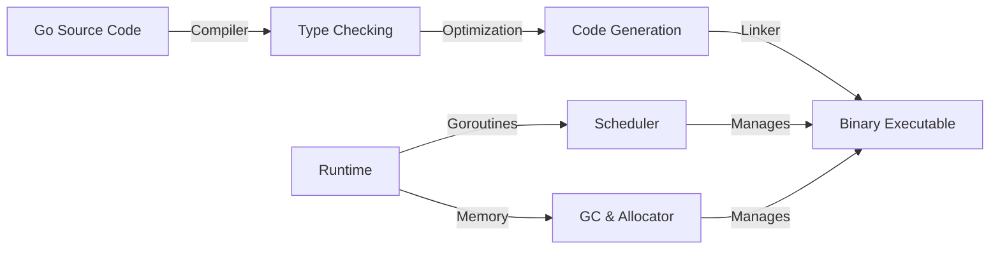
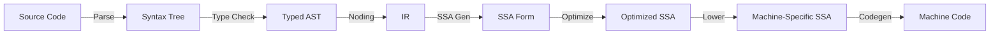
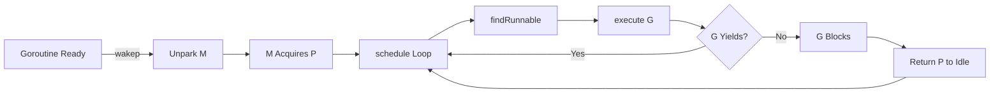
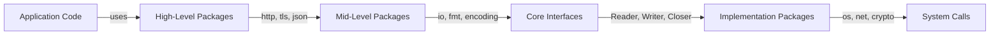

[Skip to content](https://www.augmentcode.com/open-source/golang/go#main-content)

# Go Programming Language

Last updated on Dec 18, 2025 (Commit: [cfc024d](https://github.com/golang/go/commit/cfc024d))

[View on GitHub](https://github.com/golang/go)

## Overview [Link to this section](https://www.augmentcode.com/open-source/golang/go\#overview)

Relevant Files

- `README.md`
- `CONTRIBUTING.md`
- `LICENSE`
- `src/` \- Standard library and runtime implementation
- `cmd/` \- Go toolchain commands
- `test/` \- Language and compiler tests

Go is an open source programming language designed for building simple, reliable, and efficient software. Created by Google, it emphasizes fast compilation, efficient execution, and ease of programming with built-in support for concurrency through goroutines and channels.

### Core Language Features [Link to this section](https://www.augmentcode.com/open-source/golang/go\#core-language-features)

Go combines the efficiency of compiled languages with the simplicity of dynamic languages. Key characteristics include:

- **Fast Compilation:** Go compiles directly to machine code with minimal dependencies
- **Concurrency:** Lightweight goroutines and channels enable efficient concurrent programming
- **Simplicity:** Clean syntax with minimal keywords and straightforward semantics
- **Static Typing:** Strong type system with type inference for cleaner code
- **Garbage Collection:** Automatic memory management with low-latency collection

### Repository Structure [Link to this section](https://www.augmentcode.com/open-source/golang/go\#repository-structure)

The Go repository is organized into several key directories:

- **`src/`** \- Contains the standard library packages and runtime implementation. Organized by package name (e.g., `src/fmt`, `src/net`, `src/crypto`)
- **`cmd/`** \- Go toolchain commands including the compiler (`compile`), linker (`link`), and tools like `go`, `gofmt`, and `vet`
- **`test/`** \- Comprehensive test suite for language features, compiler behavior, and standard library functionality
- **`doc/`** \- Documentation and release notes
- **`api/`** \- API compatibility tracking across Go versions
- **`lib/`** \- Platform-specific libraries and support code
- **`misc/`** \- Miscellaneous tools and editor integrations

### Standard Library [Link to this section](https://www.augmentcode.com/open-source/golang/go\#standard-library)

The standard library provides comprehensive packages for common tasks:

- **I/O & Encoding:**`io`, `bufio`, `encoding`, `json`, `xml`, `csv`
- **Networking:**`net`, `net/http`, `net/rpc`
- **Cryptography:**`crypto`, `crypto/sha256`, `crypto/rsa`, `crypto/tls`
- **Data Structures:**`container`, `sort`, `slices`, `maps`
- **System:**`os`, `syscall`, `runtime`, `sync`
- **Testing:**`testing`, `log`

### Runtime & Compiler [Link to this section](https://www.augmentcode.com/open-source/golang/go\#runtime-compiler)

The runtime (`src/runtime/`) implements Go's execution model including:

- Goroutine scheduler for lightweight concurrency
- Garbage collector with concurrent mark-and-sweep
- Memory allocator optimized for allocation patterns
- Platform-specific code for multiple architectures (x86, ARM, RISC-V, WebAssembly, etc.)

The compiler (`src/cmd/compile/`) performs type checking, optimization, and code generation to produce efficient machine code.

### Contributing & Licensing [Link to this section](https://www.augmentcode.com/open-source/golang/go\#contributing-licensing)

Go is developed collaboratively by thousands of contributors. The project uses a BSD-style license (see `LICENSE`). Contributions follow the guidelines in `CONTRIBUTING.md` and require discussion through the proposal process for significant changes.




## Architecture & Core Components [Link to this section](https://www.augmentcode.com/open-source/golang/go\#architecture-core-components)

Relevant Files

- `src/runtime/HACKING.md`
- `src/cmd/compile/README.md`
- `src/cmd/compile/abi-internal.md`
- `src/cmd/compile/internal/ssa`
- `src/cmd/link/internal/ld`

Go's architecture consists of two major subsystems: the **compiler** (`cmd/compile`) and the **runtime** (`src/runtime`). These work together to transform source code into executable binaries and manage program execution.

### Compiler Pipeline [Link to this section](https://www.augmentcode.com/open-source/golang/go\#compiler-pipeline)

The Go compiler operates in seven distinct phases:

1. **Parsing** (`syntax` package): Lexical analysis, parsing, and syntax tree construction for each source file.

2. **Type Checking** (`types2` package): Validates type correctness using a port of `go/types` adapted for the compiler's AST.

3. **IR Construction** (`ir`, `noder` packages): Converts syntax and type information into the compiler's internal representation (IR) using Unified IR, which serializes typechecked code for import/export and inlining.

4. **Middle End** (`inline`, `escape`, `devirtualize` packages): Applies optimization passes including function inlining, escape analysis, and devirtualization.

5. **Walk** (`walk` package): Decomposes complex statements into simpler ones and desugars high-level constructs (e.g., `switch` to jump tables, map operations to runtime calls).

6. **SSA Generation** (`ssa`, `ssagen` packages): Converts IR to Static Single Assignment form, applies machine-independent optimizations, and handles function intrinsics.

7. **Code Generation** (`obj` package): Lowers SSA to architecture-specific instructions, performs register allocation, and generates machine code.


### Runtime Scheduler [Link to this section](https://www.augmentcode.com/open-source/golang/go\#runtime-scheduler)

The runtime manages three core resource types:

- **G** (Goroutine): User-level lightweight thread, represented by type `g`.
- **M** (Machine): OS thread executing Go code, represented by type `m`.
- **P** (Processor): Logical processor holding scheduler and allocator state, represented by type `p`. Count equals `GOMAXPROCS`.

The scheduler matches Gs to Ms and Ps. When an M blocks (e.g., system call), it returns its P to the idle pool. On return, it must reacquire a P to resume executing user code.

### Stack Management [Link to this section](https://www.augmentcode.com/open-source/golang/go\#stack-management)

Each goroutine has a user stack (starts at 2K, grows dynamically). Each M has a system stack (`g0`) and signal stack (`gsignal`). Runtime code switches to the system stack using `systemstack`, `mcall`, or `asmcgocall` for non-preemptible operations.

Functions marked `//go:nosplit` skip stack growth checks, used for functions that must not trigger stack growth or may run without a valid G.

### Application Binary Interface (ABI) [Link to this section](https://www.augmentcode.com/open-source/golang/go\#application-binary-interface-abi-)

Go defines **ABIInternal** (register-based) for all Go functions and **ABI0** (stack-based) for assembly. Arguments and results are passed via registers when possible, otherwise on the stack. Each architecture specifies integer and floating-point register sequences. ABI wrappers enable transparent calls between ABIInternal and ABI0 functions.

```mermaid
flowchart LR
    A["Source Code"] -->|Parse| B["Syntax Tree"]
    B -->|Type Check| C["Typed AST"]
    C -->|Noding| D["Compiler IR"]
    D -->|Optimize| E["Optimized IR"]
    E -->|Walk| F["Desugared IR"]
    F -->|SSA Gen| G["SSA Form"]
    G -->|Lower| H["Arch-Specific SSA"]
    H -->|Codegen| I["Machine Code"]
    I -->|Link| J["Executable"]
```



### Synchronization Primitives [Link to this section](https://www.augmentcode.com/open-source/golang/go\#synchronization-primitives)

The runtime provides multiple synchronization mechanisms with different semantics:

- **mutex**: Blocks M directly; safe at low levels but prevents rescheduling.
- **note**: One-shot notifications; `notesleep` blocks M, `notetsleepg` allows P reuse.
- **gopark/goready**: Direct scheduler interaction; parks G without blocking M.

### Memory Management [Link to this section](https://www.augmentcode.com/open-source/golang/go\#memory-management)

Unmanaged memory (outside GC heap) uses three allocators:

- **sysAlloc**: Direct OS allocation, page-aligned, can be freed.
- **persistentalloc**: Combines allocations to reduce fragmentation; no freeing.
- **fixalloc**: SLAB-style allocator for fixed-size objects; reusable within same pool.

Objects in unmanaged memory must not contain heap pointers unless they're GC roots or properly zero-initialized before becoming visible to GC.

## Compiler Pipeline [Link to this section](https://www.augmentcode.com/open-source/golang/go\#compiler-pipeline-1)

Relevant Files

- `src/cmd/compile/internal/syntax` \- Lexer, parser, syntax tree
- `src/cmd/compile/internal/types2` \- Type checking
- `src/cmd/compile/internal/ir` \- Compiler AST representation
- `src/cmd/compile/internal/ssa` \- SSA passes and rules
- `src/cmd/compile/internal/ssagen` \- IR to SSA conversion
- `src/cmd/compile/internal/noder` \- Unified IR generation

The Go compiler transforms source code through a series of well-defined phases, each building on the previous one. Understanding this pipeline is essential for working with the compiler internals.

### Phase 1: Parsing [Link to this section](https://www.augmentcode.com/open-source/golang/go\#phase-1-parsing)

The compiler begins by tokenizing and parsing Go source files using the `syntax` package. This phase produces an Abstract Syntax Tree (AST) that exactly represents the source code, including position information for error reporting and debugging.

### Phase 2: Type Checking [Link to this section](https://www.augmentcode.com/open-source/golang/go\#phase-2-type-checking)

The `types2` package performs type checking on the parsed syntax tree. This phase validates that all operations are type-safe and resolves type information for all expressions and declarations.

### Phase 3: IR Construction (Noding) [Link to this section](https://www.augmentcode.com/open-source/golang/go\#phase-3-ir-construction-noding-)

The compiler converts the syntax tree and type information into its own internal representation using the `ir` and `types` packages. This process, called "noding," uses Unified IR—a serialized representation that enables efficient import/export and inlining of packages.

### Phase 4: SSA Generation and Optimization [Link to this section](https://www.augmentcode.com/open-source/golang/go\#phase-4-ssa-generation-and-optimization)

The IR is converted to Static Single Assignment (SSA) form in `ssagen`, then processed through a series of optimization passes in the `ssa` package. Key passes include:

- **Early optimization**: Dead code elimination, constant folding, common subexpression elimination
- **Mid-level optimization**: Nil check elimination, escape analysis, branch elimination
- **Late optimization**: Register allocation, stack frame layout, pointer liveness analysis



### Phase 5: Machine Code Generation [Link to this section](https://www.augmentcode.com/open-source/golang/go\#phase-5-machine-code-generation)

The "lower" pass converts generic SSA operations into architecture-specific variants. Final optimization passes run, including register allocation and dead code elimination. The result is a series of `obj.Prog` instructions passed to the assembler.

### SSA Compilation Passes [Link to this section](https://www.augmentcode.com/open-source/golang/go\#ssa-compilation-passes)

The SSA compiler runs 50+ passes in strict order. Critical passes include:

- `opt` \- Generic optimization rules (runs multiple times)
- `lower` \- Architecture-specific lowering
- `regalloc` \- Register and stack allocation
- `schedule` \- Instruction scheduling
- `layout` \- Basic block ordering

Pass ordering is enforced by dependency constraints documented in `compile.go`. Some passes are marked "required" and always run; others are optional optimizations.

### Debugging SSA [Link to this section](https://www.augmentcode.com/open-source/golang/go\#debugging-ssa)

Use the `GOSSAFUNC` environment variable to inspect SSA transformations:

```bash
GOSSAFUNC=MyFunc go build
```

This generates `ssa.html` showing the function's SSA form at each compilation pass, making it easy to understand how optimizations transform code.

## Runtime & Scheduler [Link to this section](https://www.augmentcode.com/open-source/golang/go\#runtime-scheduler-1)

Relevant Files

- `src/runtime/proc.go`
- `src/runtime/runtime2.go`
- `src/runtime/mgc.go`
- `src/runtime/malloc.go`
- `src/runtime/stack.go`

### Core Scheduler Concepts [Link to this section](https://www.augmentcode.com/open-source/golang/go\#core-scheduler-concepts)

Go's scheduler manages three fundamental resources: **Gs** (goroutines), **Ms** (OS threads/machines), and **Ps** (processors). The scheduler's job is to match up a G (code to execute), an M (where to execute it), and a P (rights and resources to execute it).

- **G (Goroutine):** A lightweight user-level thread represented by type `g`. When a goroutine exits, its `g` object is returned to a pool for reuse.
- **M (Machine):** An OS thread that can execute user Go code, runtime code, system calls, or be idle. Represented by type `m`.
- **P (Processor):** A logical processor representing resources needed to execute Go code (scheduler state, memory allocator state). There are exactly `GOMAXPROCS` Ps. Represented by type `p`.

All `g`, `m`, and `p` objects are heap-allocated but never freed, ensuring memory stability for the scheduler's low-level operations.

### Goroutine States [Link to this section](https://www.augmentcode.com/open-source/golang/go\#goroutine-states)

Goroutines transition through multiple states managed by atomic status fields:

- `_Grunnable` \- On a run queue, ready to execute
- `_Grunning` \- Currently executing user code with stack ownership
- `_Gsyscall` \- Executing a system call
- `_Gwaiting` \- Blocked in the runtime (e.g., channel operation)
- `_Gcopystack` \- Stack is being relocated during growth
- `_Gpreempted` \- Stopped for preemption, awaiting resumption

The `_Gscan` bit combined with other states indicates GC is scanning the goroutine's stack.

### Processor States [Link to this section](https://www.augmentcode.com/open-source/golang/go\#processor-states)

- `_Pidle` \- Not running user code, available for scheduling
- `_Prunning` \- Owned by an M, executing user code or scheduler
- `_Pgcstop` \- Halted for stop-the-world GC
- `_Pdead` \- No longer used (GOMAXPROCS decreased)

### The Scheduler Loop [Link to this section](https://www.augmentcode.com/open-source/golang/go\#the-scheduler-loop)

The main scheduler function (`schedule()`) runs in an infinite loop on each M:

1. **Find work:** Call `findRunnable()` to locate a runnable goroutine from local queues, global queues, timers, or GC work
2. **Execute:** Call `execute()` to run the goroutine
3. **Repeat:** After the goroutine yields or blocks, return to step 1

```go
func schedule() {
    gp, inheritTime, tryWakeP := findRunnable()
    execute(gp, inheritTime)
}
```

### Work Queues [Link to this section](https://www.augmentcode.com/open-source/golang/go\#work-queues)

Each P has a local run queue (256-entry circular buffer) for fast, lock-free scheduling. When the local queue is full, goroutines go to the global run queue. The scheduler uses work stealing: idle Ms check other Ps' queues before parking.

### Stack Management [Link to this section](https://www.augmentcode.com/open-source/golang/go\#stack-management-1)

Goroutine stacks start small (2KB minimum) and grow dynamically. When a function's stack frame would overflow the guard area, `morestack()` is called to allocate a larger stack and copy the existing data. Stack growth is multiplicative (typically doubling) for amortized constant cost.

```go
const stackMin = 2048  // Minimum stack size
```

### Memory Allocation Hierarchy [Link to this section](https://www.augmentcode.com/open-source/golang/go\#memory-allocation-hierarchy)

The allocator uses a hierarchical caching system:

1. **mcache** (per-P) - Fast, lock-free allocation for small objects
2. **mcentral** \- Central cache of spans for each size class
3. **mheap** \- Manages pages at 8KB granularity
4. **OS** \- Allocates large page runs (>1MB) from the operating system

Small allocations (<=32KB) are rounded to ~70 size classes. Each P has its own mcache to minimize lock contention.

### Thread Parking & Spinning [Link to this section](https://www.augmentcode.com/open-source/golang/go\#thread-parking-spinning)

The scheduler balances CPU utilization by managing idle threads:

- **Spinning threads** search for work without parking, reducing latency
- **Parking** conserves CPU when no work is available
- `wakep()` unparks a thread when work becomes available and no spinning threads exist
- The `sched.nmspinning` counter tracks spinning threads to avoid excessive unparking

### GC Integration [Link to this section](https://www.augmentcode.com/open-source/golang/go\#gc-integration)

During garbage collection, the scheduler:

- Stops all Ps at safe points via `stopTheWorldWithSema()`
- Disables user goroutine scheduling with `schedEnableUser(false)`
- Runs GC workers as special goroutines
- Resumes with `startTheWorldWithSema()`



### Key Synchronization Primitives [Link to this section](https://www.augmentcode.com/open-source/golang/go\#key-synchronization-primitives)

- **mutex** \- OS-level lock for protecting shared structures
- **note** \- One-shot notification mechanism (race-free sleep/wakeup)
- **Atomic operations** \- Used for lock-free scheduler state updates

The runtime avoids write barriers in the scheduler's critical paths by using special pointer types (`guintptr`, `muintptr`, `puintptr`) that bypass GC write barrier checks.

## Standard Library Organization [Link to this section](https://www.augmentcode.com/open-source/golang/go\#standard-library-organization)

Relevant Files

- `src/fmt`
- `src/net`
- `src/crypto`
- `src/encoding`
- `src/sync`
- `src/io`

Go's standard library is organized into focused, single-purpose packages that follow a clear hierarchical structure. Each package exports a minimal public API while keeping implementation details private, making the codebase maintainable and easy to navigate.

### Core I/O and Formatting [Link to this section](https://www.augmentcode.com/open-source/golang/go\#core-i-o-and-formatting)

The **`fmt`** package provides formatted I/O with four families of functions organized by output destination: `Print`/`Println`/`Printf` write to stdout, `Sprint`/`Sprintln`/`Sprintf` return strings, `Fprint`/`Fprintln`/`Fprintf` write to `io.Writer`, and `Append`/`Appendln`/`Appendf` append to byte slices. Format verbs follow C conventions but are simpler.

The **`io`** package defines fundamental interfaces like `Reader`, `Writer`, and `Closer` that abstract I/O operations. It also provides utility functions for composing readers and writers, establishing a contract that implementations across the standard library follow.

### Networking and Protocols [Link to this section](https://www.augmentcode.com/open-source/golang/go\#networking-and-protocols)

The **`net`** package provides portable network I/O for TCP/IP, UDP, and Unix domain sockets. It abstracts platform differences through interfaces like `Conn` and `Listener`. The package includes DNS resolution with both pure Go and cgo-based resolvers, and sub-packages like `net/http`, `net/mail`, and `net/url` handle higher-level protocols.

### Cryptography and Security [Link to this section](https://www.augmentcode.com/open-source/golang/go\#cryptography-and-security)

The **`crypto`** package serves as a registry for cryptographic hash functions and defines common interfaces. Sub-packages implement specific algorithms: `crypto/aes`, `crypto/sha256`, `crypto/rsa`, `crypto/ecdsa`, and `crypto/ed25519`. The `crypto/tls` package provides TLS/SSL support, while `crypto/x509` handles certificate parsing and validation.

### Data Encoding and Serialization [Link to this section](https://www.augmentcode.com/open-source/golang/go\#data-encoding-and-serialization)

The **`encoding`** package defines interfaces like `BinaryMarshaler` and `TextMarshaler` that enable types to participate in multiple encoding formats. Sub-packages implement specific formats: `encoding/json` for JSON, `encoding/xml` for XML, `encoding/gob` for Go binary format, `encoding/base64` and `encoding/hex` for text encodings, and `encoding/csv` for comma-separated values.

### Concurrency Primitives [Link to this section](https://www.augmentcode.com/open-source/golang/go\#concurrency-primitives)

The **`sync`** package provides low-level synchronization primitives: `Mutex` and `RWMutex` for mutual exclusion, `WaitGroup` for coordinating goroutines, `Once` for one-time initialization, `Cond` for condition variables, and `Pool` for object reuse. The `sync/atomic` sub-package offers atomic operations on shared variables without locks.



### Design Principles [Link to this section](https://www.augmentcode.com/open-source/golang/go\#design-principles)

1. **Interface-based abstraction**: Packages define minimal interfaces that implementations satisfy, enabling composition and testing.
2. **Hierarchical organization**: Core packages provide foundations; sub-packages build specialized functionality.
3. **Platform abstraction**: Platform-specific code is isolated in separate files (e.g., `*_unix.go`, `*_windows.go`).
4. **Backward compatibility**: The standard library maintains strict API compatibility across versions.

## Tooling & Commands [Link to this section](https://www.augmentcode.com/open-source/golang/go\#tooling-commands)

Relevant Files

- `src/cmd/go` – Main Go command dispatcher
- `src/cmd/gofmt` – Code formatter
- `src/cmd/vet` – Static analysis tool
- `src/cmd/link` – Linker for combining packages into executables
- `src/cmd/trace` – Execution trace viewer

Go provides a comprehensive suite of command-line tools for building, analyzing, and debugging programs. These tools are accessed through the `go` command and the `go tool` subcommand.

### The Go Command [Link to this section](https://www.augmentcode.com/open-source/golang/go\#the-go-command)

The `go` command is the primary entry point for Go development. It dispatches to various subcommands defined in `src/cmd/go/internal/`, including:

- **build** – Compile packages and dependencies
- **test** – Run tests and benchmarks
- **fmt** – Format source code using gofmt
- **vet** – Run static analysis checks
- **fix** – Apply automated fixes to source code
- **generate** – Run code generation directives
- **tool** – Access low-level tools like linker, assembler, and trace viewer

### Code Formatting with gofmt [Link to this section](https://www.augmentcode.com/open-source/golang/go\#code-formatting-with-gofmt)

`gofmt` (Go formatter) standardizes code style across projects. It uses tabs for indentation and blanks for alignment.

**Key features:**

- `-l` – List files with formatting differences
- `-w` – Write changes back to files
- `-d` – Display diffs instead of rewriting
- `-r rule` – Apply rewrite rules (e.g., `'(a) -> a'` removes unnecessary parentheses)
- `-s` – Simplify code (e.g., `s[a:len(s)]` becomes `s[a:]`)

The `go fmt` command wraps gofmt and applies it to packages.

### Static Analysis with vet [Link to this section](https://www.augmentcode.com/open-source/golang/go\#static-analysis-with-vet)

`go vet` examines code for suspicious constructs using heuristic-based checkers. It runs 30+ analyzers covering common mistakes:

**Core checkers:**

- `printf` – Format string consistency
- `atomic` – Sync/atomic package misuse
- `copylock` – Locks passed by value
- `loopclosure` – Loop variable capture in closures
- `structtag` – Invalid struct field tags
- `unreachable` – Dead code detection

Vet uses the `golang.org/x/tools/go/analysis` framework. Each analyzer is a pluggable module that can be enabled/disabled individually.

### The Linker [Link to this section](https://www.augmentcode.com/open-source/golang/go\#the-linker)

`cmd/link` combines compiled packages into executable binaries. It supports multiple architectures (amd64, arm64, wasm, etc.) with architecture-specific code in `cmd/link/internal/GOARCH`.

**Key responsibilities:**

- Resolving symbol references across packages
- Applying relocations for different platforms
- Embedding debug information (DWARF)
- Handling external linking mode for C interoperability

### Execution Tracing [Link to this section](https://www.augmentcode.com/open-source/golang/go\#execution-tracing)

`go tool trace` analyzes execution traces to visualize goroutine scheduling, network blocking, and synchronization events.

**Usage:**

```bash
go test -trace trace.out ./pkg
go tool trace trace.out
go tool trace -pprof=TYPE trace.out > TYPE.pprof
```

Supported profile types: `net`, `sync`, `syscall`, `sched`.

### Tool Architecture [Link to this section](https://www.augmentcode.com/open-source/golang/go\#tool-architecture)

Tools like vet and fix use the `unitchecker` protocol, allowing custom analysis tools to integrate with `go vet -vettool=prog`. The protocol requires:

- `-flags` – Describe flags in JSON
- `-V=full` – Describe executable for caching
- `*.cfg` – Perform analysis on a single package

## Build System & Distribution [Link to this section](https://www.augmentcode.com/open-source/golang/go\#build-system-distribution)

Relevant Files

- `src/make.bash`, `src/make.bat`, `src/make.rc`
- `src/all.bash`, `src/all.bat`, `src/all.rc`
- `src/cmd/dist/` – Bootstrap and build orchestration
- `src/cmd/distpack/` – Distribution packaging
- `src/Make.dist` – Makefile for dist tool

### Overview [Link to this section](https://www.augmentcode.com/open-source/golang/go\#overview-1)

Go's build system is a multi-stage bootstrap process designed to compile the toolchain using a previous stable Go version. This ensures reproducibility and allows the compiler to be written in Go itself. The system supports cross-compilation and generates distributable packages for multiple platforms.

### Bootstrap Process [Link to this section](https://www.augmentcode.com/open-source/golang/go\#bootstrap-process)

The build follows a three-toolchain bootstrap strategy:

1. **Toolchain 1**: Built with the bootstrap Go compiler (Go 1.24.6+) using `cmd/dist`
2. **Toolchain 2**: Rebuilt using Toolchain 1 with `GOEXPERIMENT` enabled
3. **Toolchain 3**: Final rebuild using Toolchain 2 to ensure consistency

This approach, documented in `src/cmd/dist/README`, guarantees that the final compiler is self-hosting and reproducible.

### Build Entry Points [Link to this section](https://www.augmentcode.com/open-source/golang/go\#build-entry-points)

**Unix-like systems** (`make.bash`):

- Compiles `cmd/dist` with the bootstrap compiler
- Runs `dist bootstrap` to complete the build
- Cleans up temporary artifacts

**Windows** (`make.bat`):

- Similar flow but uses batch scripting
- Generates `env.bat` for environment configuration

**Plan 9** (`make.rc`):

- Uses rc shell syntax for the Plan 9 operating system

All three scripts converge on `dist bootstrap`, which handles the actual compilation logic.

### The `dist` Tool [Link to this section](https://www.augmentcode.com/open-source/golang/go\#the-dist-tool)

Located in `src/cmd/dist/`, this tool orchestrates the entire build:

- **`bootstrap`**: Rebuilds everything (toolchains 1–3, stdlib, commands)
- **`install`**: Installs individual packages or commands
- **`clean`**: Removes all built artifacts
- **`test`**: Runs the test suite
- **`list`**: Enumerates supported platforms
- **`env`**: Prints build environment variables
- **`banner`**: Displays installation information

### Distribution Packaging [Link to this section](https://www.augmentcode.com/open-source/golang/go\#distribution-packaging)

The `cmd/distpack` tool creates release artifacts:

- **Binary distributions**: Platform-specific `.tar.gz` (Unix) or `.zip` (Windows)
- **Source distribution**: Platform-independent `.src.tar.gz`
- **Module distributions**: Go module format for `GOTOOLCHAIN` support

Invoked via `make.bash -distpack`, it outputs to `$GOROOT/pkg/distpack/`. Cross-compilation is supported by setting `GOOS` and `GOARCH` before running `make.bash`.

### Cross-Compilation [Link to this section](https://www.augmentcode.com/open-source/golang/go\#cross-compilation)

Set environment variables before building:

```bash
GOOS=linux GOARCH=arm64 ./make.bash
```

The build system automatically handles host vs. target architecture differences, building host tools first when needed.

### Key Build Variables [Link to this section](https://www.augmentcode.com/open-source/golang/go\#key-build-variables)

- `GOROOT`: Installation root directory
- `GOOS`/`GOARCH`: Target operating system and architecture
- `GOHOSTOS`/`GOHOSTARCH`: Build machine OS and architecture
- `GOEXPERIMENT`: Enables experimental features during Toolchain 2 build
- `GO_DISTFLAGS`: Additional flags passed to `dist bootstrap`

## Testing, Profiling & Debugging [Link to this section](https://www.augmentcode.com/open-source/golang/go\#testing-profiling-debugging)

Relevant Files

- `src/testing/testing.go` \- Core testing framework
- `src/testing/benchmark.go` \- Benchmark support
- `src/testing/fuzz.go` \- Fuzzing infrastructure
- `src/runtime/pprof/pprof.go` \- Profiling API
- `src/cmd/pprof/pprof.go` \- PProf visualization tool
- `src/cmd/trace/main.go` \- Execution trace viewer
- `src/cmd/cover/cover.go` \- Coverage analysis tool
- `src/debug/` \- Debug symbol packages (DWARF, ELF, etc.)

### Unit Testing [Link to this section](https://www.augmentcode.com/open-source/golang/go\#unit-testing)

Go's testing framework is built into the `testing` package and integrated with `go test`. Tests are functions matching `func TestXxx(*testing.T)` in files ending with `_test.go`. The `*testing.T` type provides methods for assertions and logging:

- `t.Error()`, `t.Errorf()` \- Report failures without stopping
- `t.Fatal()`, `t.Fatalf()` \- Report failures and stop immediately
- `t.Log()`, `t.Logf()` \- Output diagnostic information
- `t.Skip()`, `t.Skipf()` \- Skip the test
- `t.Cleanup()` \- Register cleanup functions

Tests can be run in white-box mode (same package) or black-box mode (separate `_test` package). Use `-run` flag to filter tests by regex pattern.

### Benchmarking [Link to this section](https://www.augmentcode.com/open-source/golang/go\#benchmarking)

Benchmark functions follow `func BenchmarkXxx(*testing.B)` and measure performance. The `*testing.B` type provides:

- `b.Loop()` \- Iterate the benchmark body; only the loop body is timed
- `b.ReportAllocs()` \- Include memory allocation statistics
- `b.RunParallel()` \- Run benchmark in parallel across multiple goroutines

Run benchmarks with `go test -bench=.` and control duration with `-benchtime`. Memory profiling is enabled via `-benchmem`.

### Fuzzing [Link to this section](https://www.augmentcode.com/open-source/golang/go\#fuzzing)

Fuzz tests use `func FuzzXxx(*testing.F)` to generate and test random inputs. The `*testing.F` type provides:

- `f.Add(args...)` \- Add seed corpus entries
- `f.Fuzz(fn)` \- Define the fuzz target function
- `f.Failed()`, `f.Name()` \- Query test state

Fuzz tests discover bugs by generating inputs and minimizing failures. Run with `go test -fuzz=FuzzXxx` and control duration with `-fuzztime`.

### Profiling with PProf [Link to this section](https://www.augmentcode.com/open-source/golang/go\#profiling-with-pprof)

The `runtime/pprof` package enables profiling. Built-in profiles include:

- **CPU** \- `pprof.StartCPUProfile()` / `pprof.StopCPUProfile()` \- Samples CPU usage at 100 Hz
- **Heap** \- `pprof.Lookup("heap")` \- Memory allocations of live objects
- **Allocs** \- `pprof.Lookup("allocs")` \- All allocations since program start
- **Goroutine** \- `pprof.Lookup("goroutine")` \- Stack traces of all goroutines
- **Block** \- `pprof.Lookup("block")` \- Synchronization blocking time
- **Mutex** \- `pprof.Lookup("mutex")` \- Lock contention

Enable profiling in tests with `-cpuprofile`, `-memprofile`, `-blockprofile`, `-mutexprofile` flags. Analyze profiles with `go tool pprof`.

### Execution Tracing [Link to this section](https://www.augmentcode.com/open-source/golang/go\#execution-tracing-1)

The `runtime/trace` package captures detailed execution events. Generate traces with `go test -trace=trace.out` or `runtime/trace.Start()`. View traces with `go tool trace trace.out`, which opens an interactive web UI showing:

- Goroutine execution timeline
- Processor utilization
- Network and synchronization blocking
- Garbage collection events

Extract pprof-compatible profiles from traces using `go tool trace -pprof=TYPE trace.out`.

### Code Coverage [Link to this section](https://www.augmentcode.com/open-source/golang/go\#code-coverage)

The `cmd/cover` tool instruments source code to track execution. Generate coverage profiles with `go test -coverprofile=cover.out`. Analyze coverage with:

- `go tool cover -html=cover.out` \- Interactive HTML report
- `go tool cover -func=cover.out` \- Per-function coverage statistics

Coverage modes: `set` (executed/not), `count` (execution count), `atomic` (thread-safe counting).

### Debugging [Link to this section](https://www.augmentcode.com/open-source/golang/go\#debugging)

The `debug` package provides symbol and binary format support:

- `debug/dwarf` \- DWARF debug information
- `debug/elf`, `debug/macho`, `debug/pe` \- Binary format parsing
- `debug/gosym` \- Go symbol tables and PC line tables

Use `go tool objdump` to disassemble binaries and `go tool addr2line` to map addresses to source locations.

* * *
