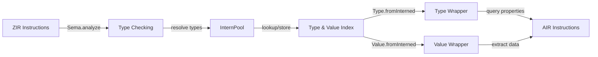
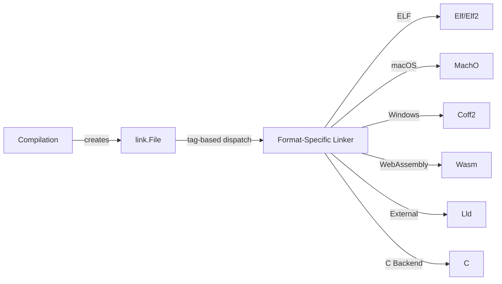
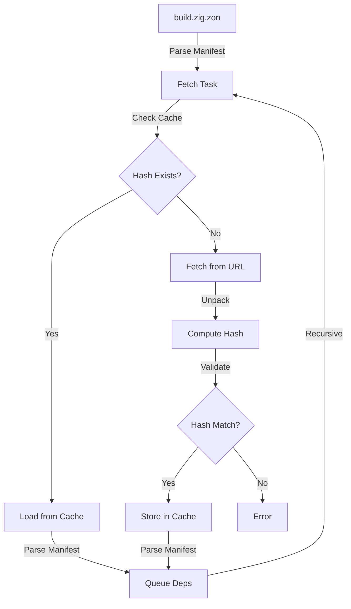

[Skip to content](https://www.augmentcode.com/open-source/ziglang/zig#main-content)

# Zig Programming Language Compiler & Toolchain

Last updated on Nov 26, 2025 (Commit: [738d2be](https://github.com/ziglang/zig/commit/738d2be))

[View on GitHub](https://github.com/ziglang/zig)

## Overview [Link to this section](https://www.augmentcode.com/open-source/ziglang/zig\#overview)

Relevant Files

- `src/main.zig` \- CLI entry point and command dispatcher
- `build.zig` \- Build system configuration
- `__deepwiki_repo_metadata.json` \- Repository metadata

Zig is a general-purpose programming language and toolchain designed for building robust, optimal, and reusable software. The compiler emphasizes simplicity, safety, and performance with explicit error handling, no hidden control flow, and direct memory management.

### Core Architecture [Link to this section](https://www.augmentcode.com/open-source/ziglang/zig\#core-architecture)

The Zig compiler is a self-hosted toolchain written primarily in Zig with C++ integration for LLVM backends. The main entry point (`src/main.zig`) dispatches to various compilation modes and commands:

- **Build modes**: `build-exe`, `build-lib`, `build-obj` for creating executables, libraries, and object files
- **Testing**: `test` and `test-obj` for unit testing
- **Development tools**: `fmt` (code formatting), `translate-c` (C-to-Zig conversion), `reduce` (bug minimization)
- **Toolchain integration**: `cc`, `c++` (C/C++ compiler compatibility), `ar`, `ranlib`, `objcopy` (archiver tools)

### Key Features [Link to this section](https://www.augmentcode.com/open-source/ziglang/zig\#key-features)

**Cross-compilation**: Zig supports compiling for multiple target architectures and operating systems (Linux, macOS, Windows, FreeBSD, WASI, and more) from a single host.

**Incremental compilation**: The compiler supports incremental builds to speed up development cycles, with caching mechanisms for intermediate results.

**C interoperability**: Direct C function calling, C struct definitions, and automatic C-to-Zig translation via the `translate-c` command.

**Multiple backends**: Supports both LLVM-based compilation and a self-hosted backend for flexibility and portability.

**Comprehensive standard library**: Located in `lib/std/`, providing utilities for I/O, memory management, data structures, and platform-specific functionality.

### Build System [Link to this section](https://www.augmentcode.com/open-source/ziglang/zig\#build-system)

The `build.zig` file orchestrates the entire build process using Zig's build system. It:

- Compiles the self-hosted compiler executable
- Runs comprehensive test suites (behavior tests, standard library tests, compiler tests)
- Generates language reference documentation
- Supports optional LLVM integration for advanced code generation
- Manages platform-specific configurations and dependencies

### Command Structure [Link to this section](https://www.augmentcode.com/open-source/ziglang/zig\#command-structure)

```
zig [command] [options]
```

Common workflows include:

- `zig build-exe main.zig` \- Compile a single file to an executable
- `zig build` \- Run the project's build.zig script
- `zig test` \- Run unit tests
- `zig fmt` \- Format source code
- `zig cc` \- Use Zig as a C compiler drop-in replacement

### Project Organization [Link to this section](https://www.augmentcode.com/open-source/ziglang/zig\#project-organization)

- `src/` \- Compiler source code (Zig and C++)
- `lib/` \- Standard library and runtime support
- `test/` \- Comprehensive test suites
- `tools/` \- Utility programs for development
- `doc/` \- Language reference and documentation
- `ci/` \- Continuous integration scripts for multiple platforms

## Architecture & Compilation Pipeline [Link to this section](https://www.augmentcode.com/open-source/ziglang/zig\#architecture-compilation-pipeline)

Relevant Files

- `src/Compilation.zig`
- `src/Zcu.zig`
- `src/Sema.zig`
- `src/Air.zig`
- `src/codegen.zig`
- `src/link.zig`

The Zig compiler transforms source code through a multi-stage pipeline, each stage producing intermediate representations that feed into the next. Understanding this architecture is essential for working with the compiler internals.

### Compilation Pipeline Overview [Link to this section](https://www.augmentcode.com/open-source/ziglang/zig\#compilation-pipeline-overview)


### Stage 1: Parsing & AST Generation [Link to this section](https://www.augmentcode.com/open-source/ziglang/zig\#stage-1-parsing-ast-generation)

The compiler begins by tokenizing and parsing Zig source files into an Abstract Syntax Tree (AST). This stage is handled by `std.zig.Ast` and produces a tree of nodes representing the program structure. The AST is then converted to ZIR (Zig Intermediate Representation) via `AstGen`, which performs initial lowering while preserving semantic information for later analysis.

### Stage 2: Semantic Analysis (Sema) [Link to this section](https://www.augmentcode.com/open-source/ziglang/zig\#stage-2-semantic-analysis-sema-)

The `Sema` module transforms ZIR into AIR (Analyzed Intermediate Representation). This is where type checking, comptime control flow evaluation, and safety-check generation occur. Sema is the heart of the compiler—it validates types, resolves function calls, and determines which code runs at compile-time versus runtime. Each function receives its own `Air` instance containing semantically-verified instructions.

### Stage 3: Code Generation [Link to this section](https://www.augmentcode.com/open-source/ziglang/zig\#stage-3-code-generation)

The `codegen` module converts AIR into MIR (Machine Intermediate Representation), which is backend-specific. The compiler supports multiple backends:

- **LLVM** (`stage2_llvm`) — Leverages LLVM for optimization and code generation
- **Native backends** — Direct machine code generation for x86\_64, aarch64, riscv64, wasm, spirv, and others
- **C backend** (`stage2_c`) — Generates C code for portability

Each backend produces its own MIR format, unified through the `AnyMir` union type. Code generation is designed to be a pure process, converting AIR plus liveness data into machine code.

### Stage 4: Linking [Link to this section](https://www.augmentcode.com/open-source/ziglang/zig\#stage-4-linking)

The `link` module combines generated code objects, resolves symbols, and produces the final binary. It handles multiple output formats (ELF, Mach-O, COFF, WebAssembly) and manages linker dependencies, library linking, and symbol resolution. The linker receives MIR from all compiled functions and orchestrates the final assembly.

### Compilation Unit (Zcu) [Link to this section](https://www.augmentcode.com/open-source/ziglang/zig\#compilation-unit-zcu-)

The `Zcu` (Zig Compilation Unit) represents all Zig source code in a single compilation. It maintains:

- **Module hierarchy** — Packages and their dependencies
- **Intern pool** — Deduplicated types, values, and declarations
- **Analysis state** — Tracks which declarations have been analyzed
- **Export tracking** — Manages public symbols and exports

Each `Compilation` has zero or one `Zcu`, depending on whether Zig source code is present. The `Compilation` itself manages the overall build process, including C interop, linking, and output generation.

### Incremental Compilation [Link to this section](https://www.augmentcode.com/open-source/ziglang/zig\#incremental-compilation)

The compiler supports incremental compilation through caching and dependency tracking. When source files change, only affected declarations are re-analyzed. The `Zcu` maintains resolved references to determine which declarations depend on changed code, enabling efficient rebuilds.

### Multi-threaded Job Queue [Link to this section](https://www.augmentcode.com/open-source/ziglang/zig\#multi-threaded-job-queue)

Compilation uses a thread pool to parallelize analysis and code generation. The `Compilation` module queues jobs (analyze module, codegen function) that workers process concurrently. Progress tracking ensures semantic analysis completes before code generation begins, preventing race conditions.

## Semantic Analysis & Type System [Link to this section](https://www.augmentcode.com/open-source/ziglang/zig\#semantic-analysis-type-system)

Relevant Files

- `src/Sema.zig`
- `src/Type.zig`
- `src/Value.zig`
- `src/InternPool.zig`

Semantic analysis transforms untyped ZIR (Zig Intermediate Representation) into typed AIR (Abstract Intermediate Representation). This is where type checking, comptime evaluation, and safety checks occur. The system uses a unified representation for both types and values through the InternPool.

### Core Architecture [Link to this section](https://www.augmentcode.com/open-source/ziglang/zig\#core-architecture-1)

The semantic analysis pipeline consists of four interconnected components:

**Sema.zig** is the heart of type checking. It analyzes ZIR instructions, performs type inference, validates operations, and generates AIR. Key responsibilities include managing comptime control flow, tracking dependencies, and handling error propagation.

**Type.zig** provides an abstraction over types stored in the InternPool. Each type is represented as a 32-bit index. Methods like `abiSize()`, `hasRuntimeBits()`, and `zigTypeTag()` query type properties. Types support lazy resolution for complex cases like array lengths and struct field types.

**Value.zig** similarly abstracts values in the InternPool. Values carry both a type and a runtime representation. Methods like `toUnsignedInt()`, `toBigInt()`, and `orderAgainstZero()` extract value information. Values can be comptime-known or runtime-only.

**InternPool.zig** is the canonical storage for all types and values. It uses a sharded, thread-safe hash table to deduplicate and intern objects. The `Key` union defines all possible type and value variants. Every interned object has both a value and a type, enabling unified handling.

### Type System Design [Link to this section](https://www.augmentcode.com/open-source/ziglang/zig\#type-system-design)



Types are organized hierarchically: simple types (`i32`, `bool`, `void`), container types (`struct`, `union`, `enum`), and composite types (`array`, `pointer`, `optional`). Each type can be queried for ABI size, alignment, and runtime bit requirements.

### Comptime Evaluation [Link to this section](https://www.augmentcode.com/open-source/ziglang/zig\#comptime-evaluation)

Sema handles comptime execution by evaluating expressions at compile time. When a value is comptime-known, Sema stores it in the InternPool. Operations like arithmetic, field access, and array indexing can be performed on comptime values. If a runtime condition is encountered, Sema converts comptime control flow to runtime control flow.

### Resolution Strategies [Link to this section](https://www.augmentcode.com/open-source/ziglang/zig\#resolution-strategies)

Type and value resolution uses three strategies: **eager** (assert already resolved), **lazy** (defer resolution), and **sema** (resolve during analysis). This allows handling of forward references and circular dependencies in structs and generics.

### Key Patterns [Link to this section](https://www.augmentcode.com/open-source/ziglang/zig\#key-patterns)

- **Type queries**: `ty.abiSize(zcu)`, `ty.hasRuntimeBits(zcu)`, `ty.zigTypeTag(zcu)`
- **Value extraction**: `val.toUnsignedInt(zcu)`, `val.toBigInt(&space, zcu)`
- **Interning**: `pt.intern(.{ .int = ... })` creates or retrieves canonical indices
- **Coercion**: `sema.coerce()` converts values between compatible types

## Code Generation & Backends [Link to this section](https://www.augmentcode.com/open-source/ziglang/zig\#code-generation-backends)

Relevant Files

- `src/codegen.zig`
- `src/codegen/llvm.zig`
- `src/codegen/c.zig`
- `src/codegen/x86_64/CodeGen.zig`
- `src/codegen/aarch64.zig`
- `src/codegen/wasm/CodeGen.zig`
- `src/codegen/riscv64/CodeGen.zig`
- `src/codegen/sparc64/CodeGen.zig`
- `src/codegen/spirv/CodeGen.zig`

### Overview [Link to this section](https://www.augmentcode.com/open-source/ziglang/zig\#overview-1)

Code generation transforms **AIR** (Analyzed Intermediate Representation) from semantic analysis into **MIR** (Machine Intermediate Representation), which is backend-specific. The compiler supports multiple backends, each producing its own MIR format unified through the `AnyMir` union type.

### Supported Backends [Link to this section](https://www.augmentcode.com/open-source/ziglang/zig\#supported-backends)

The compiler includes the following code generation backends:

- **LLVM** (`stage2_llvm`) — Leverages LLVM for optimization and code generation across many architectures
- **x86\_64** (`stage2_x86_64`) — Native code generation for x86-64 processors
- **aarch64** (`stage2_aarch64`) — Native code generation for ARM64 processors
- **RISC-V 64** (`stage2_riscv64`) — Native code generation for RISC-V 64-bit
- **SPARC64** (`stage2_sparc64`) — Native code generation for SPARC v9
- **WebAssembly** (`stage2_wasm`) — Generates WebAssembly binary format
- **SPIR-V** (`stage2_spirv`) — Generates SPIR-V for GPU compute
- **C** (`stage2_c`) — Generates portable C code for maximum compatibility

### Code Generation Pipeline [Link to this section](https://www.augmentcode.com/open-source/ziglang/zig\#code-generation-pipeline)


### Key Concepts [Link to this section](https://www.augmentcode.com/open-source/ziglang/zig\#key-concepts)

**AIR to MIR Conversion:** Each backend implements a `generate()` function that converts AIR instructions into backend-specific MIR. This process includes instruction selection, register allocation, and calling convention handling.

**MIR Representation:** MIR instructions have 1:1 correspondence with target machine instructions. For native backends, MIR postpones offset assignment until emission, enabling smaller instruction encodings (e.g., shorter jumps).

**Liveness Analysis:** Most backends use liveness data to optimize register allocation and stack usage. The `Air.Liveness` module tracks which values are live at each instruction.

**Calling Conventions:** Each backend implements ABI-specific calling conventions via `abi.zig` modules, handling parameter passing, return values, and register preservation.

### Backend Structure [Link to this section](https://www.augmentcode.com/open-source/ziglang/zig\#backend-structure)

Native backends (x86\_64, aarch64, riscv64, sparc64) follow a consistent pattern:

- **CodeGen.zig** — Main code generation logic, instruction selection
- **Mir.zig** — MIR data structures and emission to machine code
- **Lower.zig** — Lowers MIR to final machine code with relocations
- **Emit.zig** — Emits machine code bytes with debug information
- **abi.zig** — Calling convention and register management
- **encoding.zig** — Instruction encoding and bit patterns

The **C backend** generates human-readable C code, making it useful for debugging and cross-platform compilation. The **LLVM backend** delegates optimization and code generation to LLVM, supporting any architecture LLVM targets.

### Legalization [Link to this section](https://www.augmentcode.com/open-source/ziglang/zig\#legalization)

Before code generation, AIR may be legalized via `Air.Legalize` to expand operations unsupported by the target backend. Each backend defines `legalizeFeatures()` specifying which operations require expansion (e.g., scalarizing vector operations, expanding overflow checks).

## Linking & Object File Generation [Link to this section](https://www.augmentcode.com/open-source/ziglang/zig\#linking-object-file-generation)

Relevant Files

- `src/link.zig`
- `src/link/Elf.zig`
- `src/link/MachO.zig`
- `src/link/Coff.zig`
- `src/link/Wasm.zig`
- `src/link/Lld.zig`
- `src/link/C.zig`

### Overview [Link to this section](https://www.augmentcode.com/open-source/ziglang/zig\#overview-2)

The Zig compiler's linking system is a modular architecture that supports multiple object file formats and linker backends. It abstracts platform-specific linking details behind a unified `File` interface, allowing the compiler to generate executables, libraries, and object files across different operating systems and architectures.

### Architecture [Link to this section](https://www.augmentcode.com/open-source/ziglang/zig\#architecture)

The linking system is organized around a **polymorphic `File` abstraction** that dispatches to format-specific implementations:



### Core Components [Link to this section](https://www.augmentcode.com/open-source/ziglang/zig\#core-components)

**`link.File` (Base Abstraction)**

The `File` struct serves as the polymorphic base for all linker implementations. It contains:

- `tag`: Enum identifying the format (ELF, MachO, COFF, Wasm, etc.)
- `comp`: Reference to the compilation context
- `emit`: Output file path
- Common options: GC sections, build ID, stack size, entry point configuration

**Format-Specific Linkers**

Each linker backend implements the same interface:

- **ELF** (`Elf.zig`, `Elf2.zig`): Linux and Unix-like systems. Elf2 is the newer implementation.
- **MachO** (`MachO.zig`): macOS and iOS. Handles dylibs, code signing, and DWARF debug info.
- **COFF** (`Coff.zig`): Windows PE format. Manages import tables and PDB debug info.
- **Wasm** (`Wasm.zig`): WebAssembly. Handles function/global imports and memory sections.
- **LLD** (`Lld.zig`): External linker wrapper for LLVM-based linking.
- **C** (`C.zig`): Generates C code instead of binary output.

### Linking Pipeline [Link to this section](https://www.augmentcode.com/open-source/ziglang/zig\#linking-pipeline)

1. **Initialization**: `File.open()` creates a format-specific linker based on target object format.
2. **Input Loading**: `loadInput()` parses object files, archives, and shared libraries.
3. **Prelink Phase**: `prelink()` performs early linking tasks (symbol resolution, garbage collection).
4. **Code Generation**: Zig-generated code is added via `updateFunc()`, `updateNav()`, `updateExports()`.
5. **Flush**: `flush()` finalizes the output, writes headers, and emits the binary.

### Key Concepts [Link to this section](https://www.augmentcode.com/open-source/ziglang/zig\#key-concepts-1)

**Incremental Linking**: ELF and MachO support incremental updates. When code changes, only affected sections are relinked, improving compile times.

**Symbol Resolution**: Each linker maintains a symbol table and resolver. Symbols from Zig code, object files, and libraries are unified during linking.

**Relocations**: The linker tracks references between code/data sections and applies relocations when final addresses are known.

**Garbage Collection**: Unused sections can be removed via `--gc-sections` to reduce binary size.

**Diagnostics**: The `Diags` struct collects linker errors and warnings, including LLD stderr parsing for external linker failures.

## Standard Library [Link to this section](https://www.augmentcode.com/open-source/ziglang/zig\#standard-library)

Relevant Files

- `lib/std/std.zig`
- `lib/std/Build.zig`
- `lib/std/fs.zig`
- `lib/std/crypto.zig`
- `lib/std/compress.zig`

The Zig Standard Library (`std`) is a comprehensive collection of modules providing core functionality for systems programming, data structures, cryptography, I/O, and build system utilities. It is designed to be self-contained and cross-platform.

### Core Architecture [Link to this section](https://www.augmentcode.com/open-source/ziglang/zig\#core-architecture-2)

The standard library is organized into logical modules, each addressing a specific domain. The main entry point is `lib/std/std.zig`, which re-exports all public APIs. Key organizational principles include:

- **Modular design**: Each module is independently importable (e.g., `std.fs`, `std.crypto`, `std.json`)
- **Allocator-based memory management**: Most data structures accept an `Allocator` parameter for flexible memory handling
- **Cross-platform abstractions**: Platform-specific code is isolated in `os`, `posix`, and `windows` modules
- **Comptime capabilities**: Heavy use of Zig's compile-time features for generic types and optimizations

### Major Module Categories [Link to this section](https://www.augmentcode.com/open-source/ziglang/zig\#major-module-categories)

**Data Structures**: `ArrayList`, `HashMap`, `StringHashMap`, `DoublyLinkedList`, `SinglyLinkedList`, `Deque`, `PriorityQueue`, `MultiArrayList`, `Treap`, and bit sets provide flexible collection types for various use cases.

**I/O and Filesystem**: The `Io` module handles readers, writers, and networking. The `fs` module provides cross-platform file system operations including `Dir`, `File`, and `AtomicFile` for safe atomic writes.

**Cryptography**: The `crypto` module includes:

- Hash functions: SHA-2, SHA-3, BLAKE2, BLAKE3, MD5
- Symmetric encryption: AES, ChaCha20, Salsa20
- Authenticated encryption: AES-GCM, ChaCha20-Poly1305, AEGIS
- Key derivation: Argon2, Bcrypt, Scrypt, PBKDF2
- Digital signatures: Ed25519, ECDSA, ML-DSA
- Post-quantum cryptography: ML-KEM, Kyber

**Compression**: The `compress` module provides FLATE (gzip/zlib), LZMA, LZMA2, XZ, and Zstandard implementations.

**Build System**: The `Build` module is the foundation for Zig's build system, managing compilation steps, dependencies, and cross-compilation targets.

**Utilities**: `math` (trigonometry, logarithms, big integers), `json` (RFC 8259 parsing and stringification), `fmt` (formatting), `time` (epoch and timezone handling), `unicode` (UTF-8 utilities), and `testing` (test helpers).

### Memory Management [Link to this section](https://www.augmentcode.com/open-source/ziglang/zig\#memory-management)

The standard library uses an allocator-based approach where most types accept an `Allocator` interface. Common allocators include:

- `page_allocator`: Direct syscalls for each allocation (thread-safe)
- `GeneralPurposeAllocator`: Flexible allocator with optional safety checks
- `ArenaAllocator`: Fast allocation with bulk deallocation
- `FixedBufferAllocator`: Stack-based allocation from a fixed buffer

### Thread Safety and Concurrency [Link to this section](https://www.augmentcode.com/open-source/ziglang/zig\#thread-safety-and-concurrency)

The `Thread` module provides primitives for concurrent programming:

- `Mutex`: Mutual exclusion locks
- `Condition`: Condition variables for signaling
- `RwLock`: Reader-writer locks
- `Semaphore`: Counting semaphores
- `Pool`: Thread pool for work distribution

### Platform Abstraction [Link to this section](https://www.augmentcode.com/open-source/ziglang/zig\#platform-abstraction)

The library abstracts platform differences through:

- `os` module: OS-specific APIs (Linux, Windows, macOS, WASI, Plan9)
- `posix` module: POSIX-compliant system calls
- `windows` module: Windows-specific APIs
- Conditional compilation using `builtin.os.tag` and `builtin.cpu.arch`

### Configuration [Link to this section](https://www.augmentcode.com/open-source/ziglang/zig\#configuration)

Global options can be set via `std.options` in the root file, allowing customization of:

- Segfault handler behavior
- Log levels and scopes
- Stack trace capture
- WASI current working directory function

## Package Management & Build System [Link to this section](https://www.augmentcode.com/open-source/ziglang/zig\#package-management-build-system)

Relevant Files

- `src/Package.zig`
- `src/Package/Module.zig`
- `src/Package/Fetch.zig`
- `src/Package/Manifest.zig`
- `build.zig`
- `build.zig.zon`

Zig's package management system provides a declarative, hash-based approach to dependency management. Every Zig project is a package defined by a `build.zig.zon` manifest file, which specifies metadata, version, and dependencies.

### Core Concepts [Link to this section](https://www.augmentcode.com/open-source/ziglang/zig\#core-concepts)

**Manifest (`build.zig.zon`):** The package manifest declares the package name, semantic version, and dependencies. Each dependency specifies either a URL (for remote packages) or a path (for local packages). Dependencies can be marked as lazy, meaning they are only fetched when explicitly needed.

**Package Hash:** Every package snapshot is identified by a cryptographic hash combining the package name, version, and SHA-256 digest of its contents. This ensures reproducible builds and prevents tampering. The hash format is `name-version-hashplus`, where `hashplus` encodes the package ID, size, and truncated SHA-256 digest in base64.

**Module:** A `Module` represents an importable unit of code with a root source file and configuration (target, optimization level, sanitizers, etc.). Each package exposes a module with `build.zig` as its root source file.

### Dependency Resolution [Link to this section](https://www.augmentcode.com/open-source/ziglang/zig\#dependency-resolution)



The `Fetch` system handles package acquisition in parallel. For each dependency, it checks the global cache first. If not found, it fetches from the URL, unpacks the archive, computes the hash, and validates against the expected hash. Once cached, the manifest is parsed to queue recursive dependencies.

### Build Integration [Link to this section](https://www.augmentcode.com/open-source/ziglang/zig\#build-integration)

The compiler generates a `@dependencies` module containing all resolved packages. This module exposes a `packages` struct with entries for each dependency, including the build root path and optional `build_zig` struct. The build system uses this to instantiate child builders for each dependency, passing configuration options down the dependency tree.

### Key Features [Link to this section](https://www.augmentcode.com/open-source/ziglang/zig\#key-features-1)

- **Lazy Dependencies:** Marked with `lazy = true`, fetched only when accessed via `lazyDependency()`.
- **Path Dependencies:** Local packages referenced by relative path, useful for monorepos.
- **Inclusion Rules:** The `paths` field in `build.zig.zon` specifies which files to include, reducing cache size.
- **Fingerprints:** Optional fingerprints validate package identity and prevent accidental reuse.
- **Offline Mode:** Once all dependencies are fetched, builds work without internet connectivity.

## Testing & Quality Assurance [Link to this section](https://www.augmentcode.com/open-source/ziglang/zig\#testing-quality-assurance)

Relevant Files

- `test/tests.zig` \- Main test orchestration and target configuration
- `test/behavior.zig` \- Behavior test suite aggregator
- `test/cases.zig` \- Test case infrastructure
- `test/compile_errors.zig` \- Compile error test definitions
- `test/incremental` \- Incremental compilation test cases
- `test/src/Cases.zig` \- Core test case framework
- `build.zig` \- Build system test configuration

The Zig compiler uses a comprehensive, multi-layered testing strategy to ensure correctness across different backends, optimization levels, and target platforms.

### Test Categories [Link to this section](https://www.augmentcode.com/open-source/ziglang/zig\#test-categories)

**Behavior Tests** (`test/behavior/`) verify language semantics and runtime behavior. These tests cover fundamental features like arrays, control flow, type casting, and memory operations. Each test file focuses on a specific language feature and can be conditionally skipped based on the backend or architecture.

**Compile Error Tests** (`test/compile_errors.zig`) validate that invalid code produces expected error messages with correct line and column information. These tests ensure the compiler's error reporting is precise and helpful.

**Case Tests** (`test/cases/`) use a metadata-driven format where test expectations are embedded as comments at the end of each file. A single file can define multiple test scenarios (compile, execution, error checking, header generation) using directives like `// run`, `// error`, and `// backend=`.

**Incremental Tests** (`test/incremental/`) simulate real-world development workflows by testing how the compiler handles file changes. Each test directory contains numbered files (`.0.zig`, `.1.zig`, etc.) representing successive edits, allowing verification that incremental compilation correctly updates only affected code.

### Test Infrastructure [Link to this section](https://www.augmentcode.com/open-source/ziglang/zig\#test-infrastructure)

The `Cases.zig` framework provides a unified API for defining tests. Each test case specifies:

- **Target platform** and optimization mode
- **Test type**: Compile (no errors), Execution (run and check output), Error (expect specific diagnostics), Header (verify generated C headers)
- **Source files** and optional dependencies
- **Backend filters** to skip tests on unsupported backends (e.g., SPIR-V, WebAssembly)

The build system in `build.zig` configures a test matrix across multiple optimization levels (`Debug`, `ReleaseFast`, `ReleaseSafe`, `ReleaseSmall`) and target platforms. Options like `--skip-release`, `--skip-llvm`, and `--skip-non-native` allow developers to customize test scope during development.

### Running Tests [Link to this section](https://www.augmentcode.com/open-source/ziglang/zig\#running-tests)

```bash
zig build test                    # Run all tests
zig build test -Dskip-release    # Skip release builds
zig build test-c-abi             # C ABI compatibility tests
zig build test-incremental       # Incremental compilation tests
```

The test runner supports filtering by name and can be seeded for reproducible fuzzing. Tests report pass/skip/fail status and exit with appropriate codes for CI integration.

* * *
