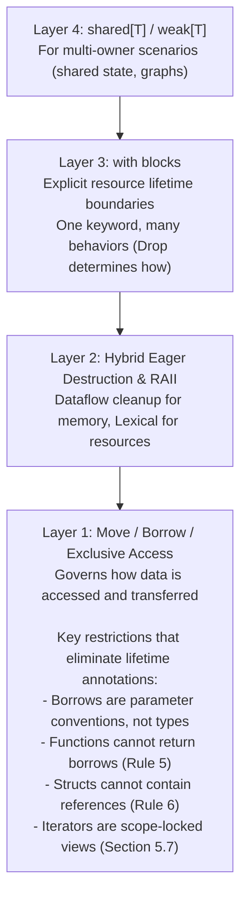

> **Document Status**: Design Specification (Pre-Alpha Implementation)  
> **Last Updated**: 2026-09-01  
> **Version**: 0.1.0-draft
>
> ---
>
> ## About This Document
>
> This is the **design specification** for the Ryo programming language—a statically-typed, compiled language prioritizing developer experience, memory safety, and performance. This document defines the language's syntax, semantics, type system, and standard library design.
>
> ### Current Status
>
> - **Stage**: Pre-alpha implementation phase
> - **Purpose**: Language design documentation and reference. This document always describes the **final design** of the language — implementation status is tracked separately in the development roadmap, never here.
> - **Completeness**: Core design is comprehensive; features whose design is not yet final are collected in Section 19 (Future Work)
> - **Stability**: Design is evolving based on analysis and feedback
>
> ### What's Documented
>
> ✅ **Complete Design**:
>
> - Core syntax and semantics
> - Type system (primitives, collections, enums, errors, optionals)
> - Memory management ("Ownership Lite" model)
> - Error handling with error unions
> - Concurrency model (Green Threads/Task/Future/Channel)
> - Module system with three-tier visibility
> - Standard library architecture
> - Tooling approach (native toolchain)
>
> ⏳ **Acknowledged Gaps** (see Section 19):
>
> - Formal grammar (EBNF/BNF)
> - Detailed standard library API signatures
> - Precise borrow checker algorithm specification
> - Features whose design is not yet final (collected in Section 19)
>
> ### Target Audience
>
> This specification is written for:
>
> - **Language designers** evaluating design decisions
> - **Potential contributors** understanding the vision
> - **Developers** familiar with Rust/Go/Python/Zig assessing whether Ryo fits their needs
>
> **Not a tutorial**: For learning Ryo, see the planned Getting Started Guide and code examples.
>
> ### How to Provide Feedback
>
> We welcome feedback on:
>
> 1. **Design Philosophy**: Does the DX-first approach (trading some performance for debugging) make sense?
> 2. **Ownership Model**: Is "Ownership Lite" (simplified borrowing without lifetimes) clear and practical?
> 3. **Error Handling**: Are error unions (Zig-inspired) and exhaustive matching intuitive?
> 4. **Concurrency**: Does the green threads + ambient runtime model solve real-world use cases?
> 5. **Module System**: Is the three-tier visibility (`pub`/`package`/private) appropriate?
> 6. **Missing Elements**: What critical details are needed for evaluation?
>
> **Note**: Design decisions include explicit trade-offs documented throughout (see Section 1.1 for DX vs. Performance philosophy).
>
> ---

# Ryo Programming Language Specification

## 1. Introduction & Vision

- **Vision:** Ryo is a statically-typed, compiled programming language designed to prioritize developer experience while maintaining memory safety and native performance. It aims to combine the compile-time memory safety guarantees inspired by Rust (simplified, without a garbage collector), the approachable syntax and developer experience reminiscent of Python, and familiar Task/Future/Channel concurrency patterns. Where trade-offs exist, Ryo explicitly chooses developer productivity and debugging capability over raw performance optimization.

- **Target Domains:** Web Backend Development (API Servers, Microservices), CLI Tools, Network Services & Proxies, WebAssembly (Wasm) Applications & Libraries, Game Development (Tooling, Scripting, Core Logic), Data Processing & ETL Pipelines, and Higher-Level Embedded Systems.
- **Core Goals:**
  - **Python-like Ergonomics:** Clean, readable, minimal syntax. Easy to learn, especially for Python developers. Reduce boilerplate.
  - **Rust-like Safety (Simplified):** Memory safe by default via ownership and borrowing, without GC. Compile-time checks prevent dangling pointers, data races, use-after-free. Simplified borrowing model compared to Rust (no manual lifetimes).
  - **Go-Inspired Simplicity:** Minimal keyword set, straightforward core concepts, avoid unnecessary feature creep. Focus on providing essential, orthogonal features. Simpler than Rust, more expressive than Go — the right trade-off for Ryo's target audience.
  - **Native Performance:** Compiled to native code. No GC pauses. Deterministic resource management. Performance comparable to Go — faster than Python, Node.js, or Ruby. Note: Ryo includes automatic debugging features (stack traces, error context) that add ~5-10% runtime overhead but significantly improve developer experience.
  - **Effective Concurrency:** Simple and safe concurrency using Task/Future/Channel patterns with a concurrent runtime.
  - **Compile-Time Power:** Integrated compile-time function execution (`comptime`) for metaprogramming, configuration, and optimization.
    *.  **Excellent Tooling:** Provide a seamless experience out-of-the-box, including a fast compiler, integrated package manager, REPL, and testing framework.

- **Target Audience:** Developers familiar with languages like Python, Go, TypeScript, or C# seeking better performance and stronger safety guarantees without the steep learning curve of Rust or the runtime overhead of GC languages, especially for backend services, CLI tools, and scripting.

### Language Inspirations

Ryo synthesizes ideas from several modern programming languages:

- **Python** - Clean syntax with colons and indentation, f-strings, type inference, developer-friendly design
- **Rust** - Ownership model for memory safety, algebraic data types (enums with data), pattern matching, trait system, Result/Option types
- **Mojo** - Simplified ownership without manual lifetimes, value semantics, progressive complexity model
- **Go** - Simplicity as a core design principle, fast compilation, built-in concurrency primitives, minimal feature set
- **Zig** - Explicit error handling with error unions, no operator overloading, readable-by-default design, minimal runtime, comptime execution (Ryo plans similar compile-time features for future versions)

**Key Differentiators**: Ryo aims to be easier than Rust (no lifetimes), safer than Python (compile-time memory safety), more expressive than Go (generics, algebraic types), and more familiar than Zig (Python-like syntax).

### 1.1 DX-First Philosophy: Performance vs. Developer Experience Trade-offs

Ryo explicitly prioritizes **developer experience and debugging capability over raw performance** in key areas. This philosophical choice distinguishes Ryo from languages that pursue zero-cost abstractions at the expense of usability.

**Where Ryo Trades Performance for DX:**

| Feature | Runtime Overhead | Binary Size Impact | DX Benefit | Rationale |
| --------- | ------------------ | ------------------- | ------------ | ----------- |
| **Automatic error stack traces** | ~5-10% (at error creation) | - | Complete error origin tracking with file/line/function | Eliminates hours of debugging; worth the cost for most applications |
| **Stack frame capture at `try`** | ~5-10% cumulative (at each propagation) | - | Full error propagation chain | Shows exactly how errors bubble through call stack |
| **Panic stack traces** | ~5-10% always-on | - | Post-mortem analysis without debugger | Critical for production debugging |
| **Debug symbols in binaries** | - | +20-30% | Resolve stack traces to source code | Use `--strip` flag for production if needed |

**Total Estimated Overhead:** ~5-10% for error-heavy workloads, negligible for error-free paths.

**When Ryo Is/Isn't Appropriate:**

✅ **Good fit:**

- Web backends, APIs, microservices (I/O-bound)
- CLI tools, build systems, developer tooling
- Applications where debugging time > runtime performance
- Prototyping and rapid development
- Teams prioritizing maintainability

❌ **Not ideal for:**

- Ultra-low-latency systems (HFT, real-time audio/video)
- Bare-metal embedded systems with tight resource constraints
- Applications where every microsecond matters
- Systems that cannot afford 5-10% overhead

**Comparison to Other Languages:**

- **Rust:** Zero-overhead tracing (opt-in via `RUST_BACKTRACE`). Fastest, but harder to debug by default.
- **Go:** Built-in stack traces with moderate overhead. Simpler than Ryo, but less detailed.
- **Zig:** Near-zero overhead with opt-in tracing. Maximum control, minimal automation.
- **Ryo:** Rich debugging by default, trades performance for DX. Better out-of-box experience than Go, more overhead than Rust/Zig.

*Rationale: Most applications spend more engineering time debugging than optimizing. Ryo chooses to save developer time at the cost of runtime performance, making it ideal for the 95% of applications where developer productivity matters more than the last 10% of performance.*

#### Configuration: Choice Without Complexity

True DX means **smart defaults + user choice**, not mandatory overhead. Ryo provides configuration options for performance-critical applications:

**Build-time control (compiler flags):**

```bash
ryo build                        # Default: full traces (~5-10% overhead)
ryo build --error-traces=minimal # Location only (~2-3% overhead)
ryo build --error-traces=off     # No capture (0% overhead)
```

**Profile-based defaults:**

```toml
# ryo.toml
[profile.dev]
error-traces = "full"      # Development wants full DX

[profile.release]
error-traces = "minimal"   # Production balances DX + performance
```

**Key principle:** Most developers never configure this. Defaults prioritize DX. Escape hatches exist for the 5% of applications where performance is critical.

See Section 7.10 for complete configuration reference.

### 1.2 AI-Era Language Design

Ryo assumes a workflow where AI agents write code and human developers review, debug, and maintain it. This design choice shapes several language features.

**Design Implications:**

1. **Strict over convenient.** Verbose safety patterns (`task.spawn_detached` over `task.spawn`) cost the AI nothing — it types for free. But explicit names help the human reviewer instantly understand intent without reading surrounding context.

2. **Compiler strictness over runtime flexibility.** The AI will follow the rules perfectly. Strict compile-time enforcement catches the rare cases where it doesn't, before code reaches production. Warnings on unused `future[T]` values, implicit move enforcement for task closures, and forbidden global mutable state are examples of this principle.

3. **Predictable patterns over clever shortcuts.** An AI benefits from a small set of orthogonal primitives with consistent behavior. A human benefits from reading code that always follows the same patterns. Both are served by fewer features, done well.

4. **Readable by default.** Ryo is implicit where ceremony would hurt clarity (parameter borrowing, type narrowing after null checks) and explicit where the reviewer needs to see intent (`shared[mutex[map[str, int]]]`, `try` for error propagation, `move` for ownership transfer). The test: *can a human reviewer understand the semantics by reading the code, without memorizing special rules?* No exceptions, no implicit numeric conversions — but also no unnecessary annotations that add noise without aiding comprehension. Operator overloading is **bounded**: trait-based, fixed operator set (`+ - * / %`, comparisons, unary negation, `[]`), same-type operands for binary arithmetic and comparisons (`[]` takes a collection and an integer index), static dispatch, no user-defined symbols — built-ins unchanged (`str + str` concatenation is built-in and cannot be overridden; f-strings and `str_push` are the idiom).

5. **Not limiting where an elegant solution exists.** A solution is **elegant** if and only if: (a) it is statically verified, with no annotations required at the use site; (b) any runtime cost it carries is **opt-in and visible in the type or signature**; (c) code that does not use it pays nothing — no hidden costs; (d) it passes the reviewer test: a human can understand the semantics by reading the code, without memorizing special rules. Elegance is never achieved by making the *default* dynamic.

**Balance:** Ryo prioritizes DX over theoretical purity. Python-style syntax, clean error messages, and readable stack traces serve the human side of the workflow. The AI handles the ceremony; the human benefits from the clarity.

## 2. Lexical Structure

- **Encoding:** Source files are UTF-8 encoded, allowing for Unicode characters in strings and potentially identifiers (if identifier rules are expanded later).
- **Identifiers:** `[a-zA-Z_][a-zA-Z0-9_]*`. Case-sensitive.
  - *Convention:* Follow `snake_case` for variables, functions, and modules. Use `PascalCase` for user-defined types (structs, enums, traits) and enum variants. Built-in fundamental types (primitives and collections) use lowercase (e.g., `int`, `str`, `list`, `map`). *(Rationale: Adopting common conventions enhances readability and aligns with practices in Python and Rust).*
- **Keywords:** `fn`, `struct`, `enum`, `trait`, `impl`, `mut`, `if`, `elif`, `else`, `for`, `while`, `in`, `return`, `break`, `continue`, `import`, `match`, `pub`, `package`, `true`, `false`, `none`, `void`, `move`, `error`, `try`, `catch`, `as`, `orelse`, `select`, `case`, `default`. (Note: `comptime` and `unsafe` are reserved for compile-time execution and unsafe blocks (Sections 10 and 17). `void` is reserved for the unit type. `let` is not a keyword; `as` is a binding keyword used in `with`, `catch`, and `task.scope` to name a captured value (type conversions use `TargetType(value)`, not `as`, keeping its meaning unambiguous). `package` is an access modifier keyword added for package-internal visibility. `select`, `case`, and `default` are used for non-deterministic concurrent operations).
- **Operators:** Standard set including arithmetic (`+`, `-`, `*`, `/`, `%`), comparison (`==`, `!=`, `<`, `>`, `<=`, `>=`), logical (`and`, `or`, `not`), assignment (`=`), type annotation (`:`), scope/literal delimiters (`{`, `}`, `[`, `]`, `(` `)`), access (`.`), error union prefix (`!`), optional chaining (`?.`), range bounds (`..`, used in constrained types `int(1..65535)` — not used for iteration or slicing), slice (`:` inside `[]`, e.g., `s[1:4]`, `s[:4]`, `s[2:]` — Python/Go convention).
  - **Important Note:** The `!` operator is used exclusively for error union type prefixes (`!T` = error or T, `ErrorType!T` = ErrorType or T). The `!` is NOT used for logical negation—use `not` instead (following Python convention). Similarly, `?` operator in type context (`?T`) denotes optional types, while `?.` is the optional chaining operator.
  - `_` (Underscore): The underscore `_` is treated as a special identifier. When used in patterns (`match`, destructuring assignment), it signifies a wildcard or an intentionally ignored value; it does not bind to a variable.
- **Literals:** Integers (decimal `123`, hex `0xFF`, octal `0o77`, binary `0b11`; underscores `1_000`), Floats (`123.45`, `1.23e-10`; underscores `1_000.0`), Strings (`"..."` basic escapes like `\n`, `\t`, `\\`, `\"`, `\xHH`, `\u{HHHH}`), Bytes (`b"..."` raw bytes; `\xNN` escapes accept the full 0x00–0xFF range). `f"..."` (f-strings with `{expression}` interpolation). `t"..."` (t-strings for template literal parsing/interpolation). Booleans (`true`, `false`), Optional null value (`none`), List (`[...]`), Map (`{key: value, ...}`), Tuple (`(v1, v2, ...)`), Char (`'a'`, `'\u{1F600}'`).

    **Note on Strings (`f"..."` vs `t"..."`):**
  - **F-strings (`f"..."`):** Produce a standard `str`. The compiler immediately evaluates the interpolations and concatenates the resulting string.
  - **T-strings (`t"..."`):** Inspired by Python 3.14's `t-strings`, these do not produce a raw `str`. Instead, they produce a `Template` object (which contains the static string parts and the dynamic values as separate components). This is the foundation for secure web templating and database queries in Ryo. By passing a `Template` to a parser (like an HTML or SQL builder), the builder can securely escape the dynamic values before rendering, entirely preventing Injection and XSS attacks.
- **Comments:**
  - **Regular Comment:** Starts with `#` followed by a space or directly by the comment text. Continues to the end of the line. Ignored by the compiler.

        ```ryo
		# This is a comment
		#Another comment
		x = 1 # Comment after code
		```

  - **Documentation Comment:** Starts with the specific sequence `#:` (hash symbol immediately followed by a colon). Continues to the end of the line. Processed by documentation tooling (supports Markdown). Ignored otherwise by the compiler. Applies to the item immediately following it. Consecutive `#:` lines form a single documentation block.

        ```ryo
		#: Represents a point in 2D space.
		#: Supports basic arithmetic.
		struct Point:
			x: int #: X coordinate (doc comment for field)
			y: int # Regular comment for field

		#: Calculates the distance from the origin.
		fn distance(p: &Point) -> float:
			...
		```

  - *(Rationale: Uses `#` as the base. The `#:` marker provides an unambiguous distinction for documentation tooling, avoiding whitespace sensitivity and block comment syntax. Attributes `#[...]` remain separate).*
- **Attributes:** Metadata annotations use the `#[...]` syntax, placed before the documented item. *(Rationale: Distinct syntax using brackets clearly separates attributes from code and comments).* Ahead of the general attribute system, the compiler recognizes `#[derive(Eq)]` and `#[repr(C)]` on struct definitions (Section 4.5) as one-off compiler-known attributes (see Section 6.1.1 and the testing framework's `#[test]`).
- **Indentation:** **Tabs** strictly denote code blocks. One tab per indentation level. Mixing tabs and spaces for indentation is a compile-time error. *(Rationale: Enforces a single, consistent style like Go, avoids common Python indentation issues).*
  - **Note:** Code examples in this documentation may display spaces for markdown rendering compatibility, but actual `.ryo` source files **MUST** use tabs. The compiler will enforce this requirement and reject files with mixed tabs and spaces.
- **Statements:** Generally one per line; semicolons are not required or used.

## 3. Syntax & Grammar

- *(Note: A formal grammar (EBNF) is required for full implementation but omitted here).*
- **The Binding Rule:** `=` binds a name to a value. `:` never binds — it *relates* (name↔type, header↔block, key↔value, position↔position). Everywhere a name gets a value, the mark is `=`; everywhere the mark is `:`, no name gets a value. **Corollary (the field/key rule):** struct fields are **names** (accessed as identifiers, compiler-known) → `=`; map keys are **data** (accessed as runtime values) → `:`. Scope: the law governs bindings, types, scopes, and pairings; bracket/string micro-syntax (slice ranges, format specs) satisfies "never binds" without being governed by it.
- **The Brace Law:** parens group positionally; braces group by name. Construction is visibly distinct from calls: `Point{x=1, y=2}` cannot be mistaken for `fetch(x=1, y=2)` — construction allocates, establishes invariants, and creates ownership.
- **Function Definition:** `fn name(param: Type, ...) -> RetType: ...`
- **Variable Declaration:** Variables are **immutable by default** and do not require a keyword. Use `mut` for mutable variables.
  - Immutable: `name = value` (type inferred)
  - Immutable with explicit type: `name: Type = value`
  - Mutable: `mut name = value` (type inferred)
  - Mutable with explicit type: `mut name: Type = value`
  - Examples:

        ```ryo
		pi = 3.14                    # Immutable float (type inferred)
		name = "Alice"               # Immutable string (type inferred)
		count: int = 42              # Immutable int (explicit type)
		mut counter = 0              # Mutable integer (type inferred)
		mut temperature: float = 98.6 # Mutable float (explicit type)
		```

  - **Variable Shadowing:** Same-scope shadowing is **not allowed**. Re-using a name in the same scope is a compile-time error — use a new name or `mut` if you need to update a value. Inner-scope shadowing (e.g., inside an `if` or loop body) **is** allowed via an explicit declaration (`mut x = ...` or `x: Type = ...`).

        ```ryo
		x = "123"
		x = int(x)       # ERROR: cannot assign to immutable variable 'x'

		# Instead, use a different name:
		x_str = "123"
		x = int(x_str)   # OK: new declaration

		# Inner-scope shadowing is allowed:
		count = 10
		if condition:
			mut count = 0  # OK: shadows outer 'count' in this block
		```

  - *(Rationale: Immutable-by-default promotes safer code. No `let` keyword provides Pythonic simplicity. Type inference reduces boilerplate while explicit types remain available for clarity. The `mut` keyword makes mutability explicit and visible. Banning same-scope shadowing avoids accidental rebinding — if `x = ...` appears twice, it's almost always a mistake, not a deliberate type transformation).*
  - **Type Inference:** Ryo uses **bidirectional type checking** (like Rust, TypeScript, and modern statically-typed languages) which provides:
    - **Function signatures require type annotations** - Good for documentation and API clarity
    - **Local variables inferred from initialization** - Ergonomic for local code
    - **Better, localized error messages** - More understandable than full Hindley-Milner
    - **Simpler implementation** - More practical than complete HM type inference
    - **Comptime with enhanced inference** - More aggressive type inference in compile-time contexts
    - Examples:

            ```ryo
			fn add(a: int, b: int) -> int:  # Parameters need types
				result = a + b              # Local variable type inferred: int
				return result               # Return type checked against signature

			# Type errors are localized and clear
			x = 5              # Inferred: int
			y = 3.14           # Inferred: float
			z = x + y          # Error: cannot add int and float (clear, localized)
			```

    - *(Rationale: Bidirectional type checking provides the right balance - function signatures serve as documentation and API contracts while local code remains concise. This matches developer expectations from Rust/TypeScript and provides better error messages than fully implicit systems like Hindley-Milner).*
- **Struct Definition:** `struct Name: field: Type ...`
- **Enum Definition:** `enum Name: Variant1, Variant2(Type), Variant3(field: Type) ...`
- **Trait Definition:** `trait Name: fn method(...) -> RetType ... (with optional default implementation)`
- **Implementation:** `impl Trait for Type: fn method(...) -> RetType: ...`

    ```ryo
	struct Counter:
		count: int
	trait Resettable:
		fn reset(inout self)
	impl Resettable for Counter:
		fn reset(inout self): self.count = 0
	```
- **Method Call:** `instance.method(args...)`. Field Access: `instance.field`.
- **Control Flow:** `if/elif/else`, two `for` loop forms and `while`:
  - **Iteration:** `for item in iterable:` — iterate over collections
  - **Counted:** `for i in range(start, end):` — counted iteration (exclusive end)
  - **Condition:** `while condition:` — repeat while condition is true
  - **Infinite:** `while true:` — infinite loop (use `break` to exit)
- **Loop Semantics:**
  - **Loop Variable Scope:** Loop variables are **block-scoped** — they exist only inside the loop body and are not accessible after the loop ends.

        ```ryo
		for i in range(5):
		    print(i)      # ok
		# print(i)        # compile error: `i` not in scope
		```

  - **Loop Variable Mutability:** Loop variables are **immutable** (consistent with Ryo's default). In iteration loops, the variable is re-bound each iteration. For `while` loops, use a separately declared `mut` variable.

        ```ryo
		for item in items:
		    # item is immutable — cannot assign to item
		    print(item)

		mut counter = 0
		while counter < 10:
		    print(counter)
		    counter += 1    # counter is mut, declared outside the loop
		```

  - **`range()` Built-in Function:** The only way to create counted iteration sequences. Exclusive end (matches Python convention).
    - `range(end)` — 0 to end, exclusive
    - `range(start, end)` — start to end, exclusive
    - `range(start, end, step)` — with step

        ```ryo
		for i in range(5):           # 0, 1, 2, 3, 4
		    print(i)
		for i in range(2, 8):        # 2, 3, 4, 5, 6, 7
		    print(i)
		for i in range(0, 10, 2):    # 0, 2, 4, 6, 8
		    print(i)
		```

        **Note:** The `..` operator is reserved for type bounds (`int(1..65535)`). Slicing uses `:` inside `[]` (`s[1:4]`). Iteration uses `range()`. Each operator has exactly one meaning.
  - **`break`/`continue`:** Affect the **innermost** enclosing loop. Using `break` or `continue` outside a loop is a compile error. Labeled breaks are not supported. Loops are statements, not expressions — `break` does not carry a value.
  - *(Rationale: Block-scoped loop variables prevent accidental use of stale state. Immutable loop variables are consistent with Ryo's default and eliminate a class of bugs. `range()` is the single mechanism for counted iteration — no operator alternative, no ambiguity. It follows Python conventions because that's the target audience. Each operator has exactly one purpose: `range()` for iteration, `:` for slicing, `..` for type bounds. `for` handles iteration and counting; `while` handles conditions. Each keyword has one clear purpose. `while true:` replaces a dedicated `loop` keyword — one keyword per concept, no more.)*

- **Pattern Matching:** `match expr: Pattern1: ... Pattern2(bind): ... Pattern3 { x, y }: ... _ : ...` (`_` for wildcard/default).

- **Closures:** Anonymous functions with capture semantics.
  - Single-line: `fn(args): expression`
  - Multi-line: `fn(args):` followed by indented block (tab-based)
  - Move capture: `move fn(args): ...`
  - See Section 6.2 for complete closure specification including capture semantics and examples.
- **Tuple Destructuring:** `(a, b) = my_tuple`.
- **Type Conversion Syntax:** Uses function-call style `TargetType(value)` for explicit, safe conversions (primarily numeric and compatible types). *(Rationale: Explicit, uses type name directly like Go, avoids `as` keyword ambiguity, separates safe/unsafe casts clearly).*
- **Equality Operators:** `==` (equal), `!=` (not equal). Both operands must have the same type — with one exception: an owned value compares against its view type (`str` with `strview`, `bytes` with `bytesview`) through the same implicit owner→view conversion used at call sites (§4.4), so `raw == raw[0:2]` type-checks in either operand order. Equality operators return `bool`. Equality does **not** chain: `a == b == c` is a syntax error. *(Rationale: Explicit equality with no implicit coercion prevents subtle bugs; non-chaining equality avoids ambiguous expressions. The owner↔view exception compares identical byte content, so it carries no coercion ambiguity.)*

## 4. Types

### 4.1 Static Typing & Inference

- **Static Typing:** Checked at compile time. Enhances safety and enables performance optimizations.
- **Type Inference:** Limited to variable declarations (`var = val`). Explicit type annotations are required for function signatures, struct fields, enum variant data, and potentially complex literals to maintain clarity. *(Rationale: Balances Pythonic convenience for local variables with the clarity and safety benefits of explicit types in definitions and interfaces).*

### 4.2 Primitive Types

- `int`: Defaults to `i64` (64-bit signed integer). *(Rationale: Consistent behavior across platforms, unlike C's `long` or Rust's `isize` default).*
- `float`: Defaults to `float64` (64-bit IEEE 754 float).
- `bool`: Boolean type with two values: `true` and `false`. Produced by equality operators (`==`, `!=`). No implicit conversion to or from `int`. *(Rationale: Explicit boolean semantics prevent common bugs from implicit truthy/falsy conversions, following Zig's design philosophy).*
- `str`: Owned, heap-allocated, UTF-8 string. Can grow and shrink dynamically when bound to a `mut` variable. *(Rationale: Provides a primary, easy-to-use string type. Mutability controlled by binding aligns with general variable mutability).*
- `bytes`: Owned, heap-allocated, contiguous byte buffer — the binary sibling of `str`. Move semantics, mutability by binding. Literal: `b"\x00\x01"`. Slicing yields a `bytesview` projection (§4.4 rules; no UTF-8 hazard, so scalar indexing `b[i]` **is** allowed, yielding `u8`). Bridging: `raw.to_str() -> Utf8Error!str` (UTF-8 validated), `text.to_bytes() -> bytes` (owned copy). *(Rationale: `list[u8]` was the only — awkward — option for protocol/binary data; `bytes` fills it with the same ownership story as `str`.)*
- `char`: Unicode Scalar Value. Literal: `'a'`.
- `void`: Unit type. Represents a value with no data. Used for functions that return no meaningful value. *(Rationale: Provides explicit way to represent "no return value" concept, common in many programming languages for side-effecting functions)*.
- `never`: Bottom type. Represents a computation that never completes (e.g., `panic`, infinite loop, `exit`). A `never` value may only appear as a **bare expression statement** — it cannot be bound to a variable, returned, passed as an argument, or used as an operand (error **E0017**, `VoidValueInExpression`); see §6.1.3 and §7.6. *(Rationale: Useful for control flow analysis and type theory completeness).*
- Explicit Sizes: `i8`-`i64`, `u8`-`u64`, `usize`, `float32`. *(Rationale: Necessary for control over representation, performance, and FFI).**

### 4.3 Anonymous Structs & Tuple Sugar

Ryo has exactly **one** ad-hoc grouping type — the **anonymous struct**. Tuples are positional sugar over it, not a separate type.

```ryo
# value literal: = (fields are names — the Binding Rule)
point  = {x=1, y=2}
packet = {header=sb[0:4], payload=sb[4:]}

# type literal: : (field declarations, mirroring struct bodies)
fn divmod(a: int, b: int) -> {q: int, r: int}

# tuple sugar: positional syntax for fields named "0", "1" — UNCHANGED surface syntax
pair = (17, "alice")              # ≡ {0=17, 1="alice"}
(q, r) = divmod(17, 5)            # positional destructure (paren-less allowed)
print(f"{pair.0}")                # positional access

# named destructuring: punning and renaming
{q, r}       = divmod(17, 5)
{x = quot}   = divmod(17, 5)

# match patterns
match point:
	{x=0, y=_}: "on y-axis"
	(0, _):     "tuple form"
```

- **Identity is structural:** same field names, same types, same order. **Exact match only** — no subtyping, no width rules. Structural typing applies *only* to anonymous structs; named structs remain nominal forever.
- **No implicit coercion** between anonymous and named structs. Graduating a value from anonymous to named is an explicit, greppable act (§4.5's `Name{...}` construction).
- **Usage rule:** crossing a boundary (public API, package, long-term storage) or carrying domain meaning → named; local/transient (multi-return, unpacking, throwaway shapes) → anonymous. A lint flags anonymous structs returned from public functions of other packages.
- **`{}` is reserved** for the future empty map literal (Python intuition). There is no empty anonymous struct — use `none`.
- Single-element tuple keeps Python's trailing comma: `(x,)`. Trailing commas allowed in all literals.
- *(Rationale: one product-type mechanism instead of two — no second ABI/ownership path, no positional swap-bug class (`(int, str)` vs `(str, int)`); the Python-familiar `(a, b)` literal/unpack syntax survives as sugar; named groupings gain self-documenting returns (`result.q` over `result.0`).)*

### 4.4 Slice Types (Scope-Locked Views)

Slices are lightweight borrowed views into owned data. They are **scope-locked**: a slice may be bound to a local variable whose uses remain within the current function; a slice cannot be stored in a variable, field, or container that outlives that function (see §5.7 and Rule 5).

- `strview` (`str` slice): Immutable UTF-8 view (pointer + byte length). Created via `my_str[start:end]` or string slicing operations. Supports shorthand: `s[:end]` (from start), `s[start:]` (to end).
- `slice[T]` (`list[T]` slice): Immutable view of `T` elements (pointer + element length). Created via `my_list[start:end]`. Supports shorthand: `items[:3]`, `items[2:]`.
- `bytesview` (`bytes` slice): Immutable byte view (pointer + byte length). Created via `raw[start:end]` with the same shorthand forms. Bytes are not text, so there is no UTF-8 boundary check at creation, and scalar indexing `b[i]` is allowed on both `bytes` and `bytesview` — bounds-checked, yielding `u8` (0–255), read-only (`b[i] = v` is a compile error).
- `inout list[T]` parameter: Mutable list access passed via explicit `inout` parameter and call-site `&` (see Section 5.3, Rule 3).
- **View liveness:** A view's lifetime ends at its last use, lifting the owner's no-move/no-mutate restriction at that point. Two conservative cases: a view that is never read freezes its owner from creation to scope end, and a view whose last read on a branch path sits inside a loop it was created outside of stays live to the join.

**Read-only string parameters prefer `strview`** — passing an owned `str` converts implicitly; owned-type parameters remain supported and are still borrowed implicitly (Rule 2), and views also pass to them via a call-scoped `cap=0` re-borrow — no copy, exactly like a string literal:

```ryo
fn process_string(s: strview):           # Preferred: read-only view — zero-copy
	# ... read s ...

fn keep_string(s: str):                 # Also fine: implicit immutable borrow (Rule 2)
	# ... read s ...

fn process_list(items: list[int]):      # Implicit immutable borrow
	# ... read items ...

fn mutate_list(inout items: list[int]): # Explicit mutable borrow
	# ... modify items ...                # caller writes `mutate_list(&my_list)`
```

*(Rationale: Mutable borrows remain a parameter-passing convention, not a type. Immutable views (`strview`, `slice[T]`, `bytesview`) are a narrow exception: they are first-class types that may be bound and passed, but they are non-escaping — they cannot be returned, moved, or stored in aggregates — so they cannot play the role of general-purpose reference types. This eliminates the need for lifetime annotations while preserving zero-copy performance within expression chains.)*

- **Materialization:** `str(view)` produces an owned `str` copy of a `strview` (allocates + copies) — the escape hatch for returning, storing, or moving viewed data past its owner. The argument must be a `strview`; anything else, including an owned `str`, is a type error. Materialization is never implicit: `x: str = view` stays a type error, while `x: str = str(view)` is the explicit, legal form. Warning **W0003** (`RedundantMaterialize`) flags materializations at argument positions the call-scoped re-borrow or a view-accepting builtin already serves, and copies that never escape while their source is never mutated — heuristically, and never as an error. `bytes(bview)` is the exact mirror for `bytesview` — an owned `bytes` copy, explicit-only, with W0003 applying to both shapes.

### 4.5 Struct Type (Product Type)

- User-defined data aggregation: `struct Name: field: Type ...`.
- Instances created via brace construction with named fields: `Name{field=value, ...}` (the Brace Law: braces group by name — visibly distinct from a call).
- Access via dot notation: `instance.field`. Mutable if instance bound `mut`.
- **Debug Representation:** Every struct has a compiler-synthesized debug string mirroring the literal syntax (`Point{x=1.0, y=2.0}`), fields in declaration order, nested structs rendered recursively. `print()` accepts any struct value via this path. Always-on — no opt-in required. *(Rationale: a field rendering cannot be semantically wrong, so there is nothing to opt into — the same reason Swift prints any struct.)*
- **Equality:** `#[derive(Eq)]` on the struct definition opts into memberwise `==` / `!=`. Every field must be Eq-capable (primitives, `str`, other derived structs — recursive); float fields use IEEE `==`, so a struct containing NaN never equals itself. *(Rationale: equality is a semantic claim the type must declare — meaningless comparisons on future Move-only types must not compile, unlike the always-on Debug representation.)*
- **Memory Layout:** Unspecified by default; the compiler may reorder fields to minimize padding (source-invisible, since access is by name). `#[repr(C)]` forces declaration order with standard C padding, for FFI (Section 4.11).
- `Eq` and `Debug` are **compiler-known interfaces** (like the `Copy` marker and `Drop`); they promote to real traits with identical surface syntax when the trait system arrives.

### 4.6 Enum Type (Sum Type / Algebraic Data Type - ADT)

- **Concept:** Defines a type that can be exactly *one* of several named **variants**. Each variant can optionally hold associated data. Enums are fundamental for representing alternatives, states, and structured data safely.
- **Syntax:**

    ```ryo
	enum EnumName[T]: # Optional type parameters for generics
		UnitVariant             # Variant with no data
		TupleVariant(Type1, Type2) # Variant holding ordered data
		StructVariant(name1: TypeA, name2: TypeB) # Variant holding named fields
	```
- **Instantiation:** Use `EnumName.VariantName`. Named payloads use brace construction (`Variant{field=value}` — the Brace Law); positional payloads keep parens.

    ```ryo
	msg1 = Message.Quit
	msg2 = Message.Write("hello")
	msg3 = Message.Coords{x=10, y=-5}
	```
- **Pattern Matching (`match`):** The primary way to use enum values. `match` destructures variants and allows executing code based on the current variant.

    ```ryo
	match my_enum_value:
		MyEnum.Variant1:
			# Code for Variant1
		MyEnum.TupleVariant(data1, data2): # Bind tuple data
			# Code using data1, data2
		MyEnum.StructVariant(field_a, count): # Bind struct fields
			# Code using field_a, count
		_ : # Wildcard for unlisted variants (required if not exhaustive)
			# Default code
	```
- **Exhaustiveness:** The compiler **enforces** that `match` expressions handle *all* possible variants of an enum, preventing runtime errors from unhandled cases. A wildcard `_` can be used to satisfy exhaustiveness if not all variants are explicitly matched. *(Rationale: Core safety feature, eliminates bugs from missed cases).*
- **Ownership:** Enum values follow standard ownership rules. An enum value owns any data contained within its current variant. Moving the enum moves the contained data. Destructuring in `match` can move or borrow contained data based on the pattern.
- **Methods:** Methods can be defined on enums using `impl EnumName: ...`, often using `match self:` internally.

    ```ryo
	impl MyEnum:
		fn process(self):
			match self:
				MyEnum.Variant1: io.print("Processing V1")
				# ... other variants ...
	```
- *(Rationale: Enums provide type-safe ways to represent alternatives (like `Result`/`Optional`), states, and structured messages, crucial for robust software and eliminating `null` errors. Exhaustive matching is a key safety feature derived from functional programming and Rust).*

### 4.7 Built-in Collections

- `list[T]`: Dynamic array. Homogeneous. *(Built-in fundamental type)*
- `map[K, V]`: Hash map. Homogeneous keys/values. `K` must be hashable/comparable. *(Built-in fundamental type)*

#### **Performance Note: Strict Bounds Checking (No Negative Indexing)**

For maximum execution speed and optimal CPU branch prediction, Ryo enforces **strict, zero-based bounds checking**.
- Negative indexing (e.g., `my_list[-1]`) is **not supported** in Ryo, as allowing it would require a hidden `if index < 0` branch on every single memory access, defeating auto-vectorization.
- **DX-First Error:** Because Ryo targets Python developers who expect negative indexing, writing `my_list[-1]` yields a special compiler error: *"Error: Ryo does not support negative indexing for performance reasons. Use `my_list.last()` instead."*

#### **Safety Note: Versioned Iterators**

To prevent "Iterator Invalidation" bugs (modifying a collection while iterating), Ryo uses **Versioned Iterators**.
- Each collection has a modification counter.
- Iterators capture this counter on creation.
- If the collection is modified during iteration, the next iterator step panics.
- *(Rationale: Prevents memory safety issues and logical bugs common in mutable iteration).*

#### **String Indexing**
- Direct indexing `s[i]` is **forbidden** for strings.
- `.len()` returns the **byte length**, not a character count. Character-level access comes from explicit decoding APIs that advertise their cost: `.chars()` (an iterator of `char` — Unicode scalar values, §4.2) and `.char_count()` (explicit O(n)); `s.chars().collect() -> list[char]` is the "decode once, then index freely" escape hatch, as an explicit allocation.
- *(Rationale: Strings are UTF-8. Byte indexing is dangerous (can split characters), and O(N) character indexing is a performance trap. Use `.to_bytes()` or `.chars()` explicitly).*

*Note: Until user-defined generics arrive, use **Enum Wrappers** (Enum Dispatch) instead of `dyn Trait` for polymorphism. Advanced generics with trait bounds are detailed in Section 19 (Future Work).*

### 4.8 Optional Types (`?T`)

- **Syntax:** `?T` represents a value of type `T` that may be absent (represented by `none`). Eliminates null pointer errors through explicit, type-safe handling.
- **Null literal:** `none` (lowercase keyword, consistent with `true` and `false`). *(Rationale: Python-familiar, semantically clear—"none" means "no value")*
- **Zero-Cost Optionals (Niche Optimization):** For any pointer-backed type (`str`, `list`, `map`, `shared[T]`, and references like `&Point`), the compiler guarantees that `?T` has the exact same memory layout as `T`. The `none` value is simply represented by a null pointer at the machine level. There is no boxing or metadata overhead.
- **Declaration and Assignment:**

    ```ryo
	user: ?User = none
	user: ?User = User(name="Alice")

	config: ?Config = load_config()  # If load_config returns ?Config
	```
- **Optional Chaining (`?.`):** Access nested optional fields without explicit unwrapping. Returns an optional type if any step is `none`:

    ```ryo
	city = user?.profile?.address?.city  # Returns ?str

	# Equivalent to (conceptually):
	city = if user != none and user.profile != none and user.profile.address != none:
		user.profile.address.city
	else:
		none
	```
- **Default Values with `orelse`:** Provide defaults or early return:

    ```ryo
	name = user?.name orelse "Unknown"
	port = config?.port orelse 8080

	# Early return pattern (with smart casting)
	user = optional_user orelse return error.NoUser
	# 'user' is now User (not ?User)
	```
- **Smart Casting after Null Checks:** After a null check, the type is automatically narrowed:

    ```ryo
	if user != none:
		print(user.name)  # user is User here, not ?User (smart cast)

	if let user = optional_user:  # Future: if-let syntax
		print(user.name)
	```
- *(Rationale: Zig-inspired `?T` syntax is concise and compositional. The `none` keyword aligns with Python's `None`. Optional chaining (`?.`) and `orelse` provide ergonomic handling. Smart casting reduces boilerplate after validation)*

### 4.9 Error Types (`ErrorType!SuccessType`)

- **Purpose:** Error types are algebraic data types specifically designed for error handling. Use the `error` keyword to define error types with associated data.

#### **Single-Variant Errors** (Simple Case)

- **Unit Error (No Data):** A simple error marker:

    ```ryo
	error Timeout
	error Unauthorized
	```

    **Usage:**

    ```ryo
	fn operation() -> Timeout!Data:
		if elapsed > limit:
			return Timeout  # Direct return
		return data
	```

- **Message-Only Error (Most Common):** Single unnamed string field becomes the message:

    ```ryo
	error NotFound(str)
	error ValidationFailed(str)
	```

    **Usage:**

    ```ryo
	fn find_user(id: int) -> NotFound!User:
		if not exists(id):
			return NotFound("User not found")
		return user
	```

    **Automatic message:** The string is accessible via `.message()` method on error trait.

- **Structured Single-Variant Error:** Multiple named fields:

    ```ryo
	error HttpError(status: int, message: str)
	error ValidationError(field: str, constraint: str)
	```

    **Usage:**

    ```ryo
	fn fetch(url: str) -> HttpError!Data:
		response = await http.get(url)
		if response.status != 200:
			return HttpError(status=response.status, message=response.body)
		return parse(response.body)
	```

#### **Grouping Related Errors with Modules**

For organizing related errors, use directory-based module organization:

> **Note:** Ryo does NOT have a `module` keyword for inline definitions. Modules are defined by directory structure, and all `.ryo` files in a directory automatically form one module. Use `import` statements to reference errors from other modules. See Section 11 (Module System) for complete details.

```ryo
# File: io/errors.ryo
error FileNotFound(path: str)
error PermissionDenied(path: str)
error DiskFull

# File: parse/errors.ryo
error InvalidSyntax(line: int, column: int)
error UnexpectedToken(expected: str, got: str)
error UnexpectedEof
```

Usage:

```ryo
# File: main.ryo
import io
import parse

fn read_file(path: str) -> io.FileNotFound!str:
	if not exists(path):
		return io.FileNotFound(path)
	return os.read(path)

fn parse_json(text: str) -> parse.InvalidSyntax!Data:
	if invalid_json(text):
		return parse.InvalidSyntax(line=0, column=0)
	return Data(...)
```

#### **Error Union Types** (Composition)

- **Explicit Error Unions** - Compose multiple error types:

    ```ryo
	# Can return either FileError or ParseError
	fn process(path: str) -> (FileError | ParseError)!Data:
		file = try read_file(path)      # FileError
		data = try parse_json(file)     # ParseError
		return data
	```

- **Inferred Error Unions** - Compiler infers error set from `try` expressions:

    ```ryo
	# Just use ! and compiler infers: (FileError | ParseError)!Data
	fn process(path: str) -> !Data:
		file = try read_file(path)      # FileError
		data = try parse_json(file)     # ParseError
		return data

	# Use --show-inferred-errors flag to see inferred type:
	# process() -> (FileError | ParseError)!Data
	```

    **Benefits:** No wrapper types needed, composition is automatic, refactoring-friendly.

- **Explicit Single Error Type** (`ErrorType!T`):

    ```ryo
	fn read_file(path: str) -> io.FileNotFound!str:
		if not exists(path):
			return io.FileNotFound(path)
		return os.read(path)
	```

- **Generic Error Type** (`!T`): Accept any error:

    ```ryo
	fn flexible_operation() -> !Data:
		# Can return any error type
		...
	```

- **Combined Error and Optional** (`!?T`):

    ```ryo
	fn find_user(db: Database, id: int) -> DatabaseError!?User:
		# Can return: DatabaseError, none (not found), or User
		rows = try db.query("SELECT * FROM users WHERE id = ?", id)
		if rows.is_empty():
			return none
		return User.from_row(rows[0])
	```

#### **Pattern Matching on Errors**

- **Single Error Type** (Exhaustive matching required):

    ```ryo
	result = read_file(path) catch as e:
		match e:
			io.FileNotFound(p):
				print(f"File not found: {p}")
			io.PermissionDenied(p):
				print(f"Permission denied: {p}")
			io.DiskFull:
				print("Disk full")
			# MUST handle all variants - compiler error if missing
	```

- **Error Union** (Exhaustive matching required):

    ```ryo
	result = process(path) catch as e:
		match e:
			io.FileNotFound(p):
				return create_default(p)
			io.PermissionDenied(p):
				return request_permissions()
			parse.InvalidSyntax(line, col):
				log_error(f"Syntax error at {line}:{col}")
				return default_config()
			parse.UnexpectedToken(exp, got):
				log_error(f"Expected {exp}, got {got}")
				return default_config()
			parse.UnexpectedEof:
				log_error("Unexpected end of file")
				return default_config()
			# MUST handle all variants in union - compiler enforces this
	```

    **Using catch-all when needed:**

    ```ryo
	result = process(path) catch as e:
		match e:
			io.FileNotFound(p):
				return create_default(p)
			_:  # Explicit catch-all: "handle everything else the same way"
				log_error(e.message())
				return default_config()
	```

- *(Rationale: Single-variant errors provide simplicity (one syntax). Error unions enable automatic composition without wrapper types (Zig-inspired). Exhaustive matching by default ensures all error cases are explicitly handled. The `_` catch-all provides an escape hatch for truly generic handling.)*

### 4.10 Error Trait and Message Handling

- **Error Creation:** When an error value is created (`return MyError(...)`), the compiler automatically captures the full call stack at that moment, storing it as the initial stack trace. **Performance Note:** Stack capture incurs ~5-10% overhead at error creation, but only when errors actually occur (error-free code paths have no overhead). See Section 1.1 for DX vs. performance trade-off rationale.
- **Error Propagation (`try`):** When an error is propagated via try, the compiler appends a new frame to the error's stack trace. This new frame contains the location (file, line, function) of the try expression itself. **Performance Note:** Each propagation adds ~5-10% overhead at that specific `try` site when an error is being propagated (no overhead on success path).
- **Result:** The final `.stack_trace()` provides a complete, easy-to-read "story" of the failure, starting with the original error and showing every function that propagated it. This rich debugging information is a core part of Ryo's DX-first philosophy.

- **Error Trait:** All error types automatically implement the `Error` trait:

    ```ryo
	trait Error:
		fn message(self) -> str           # Human-readable message
		fn location(self) -> ?Location    # Where error was created
		fn stack_trace(self) -> ?StackTrace  # Call stack when created

	struct Location:
		file: str          # File path (absolute or relative)
		line: int          # Line number (1-indexed)
		column: int        # Column number (1-indexed)
		function: str      # Function name with module path

	struct StackTrace:
		frames: list[StackFrame]

	struct StackFrame:
		function: str      # Function name with module path
		file: str          # File path
		line: int          # Line number
		column: int        # Column number
	```

- **Automatic Location Tracking:** All error values automatically capture the location where they are created:
  - **`.location()`** returns `Location` with file, line, column, and function name
  - **`.stack_trace()`** returns the full call stack (list of frames) at error creation
  - Useful for debugging: find exactly where an error originated
  - Works across error propagation with `try` - stack grows as error bubbles up

    Example:

    ```ryo
	# File: file/errors.ryo
	error NotFound(path: str)

	# File: main.ryo
	import file

	fn find_config() -> file.NotFound!Config:
		# Error created here captures: line 5, column 8, file "src/main.ryo"
		return file.NotFound("/etc/config.toml")

	fn main():
		config = find_config() catch as e:
			# Access location information
			loc = e.location()  # Returns Location(file="src/main.ryo", line=5, ...)
			print(f"Error at {loc.file}:{loc.line}:{loc.column} in {loc.function}")

			# Get full stack trace
			trace = e.stack_trace()
			for frame in trace.frames:
				print(f"  {frame.function} at {frame.file}:{frame.line}")
	```

- **Automatic Message Generation:**
  - **Single string field:** The string is used as the message.

        ```ryo
		error NotFound(str)
		# .message() returns the string directly
		```

  - **Named message field:** The `message` field is used.

        ```ryo
		error HttpError(status: int, message: str)
		# .message() returns the message field
		```

  - **Unit variant:** Variant name is used.

        ```ryo
		error Timeout
		# .message() returns "Timeout"
		```

  - **Multiple fields (no message field):** Generated from Debug representation.

        ```ryo
		error FileNotFound(path: str, permission_level: int)
		# .message() returns "FileNotFound(path=/var/log, permission_level=0700)"
		```

- **Custom Message Implementation:** Override automatic message generation:

    ```ryo
	# Single-variant errors with custom messages
	error TooShort(field: str, min_length: int)
	error TooLong(field: str, max_length: int)

	impl Error for TooShort:
		fn message(self) -> str:
			return f"{self.field} must be at least {self.min_length} characters"

	impl Error for TooLong:
		fn message(self) -> str:
			return f"{self.field} cannot exceed {self.max_length} characters"
	```

- **Accessing Error Messages and Location:**

    ```ryo
	result = operation() catch as e:
		# Access message directly
		print(e.message())

		# Access location information for debugging
		if loc = e.location():
			print(f"Error at {loc.file}:{loc.line} in {loc.function}")

		# Or use in catch handlers
		match e:
			NotFound(msg):
				print(f"Not found: {msg}")
			_:
				print(f"Error: {e.message()}")
				if trace = e.stack_trace():
					print("Stack trace:")
					for frame in trace.frames:
						print(f"  {frame.function} at {frame.file}:{frame.line}")
	```

- *(Rationale: Error messages are essential for debugging and user feedback. Automatic generation from data reduces boilerplate. Custom implementations enable domain-specific messages. Location tracking and stack traces enable efficient debugging without requiring external tools or logging.)*

### 4.11 FFI & C Interoperability

Ryo provides a simple, powerful, and unified system for interoperating with external libraries written in other languages, such as C and Rust.

#### The Universal Contract: The C Header

The core principle of Ryo's FFI is that the **C header file (`.h`) is the universal contract**. Any library that can present its public API as a C header can be seamlessly integrated into a Ryo project.

Ryo includes a built-in tool, **`ryo-bindgen`**, whose sole purpose is to read these C header files and automatically generate the corresponding Ryo FFI declarations. This process is fully automated by the `ryo build` command, providing a developer experience as simple as Zig's. Struct declarations generated by `ryo-bindgen` are always annotated `#[repr(C)]` (Section 4.5), so Ryo and C agree on field order and padding.

#### The Unified Workflow

The workflow involves declaring your external library in `ryo.toml` under the `[c_dependencies]` table. The build system then handles the rest.

**Case 1: Integrating a C Library**

This is the most direct case. You have the C source and header files.

1. **Project Structure**:

    ```
    my_ryo_project/
    ├── ryo.toml
    └── c_libs/
        ├── my_c_lib.h
        └── my_c_lib.c
    ```

2. **`ryo.toml` Configuration**:

    ```toml
    [c_dependencies]
    my_lib = { header = "c_libs/my_c_lib.h", source = "c_libs/my_c_lib.c" }
    ```

3. **Build Process**: When you run `ryo build`:
    - `ryo-bindgen` reads `my_c_lib.h` to generate Ryo bindings.
    - `zig cc` compiles `my_c_lib.c` into an object file.
    - The Ryo compiler links everything together.

**Case 2: Integrating a Rust Library**

To be used by Ryo, a Rust library must first be compiled to expose a C ABI. This typically involves using a tool like `cbindgen` to generate a C header file from the Rust source.

1. **Project Structure**: You would have the Rust library's generated header (`.h`) and its pre-compiled static library (`.a`).

    ```
    my_ryo_project/
    ├── ryo.toml
    └── rust_libs/
        ├── my_rust_lib.h           # Generated by cbindgen
        └── libmy_rust_lib.a        # Compiled with 'cargo build'
    ```

2. **`ryo.toml` Configuration**: The configuration is almost identical. You just point `source` to the `.a` file instead of a `.c` file.

    ```toml
    [c_dependencies]
    my_rust_lib = { header = "rust_libs/my_rust_lib.h", source = "rust_libs/libmy_rust_lib.a" }
    ```

3. **Build Process**: When you run `ryo build`:
    - `ryo-bindgen` reads `my_rust_lib.h` to generate the Ryo bindings. (It doesn't care the source was Rust).
    - The build system sees the `.a` file and skips compilation.
    - The Ryo compiler links your Ryo code directly with `libmy_rust_lib.a`.

#### Usage in Ryo

In both cases, the usage in Ryo code is identical. You import the bindings using the `c:` prefix.

```ryo
import c:my_lib         # Imports the C library
import c:my_rust_lib    # Imports the Rust library

fn main():
	c_result = my_lib.c_function(1)
	rust_result = my_rust_lib.rust_function_with_c_abi(2)

	print(f"C result: {c_result}, Rust result: {rust_result}")
```

This unified approach makes `ryo-bindgen` a cornerstone of Ryo's ecosystem, providing a consistent and simple path for integrating with the vast number of libraries that can expose a C ABI.

### 4.12 Type Conversion Syntax
- Uses function-call style `TargetType(value)` for explicit, safe conversions (primarily numeric and compatible types). *(Rationale: Explicit, uses type name directly like Go, avoids `as` keyword ambiguity, separates safe/unsafe casts clearly).*

### 4.13 Constrained Types (Range Types)

Constrained types attach compile-time and runtime bounds to numeric types, eliminating an entire class of validation bugs. Inspired by Ada's range types, adapted to Ryo's syntax and philosophy.

- **Syntax:** `type Name = BaseType(min..max)`

    ```ryo
    type Port = int(1..65535)
    type Percentage = float(0.0..100.0)
    type HttpStatus = int(100..599)
    type Latitude = float(-90.0..90.0)
    ```

- **Compile-Time Validation:** When a constrained type is constructed from a literal, the compiler checks bounds statically:

    ```ryo
    p = Port(8080)      # ok — checked at compile time
    p = Port(70000)     # compile error: 70000 outside range 1..65535
    ```

- **Runtime Validation:** When constructed from a dynamic value, bounds are checked at runtime:

    ```ryo
    fn serve(port: Port):
        bind(port)  # guaranteed valid — no further checks needed

    fn main():
        user_input = parse_int(args[1])
        p = Port(user_input)         # runtime check, panics if out of range
    ```

- **Safe Runtime Validation:** Use `.checked()` to return an error instead of panicking:

    ```ryo
    p = try Port.checked(user_input)  # returns RangeError!Port
    ```

- **Introspection:** Access type bounds at compile time:

    ```ryo
    Port.min   # 1
    Port.max   # 65535
    ```

- **Arithmetic Safety:** Operations on constrained types produce the base type. Re-constraining requires explicit construction:

    ```ryo
    a = Port(80)
    b = a + 1          # type is int, not Port
    c = Port(a + 1)    # runtime check: still in range?
    ```

- *(Rationale: Python developers write `if port < 1 or port > 65535: raise ValueError(...)` constantly. Constrained types eliminate this pattern — define the constraint once in the type, enforce it everywhere automatically. Consistent with existing `TargetType(value)` conversion syntax. For the AI-writes, human-reviews workflow: the AI writes the constraint once, the compiler enforces it forever, and the human reviewer sees `port: Port` and knows it's valid without tracing validation logic.)*

### 4.14 Distinct Types (Strong Typedefs)

Distinct types create new nominal types that share a representation with their base type but cannot be used interchangeably. This prevents unit-mismatch bugs at zero runtime cost.

- **Syntax:** `type Name = distinct BaseType`

    ```ryo
    type Meters = distinct float
    type Seconds = distinct float
    type Velocity = distinct float
    ```

- **Type Safety:** Distinct types cannot be mixed in operations:

    ```ryo
    fn speed(distance: Meters, time: Seconds) -> Velocity:
        return Velocity(float(distance) / float(time))

    d = Meters(100.0)
    t = Seconds(9.58)
    v = speed(d, t)        # ok
    v = speed(t, d)        # compile error: expected Meters, got Seconds
    ```

- **Conversion:** Convert between distinct type and base type using function-call syntax:

    ```ryo
    m = Meters(42.0)       # float → Meters
    raw = float(m)         # Meters → float (explicit unwrap)
    ```

- **Composition with Constrained Types:** Distinct and constrained types can be combined:

    ```ryo
    type Port = distinct int(1..65535)
    type UserId = distinct int
    type Temperature = distinct float(-273.15..1000.0)
    ```

- *(Rationale: The Mars Climate Orbiter was lost because of a unit-mismatch bug — meters vs. feet. Distinct types catch this class of error at compile time with zero runtime cost. The type has the same representation as its base, so there is no performance penalty. Combined with constrained types, this provides Ada-level type safety with Python-like syntax.)*

## 5. Memory Management: "Ownership Lite"

Ryo's memory model is designed for one goal: **Rust-level safety without lifetime annotations.** The key insight — inspired by Mojo — is that lifetime annotations only become necessary when borrows escape their immediate scope (returned from functions, stored in structs). By restricting where borrows can exist, Ryo eliminates the need for lifetimes entirely while keeping compile-time safety guarantees.

**Core principle:** Borrow-by-Default for Functions, Move-by-Default for Assignment.

- **No Garbage Collector.** Deterministic performance and resource management.
- **No Lifetime Annotations.** Borrows are scoped to function calls — the compiler always knows when they end.
- **Clone Only When Necessary.** Returning owned values uses NRVO — the compiler writes directly into the caller's slot. Moving owned values transfers a fat pointer, not the underlying data. Actual copies are rare, reserved for cases where the compiler cannot prove safety or the caller demands an independent value. See Section 5.9 for idiomatic copy-avoidance techniques.

### 5.1 Value Semantics (Copy) vs. Ownership Semantics (Move)

- **Value Types (Copy):** Primitive types (`int`, `float`, `bool`, `char`) and small, user-defined structs (that contain only Copy types) are **copied** on assignment, function call, and return. Ownership is trivial.
- **Ownership Types (Move):** Types that manage external resources (e.g., `str`, `list[T]`, `map[K, V]`, and most user-defined structs/enums) are **moved** on assignment and return. Function parameters are a separate case — they default to immutable borrow (see Rule 2); `move` is the explicit opt-in when the function needs to take ownership.

### 5.2 The Three Modes of Data Access

Ryo defines three explicit ways to pass data into functions. These are **parameter-passing conventions**, not general-purpose type constructors — borrows exist only during a function call and are released when the function returns.

| Mode | Syntax | Semantics | Caller's Variable After Call |
| :--- | :--- | :--- | :--- |
| **Immutable Borrow** | `data: Type` (implicit) | Read-only access. The default for all parameters. | **Valid** — unchanged |
| **Mutable Borrow** | `inout data: Type` (in signature) + `&x` (at call site) | Exclusive mutable access. No other borrows allowed simultaneously. | **Valid** — may be modified |
| **Move** | `move data: Type` (in signature) | Transfers ownership. The function now owns the value. | **Invalidated** — use-after-move is a compile error |

#### 5.2.1 Choosing Between Parameter Modes

Section 5.2's table lists three parameter modes: immutable borrow
(default), `inout` (mutable borrow), and `move` (ownership transfer).
The decision rule is not "do I want to mutate?" — both `inout` and
`move` can mutate. The question is: **does ownership of this value
need to leave the caller?**

| Need | Use |
| ------ | ----- |
| Read contents (strings, buffers) | `strview` / `bytesview` view parameter — the preferred read-only string/buffer convention (§4.4); owned values convert implicitly |
| Read-only access (keep or extend the value) | Default borrow (no annotation) |
| Modify in place, caller keeps the value | `inout` |
| Take ownership permanently | `move` |
| Take ownership temporarily and return it | `move T -> T` |

##### Use `inout` when

- The function modifies data and the caller keeps the binding
- Most mutation APIs (`buf.push_str`, `list.sort`, `map.insert`)
- The value stays in the same storage for the caller's entire scope

Example:

```ryo
fn add_header(inout buf: str, header: str):
	buf.push_str(header)
	buf.push('\n')
```

##### Use `move` when ownership must leave the caller

1. **Storage in another scope.** Inserting into a collection, storing
   in a struct field, sending across a channel, spawning into a task.
   The value outlives the call; `inout` cannot express this because
   a borrow ends when the function returns.

   ```ryo
   fn store(move item: Item):
   	self.items.append(move item)
   ```

2. **Type transformation.** Consuming one type to produce another.
   `inout` cannot do this because the caller's binding has a fixed
   type — you cannot mutate a `list[u8]` into a `str`.

   ```ryo
   fn into_string(move bytes: list[u8]) -> str: ...
   ```

3. **Conditional ownership return.** Take ownership, return it to the
   caller on failure, keep it on success. `inout` is always valid
   after the call, so there is no way to express "I took it unless
   I gave it back."

   ```ryo
   fn try_insert(move item: Item) -> Item!void: ...
   ```

4. **Sink parameters for incremental building.** When a caller wants
   to thread a buffer through multiple build steps without exposing
   mutability to each step:

   ```ryo
   fn append_header(move buf: str, name: str, value: str) -> str:
   	buf.push_str(name)
   	buf.push_str(": ")
   	buf.push_str(value)
   	buf.push('\n')
   	return buf
   ```

   For method chaining on builder types, `move self -> Self` is the
   idiomatic form:

   ```ryo
   result = Request.new()
   	.header("Host", "example.com")
   	.header("Accept", "*/*")
   	.send()
   ```

##### Performance note

Under Ryo's copy elision rules (see Section 5.9), `inout` and `move`
compile to identical cost. Both pass a pointer; neither copies the
underlying data. The choice is about ownership semantics and
call-site readability, not performance.

##### Concurrency constraint

Values that cross task boundaries cannot be `inout` borrowed —
borrows do not survive across tasks (Rule 7: borrows are scoped to
calls). The choice for data
crossing concurrent code is between `move` (task owns the value) and
`shared[T]` (multiple tasks share access). `inout` is not an option.

##### Interaction with Drop

`inout` leaves Drop timing with the caller — the value is dropped
when the caller's scope ends. `move` hands Drop responsibility to
the callee — the value is dropped when the callee's scope ends, or
earlier if the callee passes ownership elsewhere. For resource types
(files, connections, locks), prefer `inout` for operations and `move`
only when the resource is being consumed.

*(Rationale: The `inout`/`move` distinction is one of the sharper
edges in Ryo's design. Making the decision rule explicit — and
making performance a non-factor in the choice — frees developers to
choose based on semantics. Most code wants `inout`; the four cases
above are when `move` earns its place.)*

### 5.3 Formalized Rules

#### Rule 1: Assignment and Return Default to MOVE

For Ownership Types, assignment and return statements **move** the value, invalidating the original binding.

```ryo
name = "hello"
other = name       # moves `name` → `other`
# print(name)      # compile error: `name` was moved
```

#### Rule 2: Function Parameters Default to IMMUTABLE BORROW

Function parameters are **implicitly borrowed** — the function gets read-only access, and the caller's variable remains valid. No `&` annotation is needed at the call site or in the signature.

```ryo
fn greet(user: User) -> str:
	return f"Hello, {user.name}"

# At the call site — looks like Python, behaves like an efficient borrow
greeting = greet(user)    # `user` is borrowed, not moved
print(user.name)          # still valid
```

This is the core ergonomic trade-off: `fn read(data: MyStruct)` is equivalent to Rust's `fn read(data: &MyStruct)`. The compiler enforces that the function body only reads the parameter.

#### Rule 3: Mutable Borrows Are Always Explicit

Mutation requires `inout` on the parameter declaration and `&` on the corresponding argument at the call site. This makes mutation visible during code review — a reader immediately knows "this call changes my variable."

```ryo
fn add_bonus(inout scores: list[int], bonus: int):
	for i in range(len(scores)):
		scores[i] += bonus

fn main():
	mut scores = [90, 85, 95]
	add_bonus(&scores, 5)        # explicit: scores changes here
	print(scores)                # [95, 90, 100]
```

`inout` is a **mutable borrow**: mutations the function makes are visible to the caller immediately. The `&` at the call site marks exactly that visible mutation.

*(Rationale: "Read is implicit, Write is explicit." Immutable borrows are the common case and should be frictionless. Mutable borrows are the exception and should be visible. The signature uses `inout` (Swift idiom) rather than `&mut Type` to avoid reading like a first-class reference type — in Ryo, mutable borrows are parameter conventions only (Rules 5 and 6 forbid storing or returning them). The call-site `&` keeps mutation visible to readers and grep-able for code review.)*

#### Rule 4: Move Parameters Override the Default

Use `move` to transfer ownership into a function. The caller's variable is invalidated after the call.

```ryo
fn consume(move data: str):
	print(f"Got: {data}")
	# `data` is dropped when `consume` returns

fn main():
	message = "hello"
	consume(message)     # `message` moved into `consume`
	# print(message)     # compile error: `message` was moved
```

#### Rule 5: Functions Cannot Return Borrows

**Functions always return owned values.** A return type cannot be a borrow or scope-locked view (`strview`, `slice[T]`, or any other view type). `inout` is a parameter-only convention and cannot appear in a return position. This is the rule that eliminates lifetime annotations — if borrows never escape a function, the compiler always knows exactly when they end.

```ryo
# NOT allowed — returning a borrow requires lifetime tracking
fn longest(a: str, b: str) -> strview:  # compile error
	if len(a) > len(b): return a
	return b

# The Ryo way — return owned values
fn longest(a: str, b: str) -> str:
	if len(a) > len(b): return a.clone()
	return b.clone()
```

**Why this works for Ryo's audience:** Python always returns owned values. The mental model is identical. The compiler can apply copy elision to avoid unnecessary allocations when it proves the original is no longer used.

**Exception — method views:** Methods on `self` may return lightweight views (e.g., iterating over a collection) that are implicitly tied to `self`'s scope. These views cannot be stored or returned — they exist only within the expression or block where they're used. See section 5.7 for details.

#### Rule 6: Structs Cannot Contain References

Struct fields must be **owned values**, `shared[T]`, or IDs — never `&T`. This eliminates the need for lifetime parameters on types.

```ryo
# NOT allowed — reference fields need lifetime tracking
struct Parser:
	source: strview     # compile error: struct fields must be owned

# The Ryo way — own the data
struct Parser:
	source: str         # owns a copy of the source
	position: int

# For shared access — use shared[T]
struct Worker:
	config: shared[Config]    # reference-counted, explicit opt-in

# For relationships — use IDs (especially in data-heavy domains)
struct Order:
	user_id: int        # references User by ID, not by pointer
	total: float
```

*(Rationale: Structs with reference fields are the primary source of lifetime annotation complexity in Rust. By requiring owned fields, Ryo eliminates `struct Foo<'a>` entirely. For Ryo's target domains — web backends, CLI tools — this matches how data naturally flows: structs own their data, relationships use IDs or shared pointers.)*

#### Rule 7: Borrowing Rules (Compile-Time Enforced)

- **One Writer OR Many Readers:** At any point, a value can have *either* one or more immutable borrows *OR* exactly one mutable borrow (`inout`). Never both.
- **Borrows Are Scoped to Calls:** A borrow begins when a function is called and ends when it returns. Because borrows can't be stored or returned (Rules 5 and 6), the compiler always knows the exact scope.

```ryo
fn main():
	mut data = [1, 2, 3]

	# Many readers — fine
	a = sum(data)         # immutable borrow, released on return
	b = len(data)         # immutable borrow, released on return

	# One writer — fine
	add_bonus(&data, 10)      # exclusive mutable borrow (signature: `inout list[int]`)

	# Writer + reader — compile error
	# (Not possible in sequential code due to call scoping,
	#  but enforced in concurrent contexts — see Concurrency section)
```

### 5.4 Hybrid Eager Destruction & RAII (`Drop` Trait)

Ryo employs a **Hybrid Eager Destruction** model to optimize memory usage without compromising predictable resource management. This approach cleanly separates "Pure Memory" from "Observable Resources".

#### 1. Pure Memory is Destroyed Eagerly (Dataflow-based)

If a type does **not** implement a custom `Drop` trait (e.g., `str`, `list[T]`, primitive arrays, or plain structs containing them), the compiler destroys it immediately after its **last syntactic use**, rather than waiting for the end of the lexical scope.

- *Why?* The developer cannot observe exactly *when* pure memory is freed, only that it is. Eager destruction dramatically reduces peak memory overhead in long-running functions (similar to Mojo's eager destruction) without requiring developers to manually scope variables or call `del`.

#### 2. Resources are Destroyed Lexically (RAII/Scope-based)

If a type **does** implement a custom `Drop` trait (e.g., `File`, `MutexGuard`, `Connection`), it represents an observable resource. These are destroyed **strictly at the end of their lexical scope** (or `with` block). Eager destruction is disabled for these types.

- *Why?* When a developer acquires a lock or opens a transaction, they rely on scope boundaries for correctness. Eagerly dropping a lock because the variable isn't referenced later in the function could cause subtle data races. Lexical destruction guarantees predictable, Python-like semantics.

```ryo
impl Drop for Connection:
	fn drop(move self):
		self.close()

fn process_data():
	mut data = load_massive_list()      # `list` has no custom Drop
	
	with counter.lock() as guard:       # `MutexGuard` implements Drop
		guard.value += len(data)        # <--- `data` is eagerly destroyed RIGHT HERE
		
		# ... intensive work continues ...
		# `data` memory is already freed!
		
	# <--- `guard` is lexically destroyed RIGHT HERE (lock predictably released)
```

- **Drop order (for resources):** Reverse declaration order within a scope.
- **Relation to Ownership:** The Move/Borrow model dictates *who* owns the value. The Hybrid Eager model dictates *when* ownership ends (after last use for memory, at scope exit for resources). The `Drop` trait dictates *what happens* when ownership ends.

*(Rationale: `drop` takes `self` by move rather than `inout self` because the value is being destroyed — there is no reason to borrow something that ceases to exist. This hybrid model gives Ryo 90% of Mojo's performance benefits with 0% of the cognitive overhead or race-condition risks associated with pure eager destruction.)*

### 5.5 `with` — Resource Lifetime Blocks

For resources that need explicit lifetime boundaries — database connections, file handles, temporary buffers — Ryo provides `with` blocks. Identical to Python's `with` statement in syntax and intent, but backed by the ownership system and `Drop` trait rather than context managers.

A `with` block guarantees cleanup on exit, whether the block completes normally, returns early, or propagates an error.

```ryo
fn handle_request(req: Request) -> Error!Response:
	with Database.connect("postgres://...") as db:
		user = db.query(User, id=req.user_id)
		Response(data=user.to_json())
	# db is closed here — always, even if query returned an error
```

**Nested resources:**

```ryo
fn migrate():
	with Database.connect(SOURCE_URL) as source:
		with Database.connect(TARGET_URL) as target:
			for record in source.read_all(Users):
				target.insert(Users, record)
		# target closed
	# source closed
```

**Pool checkout — same keyword, different cleanup:**

`with` works with any type that implements `Drop`. For pool-managed resources, `Drop` returns the resource to the pool instead of closing it. No special keyword needed — the cleanup behavior is in the type, not the syntax.

```ryo
fn get_user(id: int) -> Error!User:
	with db_pool.acquire() as conn:          # checks out from pool
		conn.query(User, id=id)
	# conn returned to pool here (Drop returns it, not closes it)

fn read_file(path: str) -> Error!str:
	with File.open(path) as f:               # opens a file handle
		f.read()
	# f closed here (Drop closes it)

fn update_count(inout counter: mutex[int]):
	with counter.lock() as guard:            # acquires the lock
		guard.value += 1
	# lock released here (Drop releases it)
```

*(Rationale: Python developers already understand `with` blocks for resource management. Using the same keyword and the same `with EXPR as NAME:` syntax means zero learning curve. One keyword, one mechanism (RAII/Drop), many behaviors — determined by the type, not the syntax. Pools, locks, files, and connections all use the same pattern.)*

### 5.6 Shared Ownership (`shared[T]` / ARC)

The Move/Borrow model handles tree-shaped data well, but some patterns need shared access:

1. **Graph/Cyclic Data:** Nodes referencing each other.
2. **Shared State:** A configuration object accessed by multiple concurrent tasks.
3. **Long-Lived Resources:** State shared across route handlers in a web server.

`shared[T]` allows multiple owners via atomic reference counting. The data is dropped when the last reference is released. The semantic model follows **Swift's class reference semantics**, not Rust's manual `Arc<T>`: refcount operations are implicit on assignment, the compiler aggressively elides redundant retain/release pairs, and stdlib container types (`list`, `map`, `str`) implement copy-on-write so users see value semantics even when storage is shared. The practical effect is that `shared[T]` is cheap in common patterns and expensive only when reference counts actually cross thread boundaries or escape into closures.

`weak[T]` and `unowned[T]` break reference cycles:

- `weak[T]` — nilable on drop; the holder must check before use. Suitable for parent-pointers in trees, observer subscribers, and any reference that may legitimately outlive its referent.
- `unowned[T]` — traps on use-after-drop. Suitable for "I know this lives at least as long as I do" relationships where a check would be noise.

**Guidance:** reach for `weak[T]` by default when breaking a cycle — the nil check is the honest price of a reference that may outlive its referent. Reserve `unowned[T]` for relationships where the referent *provably* outlives the holder (for example, child-to-parent links inside a structure that is always torn down as a unit). A mistaken `unowned[T]` assumption is a runtime trap, not a compile error, so it is never the right tool for avoiding a check that is merely inconvenient.

Cycles between `shared[T]` values that do not include at least one `weak[T]` or `unowned[T]` link will leak memory — the runtime does not perform cycle collection.

```ryo
# Shared config across route handlers
fn setup_server():
	config = shared(load_config())

	router.get("/users", fn(req):
		# Each handler holds a shared reference — not a borrow
		settings = config.get()
		return handle_users(req, settings)
	)

	router.get("/orders", fn(req):
		settings = config.get()
		return handle_orders(req, settings)
	)
```

- `shared[T]` is **explicit opt-in** — the developer chooses shared ownership at the type level, and the type signature tells a reviewer "this data is shared."
- `shared[T]` is a **normal owned type** — it can be stored in struct fields, returned from functions, and moved between scopes. The inner `T` is accessed through the container.
- Assignment retains, drop releases; the user never writes `.clone()`. Most retain/release pairs are elided by the compiler before codegen.
- **Freezing.** Sharing a value *freezes* it: access through `shared[T]` is **read-only**. Constructing `shared(x)` consumes the (possibly `mut`-built) owned value and ends all mutation of it — the moment Pony spells `trn → val`. Shared mutation is possible only through interior-mutability wrappers: `shared[mutex[T]]` or `shared[rwlock[T]]` (§9.2.4). This makes a plain `shared[T]` deeply immutable and therefore — provided `T` is composed of safe Ryo types (the `unsafe` and FFI exceptions of §14.5.6 aside) — trivially safe to send across tasks: no receiver can mutate it, views of it are immutable by the P-rules (§4.4), and there is no hidden interior mutability.

*(Rationale: In Ryo's target domains, `shared[T]` is common in server code — shared DB pools, shared configuration, shared caches. It is not an "escape hatch" to be avoided; it is the idiomatic tool for shared state. Swift's model is the closest published precedent for "refcounting that's actually fast in application code," and it pairs naturally with Ryo's no-explicit-lifetimes design.)*

**Cost clarification:** For read-only shared state, `shared[T]` is simpler than Rust's approach — no `Arc` wrappers, no explicit clones, no lifetime annotations. Refcount operations that cannot be elided cost the same as Rust's `Arc::clone` / `Arc::drop` (an atomic increment / decrement). For mutable shared state, `shared[mutex[T]]` has ceremony parity with Rust's `Arc<Mutex<T>>`. For read-heavy mutable state, `shared[rwlock[T]]` allows concurrent readers.

### 5.7 Iterators and Views

Iterators are the one place where a "borrowed view" must exist beyond a single function call — an iterator borrows from a collection for the duration of a loop. Ryo handles this with **scope-locked views**: views that the compiler guarantees cannot escape their enclosing block.

```ryo
fn process(items: list[int]):
	# The iterator borrows `items` for the duration of the loop
	for item in items:
		print(item)
	# borrow released — `items` is accessible again

	# Chained operations — the entire chain is scope-locked
	result = items.iter().filter(fn(x): x > 10).map(fn(x): x * 2).collect()
	# result is an owned list[int] — the iterator chain is gone
```

**Rules for scope-locked views:**

- Views **cannot be stored** in variables that outlive the current block (iterator views); string slices are slightly wider — usable anywhere within the current function (§4.4).
- Views **cannot be returned** from functions (follows Rule 5).
- Views **cannot be passed to other functions** that would store them.
- The compiler enforces that the source collection is not mutated while a view exists (follows Rule 7).

String slices (`strview`) follow these escape restrictions at function scope; see §4.4.

```ryo
# NOT allowed — storing an iterator escapes the borrow scope
fn get_evens(items: list[int]):
	evens = items.iter().filter(fn(x): x % 2 == 0)
	return evens     # compile error: cannot return a view

# The Ryo way — collect into an owned value
fn get_evens(items: list[int]) -> list[int]:
	return items.iter().filter(fn(x): x % 2 == 0).collect()
```

*(Rationale: Lazy iterators are important for performance in chains like `filter -> map -> collect`. By scope-locking them, Ryo gets the performance benefit without lifetime annotations. The compiler can verify safety using the same lexical scope analysis used for function borrows — no new mechanism needed.)*

### 5.8 Summary

The Ryo Ownership Model is a four-layered system:



**The trade-off, stated honestly:** Ryo trades lifetime annotations for simplicity. Where Rust would return a borrowed `&str` slice tied to the caller's scope, Ryo returns an owned `str` — but most returns are free thanks to NRVO and move semantics (see Section 5.9). Actual clones are limited to cases where the caller genuinely needs an independent copy. For shared-state scenarios, Ryo's `shared[mutex[T]]` is comparable in ceremony to Rust's `Arc<Mutex<T>>` — neither language makes concurrent mutation invisible. For web backends, CLI tools, and scripts, these costs are negligible. For performance-critical inner loops, manifest-gated `unsafe` blocks (Section 17) provide an auditable escape hatch to raw pointers.

All four layers work together to deliver Ryo's promise: **memory safety that feels like Python.**

### 5.9 Avoiding Unnecessary Copies

Ryo's "clone on return" framing is misleading in practice: several
language- and library-level techniques combine to make most return
paths zero-copy or near-zero-copy, without lifetime annotations.

This section is a reference for idiomatic copy-avoidance. When a
performance-critical code path allocates more than expected, these
are the tools in order of preference.

#### Guaranteed by the compiler

1. **Return value optimization.** When a function returns a locally
   constructed owned value, the compiler writes that value directly
   into the caller's destination slot. No copy, no temporary.

2. **Move semantics cost a pointer move, not a data copy.** Owned
   types like `str` and `list[T]` are fat pointers (pointer + length
   - capacity). Moving them between scopes is a register-to-register
   transfer.

3. **Tail move-return chains pass the value straight through.** A
   function that takes `move x: T` and returns it —
   `fn f(move x: T) -> T: return x` — compiles to a direct
   pass-through with no intermediate storage. A chain of such calls
   moves the value end-to-end with no copies.

#### Idiomatic techniques

1. **Use `inout` for in-place mutation.** When a function modifies
   data rather than producing a new value, take `inout` instead of
   consuming and returning. See Section 5.2.1 for the full decision
   rule between `inout` and `move`.

   ```ryo
   fn add_header(inout buf: str, header: str):
   	buf.push_str(header)
   	buf.push('\n')
   ```

2. **Use move-in / move-out for incremental building.** When the
   caller wants to hand off a buffer for the callee to fill (the
   "sink parameter" pattern, documented in Section 5.2.1):

   ```ryo
   fn append_header(move buf: str, header: str) -> str:
   	buf.push_str(header)
   	buf.push('\n')
   	return buf
   ```

   The `buf` travels through the callee without being copied.

3. **Use `shared[T]` for read-heavy fanout.** When many holders need
   read-only access to the same value — configuration, parsed ASTs,
   loaded assets — `shared[T]` hands out cheap refcounted handles
   instead of clones. See Section 5.6.

4. **Use scope-locked views for transformation chains.** Chained
   transformations (`filter → map → collect`) allocate only at the
   terminal `collect()`. See Section 5.7.

#### Stdlib-level optimizations

These are implementation details of the standard library, not
language features, but they affect real-world copy behavior:

1. **Small-string optimization.** `str` values below a threshold are
   stored inline in the fat pointer, eliminating heap allocation
   entirely for short strings. Capacity introspection reports
   uniformly whether a `str` is stored inline or on the heap.

2. **Copy-on-write for immutable strings.** When a copy is required
   for an immutable `str`, the backing buffer is shared via refcount
   rather than duplicated, deferring allocation until mutation.

#### When to accept a clone

For small values (short strings, small lists), a clone is often
cheaper than the cognitive overhead of avoiding it. For values below
a few hundred bytes, prefer clarity over optimization. Profile
before restructuring.

#### What Ryo rejects

- **Out-parameters.** Some languages (C, Zig) pass destinations
  explicitly so callees write into caller-owned memory. Ryo rejects
  this: NRVO (technique 1) delivers the same performance without
  the syntactic noise.
- **Lifetime-annotated return references.** The whole point of
  Ownership Lite is to not have these. For shared access, use
  `shared[T]`; for in-place mutation, use `inout`.

*(Rationale: Most returns are free — NRVO writes directly into the
caller's slot, and move semantics transfer a pointer, not data.
Clones occur only when the caller genuinely needs an independent
copy of shared data. The techniques above cover every pattern Rust
handles with lifetime-annotated borrows, without reintroducing
lifetimes.)*

## 6. Functions & Closures

### 6.1 Functions & Methods

- **Functions/Methods:** Standard definition/call. Return single value (can be tuple). Methods use `self` (implicit immutable borrow, consistent with Rule 2), `inout self` (explicit mutable borrow), or `move self` (take ownership).

### 6.1.1 Named Parameters & Default Values

All function parameters are **keyword-only by default** — callers must use `name=value` syntax. The `_` prefix on a parameter opts it into **positional** calling, allowing callers to pass by position. Named arguments are always valid, even for `_` parameters.

```ryo
# All params keyword-only by default
fn create_user(name: str, age: int, role: str = "user"):
    # ...

create_user(name="Alice", age=30)              # ok — role defaults to "user"
create_user(name="Alice", age=30, role="admin") # ok
create_user("Alice", 30)                        # compile error: positional not allowed

# _ opts into positional calling
fn add(_ a: int, _ b: int) -> int:
    return a + b

add(1, 2)          # ok — positional allowed
add(a=1, b=2)      # also ok — named always works

# Mix: first param positional, rest keyword-only
fn print(_ text: str, end: str = "\n"):
    ...

print("hello")              # ok — text positional, end defaults to "\n"
print("hello", end="")      # ok — explicit end, no newline
print("hello", "")          # compile error — end is keyword-only
```

**Rules:**

- **Named by default**: All parameters require `name=value` at the call site unless marked with `_`.
- **`_` opts into positional**: `_ param: Type` allows callers to pass by position. Named calling still works.
- **Positional before named**: At the call site, positional arguments must come before any named arguments.
- **Default values**: Parameters with defaults must be trailing. Defaults are evaluated at each call site (not at definition time), and must be compile-time evaluable expressions (literals, constants, `comptime` calls).
- **No function overloading**: Each function name has one definition, so defaults never create ambiguity.

*(Rationale: Inspired by Swift's proven calling convention. For the AI-writes, human-reviews workflow, named arguments cost the AI nothing — it types for free. But the human reviewer sees exactly what each argument means without cross-referencing the function signature. Prevents the common bug of swapping arguments with the same type, e.g., `create_user("Alice", "admin", 30)` vs `create_user("Alice", 30, "admin")`. The `_` escape hatch keeps simple functions like `add(1, 2)` and `sqrt(16.0)` clean.)*

### 6.1.2 No Variadic Parameters

Ryo **does not support variadic parameters** (e.g. Python's `*args`/`**kwargs`, Go's `...T`, C's `...`). Every function has a fixed, fully-typed parameter list.

```ryo
# NOT allowed in Ryo
fn log(*args): ...                    # compile error: variadic params not supported
fn printf(fmt: str, ...): ...         # compile error: variadic params not supported

# The Ryo way — pass a list, or use an f-string
fn log(items: &list[str]): ...
log(["user", "123", "login"])

print(f"user={id} action={action}")    # f-strings replace print(a, b, c)
```

**Rationale:**

- **Conflicts with "Strict over convenient."** Variadics are pure call-site sugar. They save a pair of brackets (`[`, `]`) at the cost of a non-orthogonal parameter mode that interacts awkwardly with generics, traits, and the borrow checker.
- **No good answer in a statically-typed, no-GC language.** Homogeneous variadics (`*args: &T`) are equivalent to `args: &list[T]` with sugar. Heterogeneous variadics require either dynamic dispatch (`&dyn Display`, deferred), variadic generics (massive type-system complexity), or compile-time macros (Ryo has no macro system; `comptime` is not a macro). Each option violates "Simplicity First."
- **Hidden allocations conflict with Ownership Lite.** Any backing storage for `*args` either silently allocates a slice on every call (against "no hidden costs") or silently moves arguments (against Rule 2: parameters default to immutable borrow).
- **F-strings already cover the main use case.** `print(f"{a} {b} {c}")` is strictly more powerful than `print(a, b, c)`: it gives the caller control over spacing and formatting, is fully type-checked, and produces a single `str` that downstream consumers (loggers, sinks) can handle uniformly.
- **List literals cover the rest.** `min([1, 2, 3, 4])`, `sum([1, 2, 3])`, `log(["a", "b"])` — one extra pair of brackets, zero new language features.
- **AI-era reviewability.** At a call site, `log(a, b, c, d)` hides the role of each argument; `log([a, b, c, d])` or `log(f"...")` makes the shape obvious to the human reviewer.

**One narrow exception — C FFI.** Real C functions like `printf` are variadic at the ABI level. Ryo will permit `...` **only** in `extern "C"` declarations inside `unsafe` blocks (see Section 17). This is a calling-convention concession, not a Ryo language feature: regular `fn` definitions cannot use `...`.

```ryo
# Allowed only for C interop
unsafe extern "C":
    fn printf(fmt: *const char, ...) -> int
```

**Implication for `print`:** `print` takes exactly one value argument plus an optional keyword-only `end` parameter (default `"\n"`, appended after the value — the Python convention, which makes a separate `println` redundant), and returns `void`. The value argument is a `str` (a `strview` passes to it via the re-borrow, §4.4) or binary data (`bytes` / `bytesview`). Binary data prints as an escaped repr mirroring the literal syntax (`b"\x01\x02A"`): printable ASCII renders literally, short escapes (`\n`, `\t`, `\\`, …) are used where they exist, and every other byte renders as `\xNN`. It does not accept multiple value arguments, formatting placeholders, or other non-string types. To print other values, use an f-string, which calls the value's `Display` implementation at the interpolation site.

```ryo
# Signature (in the implicit `core`/`builtin` module)
fn print(_ s: str, end: str = "\n")

# Usage
print("hello")                         # "hello\n" — newline appended by default
print("hello", end="")                 # no trailing newline
print(b"\x01\x02A")                    # bytes print as their escaped repr
print(f"x = {x}, y = {y}")             # f-string handles formatting
# print(x, y)                          # compile error: no variadic params
# print(42)                            # compile error: expected str or bytes, got int
```

### 6.1.3 Return Checking (Return-Flow Analysis)

A function with a non-`void` return type must return a value on **every** path through its body. If control can reach the end of the body without returning, the compiler rejects the function (error **E0036**, `MissingReturn`).

```ryo
fn f() -> int:
	x = 1                          # compile error E0036: missing return

fn abs(x: int) -> int:
	if x >= 0:
		return x
	else:
		return 0 - x               # ok — every arm returns

fn sign(x: int) -> int:
	if x > 0:
		return 1
	return 0                       # ok — a trailing return covers the fall-through

fn die(msg: str) -> int:
	panic(msg)                   # ok — `panic` diverges (type `never`)
```

**Rules:**

- An `if`/`elif`/`else` chain satisfies the check only when it has an `else` and **every** arm returns.
- Loops never satisfy the check — a loop body can execute zero times, so a `return` inside `while`/`for` does not count.
- A bare `panic(...)` statement **diverges** (§4.2, §7.6): control cannot continue past it, so it satisfies the check like a `return`.
- `void` functions (including `main`) need no return.

*(Rationale: falling off the end of a non-`void` function is always a bug — the caller would receive a garbage value. Branch-aware analysis keeps the check precise: exhaustive `if`/`else` chains pass without a redundant trailing `return`.)*

### 6.2 Closures & Lambda Expressions

- **Concept:** Closures are anonymous functions that can capture variables from their enclosing scope. They provide first-class function values, enabling higher-order functions, callbacks, and functional programming patterns.

#### 6.2.1 Syntax

**Single-line closures:**

```ryo
fn(args): expression
```

**Multi-line closures (with colon-indentation):**

```ryo
fn(args):
	# Indented block (tab-based)
	statement1
	statement2
	return value
```

**Examples:**

```ryo
# Single-line closure
square = fn(x: int): x * x
print(square(5))  # 25

# Multi-line closure with complex logic
validator = fn(x: int) -> bool:
	if x < 0:
		return false
	if x > 100:
		return false
	return x % 2 == 0

result = validator(42)  # true
```

#### 6.2.2 Capture Semantics

Closures can capture variables from their enclosing scope in three ways:

**1. Default Immutable Borrow**

By default, closures capture variables by immutable reference. The original variable remains valid after closure creation.

```ryo
counter = 10
read_counter = fn(): counter + 1
print(read_counter())  # 11
print(counter)         # 10 (still valid)
```

**2. Explicit Move Capture**

Use the `move` keyword to transfer ownership of captured variables into the closure's environment. The original variables become invalid after the move.

```ryo
name = "Alice"
greeter = move fn(): f"Hello, {name}"
# name is now moved - cannot be used here
print(greeter())  # "Hello, Alice"
```

> **Task closures:** Closures passed to `task.run`, `task.scope`, or `task.spawn_detached` implicitly capture by move — no `move` keyword needed. The compiler enforces this because tasks may outlive the spawning scope. To share data across tasks, clone a `shared[T]` handle before the closure. Writing `move` explicitly on a task closure is accepted but redundant.

**3. Mutable Capture (Inferred)**

When a closure mutates a captured variable, the compiler infers a mutable borrow. The original variable must be declared `mut`.

```ryo
mut total = 0
add = fn(x: int):
	total += x  # Inferred mutable capture
	return total

print(add(5))   # 5
print(add(10))  # 15
print(total)    # 15
```

**Ownership Rules:**

- **Move capture** invalidates the original variable (use-after-move is a compile error)
- **Only one mutable borrow** at a time (prevents data races)
- **No simultaneous mutable and immutable borrows** (enforced by borrow checker)
- Compiler enforces these rules at closure creation time (no runtime overhead)

#### 6.2.3 Conceptual Types

Closures are categorized by their capture behavior for type checking purposes:

| Type | Capture Mode | Can Call Multiple Times? | Use Case |
| ------ | -------------- | -------------------------- | ---------- |
| **`Fn`** | Immutable borrow | Yes | Read-only operations, pure functions |
| **`FnMut`** | Mutable borrow | Yes (requires mut) | Stateful operations, accumulators |
| **`FnMove`** | Move ownership | No (consumes closure) | Transfer ownership, one-time use |

*(Rationale: These conceptual types guide type checking for functions accepting closures without requiring full trait complexity initially. They describe closure behavior and capabilities without implementing the complete trait system).*

**Note:** These are compiler-internal concepts, not user-facing traits. Full trait-based closures come with the trait system.

#### 6.2.4 Stateless Closure Coercion (C-ABI)

If a closure captures **no variables** from its enclosing scope, the compiler automatically coerces it into a plain, state-free function pointer.

```ryo
# Stateless closure - captures nothing
double = fn(x): x * 2

# Implicitly coerces to a C-ABI function pointer
ffi_c.register_callback(double)
```

*(Rationale: This allows developers to use Python-like lambda syntax effortlessly, even when interacting with C FFI, without needing a separate syntax for "function pointers" versus "closures". If the user accidentally captures state in a closure passed to FFI, the compiler will catch it and emit a clear error: "Cannot pass stateful closure to C FFI".)*

#### 6.2.5 Closures as Function Parameters

Closures can be passed as function parameters, enabling higher-order functions:

```ryo
fn apply(x: int, f: fn(int) -> int) -> int:
	return f(x)

result = apply(5, fn(n): n * 2)  # 10
```

**Type inference:** When the parameter type is clear from context, closure argument types can often be inferred:

```ryo
fn map(items: list[int], transform: fn(int) -> int) -> list[int]:
	mut result = list[int]()
	for item in items:
		result.append(transform(item))
	return result

# Argument type inferred from map signature
doubled = map([1, 2, 3], fn(x): x * 2)
# doubled = [2, 4, 6]
```

#### 6.2.6 Practical Examples

**Example 1: Higher-order functions (map/filter)**

```ryo
fn filter(items: list[int], predicate: fn(int) -> bool) -> list[int]:
	mut result = list[int]()
	for item in items:
		if predicate(item):
			result.append(item)
	return result

numbers = [1, 2, 3, 4, 5, 6, 7, 8, 9, 10]
evens = filter(numbers, fn(x): x % 2 == 0)
# evens = [2, 4, 6, 8, 10]
```

**Example 2: Closures with error handling**

```ryo
fn process_items(items: list[int], handler: fn(int) -> !void) -> !void:
	for item in items:
		try handler(item)
	return void

# Multi-line closure with error handling
result = try process_items([1, 2, 3], fn(n):
	if n < 0:
		return error.InvalidValue
	print(f"Processing: {n}")
)
```

**Example 3: Closure capturing mutable state (accumulator)**

```ryo
fn make_counter(start: int) -> fn() -> int:
	mut count = start
	# Return closure that captures count mutably
	return fn():
		count += 1
		return count

counter = make_counter(0)
print(counter())  # 1
print(counter())  # 2
print(counter())  # 3
```

**Example 4: Move capture for ownership transfer**

```ryo
fn create_greeter(name: str) -> fn() -> str:
	# Move name into the closure's environment
	# name is owned by the returned closure
	return move fn(): f"Hello, {name}!"

greeter = create_greeter("Bob")
# name is moved into closure, owned by closure's environment
message = greeter()  # "Hello, Bob!"
```

**Example 5: Closure with complex multi-line logic**

```ryo
# Closure that validates and transforms input
validator = fn(x: int) -> ?int:
	# Multi-line validation logic
	if x < 0:
		return none
	if x > 100:
		return none
	if x % 2 != 0:
		return none
	# Transform even numbers in range [0, 100]
	return x * 2

results = [validator(10), validator(-5), validator(42), validator(105)]
# results = [Some(20), none, Some(84), none]
```

*(Rationale: Closures provide essential functional programming capabilities. Explicit move semantics prevent accidental data races in concurrent contexts. Python-like syntax with colon-indentation maintains consistency. Borrow checker ensures capture safety without runtime overhead. Closures are crucial for callbacks, higher-order functions, and future concurrency primitives. The `fn(args):` form is the sole lambda syntax — no sigil shorthand (such as Rust's `|args|`) is provided, so one consistent shape serves typed and inferred, single- and multi-line closures).*

## 7. Error Handling

Error handling in Ryo uses algebraic error types (defined with the `error` keyword) combined with the `try` and `catch` operators for type-safe, explicit error management.

### 7.1 Error Types and Definitions

Error types are defined with the `error` keyword, using directory-based modules to organize related errors:

```ryo
# File: network/errors.ryo
error ConnectionTimeout
error DnsResolutionFailed(domain: str)
error HttpError(status: int, message: str)

# File: io/errors.ryo
error NotFound(path: str)
error PermissionDenied(path: str)
error ReadFailed(reason: str)
```

- *(Rationale: `error` keyword signals error-handling intent. Single-variant errors with module organization provide clear composition without wrapper types. Associated data enables rich error information.)*

### 7.2 Error Union Types

Function return types specify both the error type and success type. Ryo provides three ways to express error types, each with different use cases:

#### **Choosing Your Error Union Syntax**

| Syntax | Use Case | Example |
| -------- | ---------- | --------- |
| `ErrorType!T` | Single, specific error type | `fn read(path) -> FileNotFound!str` |
| `(E1\|E2\|E3)!T` | Multiple known error types | `fn load() -> (FileNotFound\|ParseError)!Data` |
| `!T` | Any/inferred error types | `fn process() -> !Result` (compiler infers all errors from `try`) |

**Decision Guide:**

- **Use `ErrorType!T`** when your function can only fail in one specific way
- **Use `(E1|E2)!T`** when you know exactly which errors can occur and want to document them
- **Use `!T`** when composing multiple functions with different errors - the compiler automatically infers the error union from `try` expressions

#### **Single Error Type**

The `ErrorType!SuccessType` syntax indicates a function can return one specific error or a value:

```ryo
fn read_file(path: str) -> FileError!str:
	if not exists(path):
		return FileError.NotFound(path)
	return os.read(path)
```

#### **Multiple Error Types (Error Unions)**

**Explicit error union** - List all possible error types:

```ryo
# Can return FileError OR ParseError OR Data
fn process(path: str) -> (FileError | ParseError)!Data:
	file = try read_file(path)      # FileError
	data = try parse_json(file)     # ParseError
	return data
```

**Inferred error union** - Compiler infers from `try` expressions:

```ryo
# Compiler infers: (FileError | ParseError)!Data
fn process(path: str) -> !Data:
	file = try read_file(path)      # FileError
	data = try parse_json(file)     # ParseError
	return data
```

**Generic error type** - Accept any error:

```ryo
fn flexible_operation() -> !Data:
	# Can return any error type
	...
```

- **Error Union Semantics:**
  - Error types are composed with `|` operator (unordered, not a sequence)
  - Inferred unions automatically track all possible errors from `try` expressions
  - Use `--show-inferred-errors` compiler flag to see inferred error set
  - Single error type is a special case of error union with one member

- *(Rationale: Zig-style `E!T` syntax is concise. Error unions eliminate wrapper types through automatic composition. Explicit unions document API contracts. Inferred unions reduce boilerplate.)*

### 7.3 Error Propagation (`try`)

**Error Context Preservation (DX Priority):** When `try` propagates an error, it captures the current execution context (file, line, function name) and appends this frame to the error's internal stack trace. **Performance Impact:** This process incurs approximately **5-10% runtime overhead** (due to memory allocation and stack frame capture) at every propagation boundary where an error is actually being propagated. The success path (no error) has no overhead. Ryo prioritizes complete debugging information over raw performance; see Section 1.1 for trade-off rationale. The final stack trace shows the complete chain of propagation.

The `try` keyword unwraps success or propagates the error early:

```ryo
fn load_and_parse(path: str) -> !Config:
	# Both try expressions propagate errors
	content = try read_file(path)      # FileError propagates
	config = try parse_config(content) # ParseError propagates
	return config
```

- **Semantic:** `try expr` evaluates `expr`:
  - If success: returns the value
  - If error: propagates error to caller

- **Error Composition with `try`:**
  - **Inferred unions (`!T`):** `try` automatically collects all error types from `try` expressions into the inferred union. No manual bookkeeping needed.
  - **Explicit unions (`(E1 | E2)!T`):** The error type of each `try` expression must be a member of the declared union. If not, the compiler emits an error: `"error type ParseError is not in the error union (FileError | NetworkError)"`. No automatic `From` conversion — composition is explicit.
  - **Single error type (`E!T`):** The error type must match exactly.
  - *(Rationale: Inferred unions are convenient for internal functions. Explicit unions document API contracts and require the developer to acknowledge every error type. No implicit conversions — consistent with Ryo's "explicit where the reviewer needs to see intent" principle.)*

- **Example - Inferred Union:**

    ```ryo
	fn process() -> !Data:
		a = try func_a()  # FileError
		b = try func_b()  # ParseError
		c = try func_c()  # NetworkError
	# Inferred as: (FileError | ParseError | NetworkError)!Data
	```

- **Example - Explicit Union with Conversion:**

    ```ryo
	# Example using separate error types with error unions
	fn process() -> (FileError | ParseError)!Data:
		a = try read_file(path)  # Can return FileError
		b = try parse_json(a)    # Can return ParseError
		return b
	```

- **Error Context Preservation:** When `try` propagates an error, the original error's location and stack trace are preserved intact. No context is lost as the error bubbles up through the call stack. Each level can inspect `.location()` and `.stack_trace()` to see where the error originated.

    Example:

    ```ryo
	fn level3() -> db.QueryFailed!Result:
		# Error created here with location information
		return db.QueryFailed("Invalid query")

	fn level2() -> db.QueryFailed!Result:
		result = try level3()  # Error propagates, context preserved
		return result

	fn level1() -> !Result:
		result = try level2()  # Error propagates, context preserved
		return result

	fn main():
		data = level1() catch as e:
			# Can still access original location from level3
			loc = e.location()
			print(f"Original error at {loc.file}:{loc.line}")
	```

- *(Rationale: `try` clearly signals error propagation. Familiar to concurrent programming users. Automatic composition via inferred unions eliminates wrapper types (Zig-inspired). Error context preservation ensures debugging information is never lost during propagation.)*

### 7.4 Error Handling (`catch`)

**IMPORTANT:** Error handling with `catch` requires **exhaustive pattern matching**. All error types and variants must be explicitly handled. If you don't want to handle specific error cases explicitly, use the `_` wildcard pattern to match remaining cases.

The `catch` operator handles errors with pattern matching:

```ryo
config = load_and_parse("app.toml") catch as e:
	match e:
		FileError.NotFound(path):
			print(f"Creating default config at {path}")
			return default_config()

		ParseError.InvalidSyntax(line, col):
			print(f"Syntax error at {line}:{col}")
			exit(1)
```

- **Syntax:** `expr catch as e: handle_error(e)` binds the error to `e`; use `expr catch:` (no `as` clause) to handle without binding. `as` is Ryo's binding keyword — the same gesture as `with EXPR as NAME:` — and is *not* used for type conversion (which uses `TargetType(value)`).
- **Pattern Matching:** Full ADT pattern matching enables type-safe error handling.
- **Note (future improvement, not yet in the language):** The dominant idiom is `catch as err:` immediately followed by `match err:` — the value is bound only to be matched on the next line, so the explicit `match err:` is superfluous boilerplate. A later language improvement may let `catch:` introduce match arms directly (e.g. `expr catch: Pattern: body`), eliding the redundant `match`. Until then, the explicit `match` is required.

- **Pattern Matching Differences:**
  - **Single Error Type** (exhaustive): Must handle all variants

        ```ryo
		result = read_file(path) catch as e:
			match e:
				FileError.NotFound(p):
					# ...
				FileError.PermissionDenied(p):
					# ...
				FileError.ReadError(r):
					# ...
				# MUST handle all variants
		```

  - **Error Union** (Exhaustive matching required): Must handle all error types in union:

        ```ryo
		result = process(path) catch as e:
			match e:
				io.FileNotFound(p):
					return create_default(p)
				parse.InvalidFormat(reason):
					log_error(f"Parse error: {reason}")
					return default_config()
				network.ConnectionFailed(reason):
					return retry_later()
				# MUST handle all variants in union
		```

  - **With Catch-All**: When you want generic handling for some errors:

        ```ryo
		result = process(path) catch as e:
			match e:
				io.FileNotFound(p):
					return create_default(p)
				_:  # Explicit catch-all for all other error types
					log_error(e.message())
					return default_config()
		```

- *(Rationale: `catch` follows familiar error-handling conventions. Exhaustive matching for all error types (single or union) ensures all error cases are explicitly handled, improving code reliability and preventing silent failures.)*

### 7.5 Combined Error + Optional (`!?T`)

For operations that can fail (error), return no value (`none`), or succeed:

```ryo
fn find_user(db: Database, id: int) -> DatabaseError!?User:
	# Can return: DatabaseError, none (not found), or User
	rows = try db.query("SELECT * FROM users WHERE id = ?", id)
	if rows.is_empty():
		return none
	return User.from_row(rows[0])

# Sequential unwrapping pattern
fn authenticate(db: Database, token: ?str) -> !User:
	t = token orelse return error.MissingToken
	# t is now str (smart cast from ?str)

	user = try find_user(db, 42) orelse return error.UserNotFound
	# First try: handle error (!?User -> ?User)
	# Then orelse: handle optional (?User -> User)
	# user is now User (fully unwrapped)

	return user
```

- **Sequential Unwrapping:** `try` handles errors, `orelse` handles optionals.
- **Smart Casting:** Values are automatically narrowed after unwrapping.
- *(Rationale: Handles real-world patterns where operations can both error and return optional data.)*

### 7.6 Unrecoverable Errors (`panic`)

For unrecoverable errors, use `panic("message")`. When a panic occurs, the program immediately terminates after printing diagnostic information.

```ryo
fn critical_operation():
	if not initialized:
		panic("System not initialized!")  # Aborts immediately
```

#### **Panic Behavior**

- **Aborts the process immediately** with exit code `101`
- **Does not unwind** - no cleanup code runs (simplifies implementation and predictability)
- **Statement-only** — `panic(...)` evaluates to the bottom type `never` (§4.2). A `never` value cannot be bound to a variable, returned, passed as an argument, or used as an operand (error **E0017**); the bare statement shown above is the only legal form. As a consequence, a bare `panic(...)` satisfies return-flow analysis like a `return` (§6.1.3).
- **Captures and prints full stack trace** - shows complete call chain leading to panic
- **Includes location information** - file, line, column, and function name of panic call

#### **Panic Output Format**

When `panic("message")` executes, output appears on stderr:

```
thread 'main' panicked at src/database.ryo:42:13 in function 'connect':
  Database connection failed: timeout after 30s

Stack trace:
  0: database::connect (src/database.ryo:42:13)
  1: app::initialize (src/app.ryo:18:25)
  2: main (src/main.ryo:10:5)

note: Set RYOLANG_BACKTRACE=full for more verbose output
```

**Stack trace details:**

- Each frame shows: frame number, function path, file:line:column location
- Frame 0 is the panic call (most recent)
- Frame N is the entry point (oldest)
- Includes inlined functions and task boundaries

#### **Debug Symbols and Stack Traces**

**Default behavior (DX-optimized):**

- Stack traces automatically captured for all panics
- Debug symbols included (DWARF format)
- Binary size impact: +20-30%

**Configuration options:**

*Build-time (compiler flags):*

```bash
ryo build                        # Default: full traces
ryo build --error-traces=minimal # Location only (~2-3% overhead)
ryo build --error-traces=off     # No automatic capture (0% overhead)
ryo build --strip                # Remove debug symbols (production)
```

*Runtime (environment variables):*

```bash
RYOLANG_ERROR_TRACES=full    # Show all frames
RYOLANG_ERROR_TRACES=short   # Show 3-5 frames (default)
RYOLANG_ERROR_TRACES=off     # Only error message
```

**Recommended approach:**

- Development: Use defaults (`--error-traces=full`)
- Production: Use `--error-traces=minimal` or profile-based config
- HFT/embedded: Use `--error-traces=off` for zero overhead

#### **Performance Implications**

Panic stack traces incur runtime overhead even when no panic occurs (in `full` mode):

- **Runtime overhead** - ~5-10% estimated (varies by workload) for stack frame maintenance
- **Memory overhead** - Maintaining stack frame information uses additional memory
- **Configurable** - Use `--error-traces=minimal` or `=off` to reduce/eliminate overhead (see Section 7.10)

**When to configure:**

- Ultra-low-latency systems → Use `--error-traces=off`
- Performance-sensitive services → Use `--error-traces=minimal`
- Most applications → Use defaults (debugging capability > 5-10% overhead)

**Mitigation strategies:**

- Use build profiles (dev: full, release: minimal)
- Structure code to avoid panic in hot paths
- Use error types (`!T`) for recoverable errors instead of panics
- See Section 7.10 for complete configuration guide

#### **When to Use `panic`**

Use `panic()` **only** for:

- Truly unrecoverable conditions that indicate a bug in your program
- Invalid program state that cannot be recovered
- Internal consistency violations

Do **not** use `panic()` for:

- User input errors (use error types instead)
- Expected failure modes (use error types instead)
- Control flow (use error types instead)

#### **Example: Understanding a Panic**

```ryo
# File: database/errors.ryo
error ConnectionFailed(reason: str)

# File: main.ryo
import database

fn connect(host: str, port: int) -> database.ConnectionFailed!Connection:
	if port < 1 or port > 65535:
		# BUG: Invalid port should never reach here if caller validates
		panic(f"Invalid port {port}: must be 1-65535")

	# ... actual connection code ...
	Connection(...)

fn main():
	# If this panics with invalid port, stack trace shows:
	# 1. panic location (in connect function)
	# 2. call to connect (in main)
	# 3. where to fix the bug
```

- *(Rationale: Immediate abort without unwinding simplifies runtime and guarantees clean termination. Comprehensive stack traces provide essential debugging information for post-mortem analysis.)*

### 7.7 Error Handling Best Practices

1. **Use `try` for propagating errors** in functions that return error unions
2. **Use `catch` for handling errors** at boundaries (main functions, API handlers)
3. **Define specific error types** that capture all failure modes
4. **Use modules to organize related errors** ensuring clear composition
5. **Use `!?T` carefully** to distinguish between errors and legitimate absence
6. **Pattern match exhaustively** to handle all error variants

### 7.8 Forbidden: Direct Unwrap

**Direct unwrap is NOT allowed.** Attempting to access error or optional values without using `try`, `catch`, or `orelse` is a **compile-time error**:

```ryo
# ❌ COMPILE ERROR: Cannot access error union value directly
result: ParseError!int = parse_int("42")
value = result  # ERROR: Cannot use value of type ParseError!int directly

# ❌ COMPILE ERROR: Cannot access optional value directly
maybe_user: ?User = get_user(id)
name = maybe_user.name  # ERROR: Cannot access fields on optional type

# ✅ CORRECT: Use try to unwrap errors
result: ParseError!int = parse_int("42")
value = try result catch as e:
	handle_error(e)
	return

# ✅ CORRECT: Use try to unwrap and propagate
fn load_data() -> ParseError!int:
	result = try parse_int("42")  # Propagates error on failure
	return result

# ✅ CORRECT: Use orelse for optionals
maybe_user: ?User = get_user(id)
name = maybe_user?.name orelse "Unknown"

# ✅ CORRECT: Use smart casting after null check
if maybe_user != none:
	name = maybe_user.name  # Type narrowed to User
```

- **Rationale:** Direct unwrap removes type safety. By requiring explicit `try`/`catch`/`orelse`, Ryo ensures all error and null cases are handled, preventing silent failures and unexpected panics. This design choice makes error handling visible and intentional.

### 7.9 Stack Traces and Debugging

Ryo provides comprehensive stack trace and debugging information to help diagnose runtime errors efficiently.

#### **Automatic Stack Trace Capture**

**Default behavior (DX-first):**

- Stack traces automatically captured for all panics and errors
- ~5-10% runtime overhead in default mode
- Can be configured at build-time or runtime

**Configuration tiers:**

1. **Build-time** (most common): `--error-traces=full|minimal|off`
2. **Runtime**: `RYOLANG_ERROR_TRACES` env var (controls display only)

See Section 7.10 for complete configuration options and trade-offs.

**Full call chain** - Shows complete function call path from entry point to error location
**Accessible at runtime** - Use `.stack_trace()` method on errors to access frame information

#### **Using Stack Traces for Debugging**

**From Panics:**

```ryo
fn dangerous_operation() -> int:
	panic("Something went very wrong!")

fn main():
	# When panic occurs, stderr shows:
	# thread 'main' panicked at src/main.ryo:10:5 in function 'dangerous_operation':
	# Something went very wrong!
	#
	# Stack trace:
	#   0: main::dangerous_operation (src/main.ryo:10:5)
	#   1: main (src/main.ryo:5:5)
	dangerous_operation()
```

**From Errors:**

```ryo
# File: db/errors.ryo
error QueryFailed(sql: str)

# File: main.ryo
import db

fn query_user(id: int) -> db.QueryFailed!User:
	# Error automatically captures file/line/function at creation
	return db.QueryFailed(f"SELECT * FROM users WHERE id = {id}")

fn main():
	user = query_user(42) catch as e:
		# Access location where error was created
		if loc = e.location():
			print(f"Error created at {loc.file}:{loc.line} in {loc.function}")

		# Access full stack at time of error creation
		if trace = e.stack_trace():
			for frame in trace.frames:
				print(f"  Frame: {frame.function} at {frame.file}:{frame.line}")
		return
```

#### **Debug Symbols and Build Information**

- **Debug symbols always included by default** - DWARF format
- **Binary size impact** - Approximately 20-30% larger due to debug information
- **`--strip` compiler flag** - Remove debug symbols from production binaries if size is critical
- **Trade-off confirmed** - Size cost justified by debugging capability

#### **Environment Variables**

Control stack trace verbosity:

- **`RYOLANG_BACKTRACE=1`** (default) - Standard stack trace with file, line, column, function name
- **`RYOLANG_BACKTRACE=full`** (future) - Verbose output with additional context and local values
- **`RYOLANG_BACKTRACE=0`** (not recommended) - Minimal output, disables stack trace display

Example:

```bash
# Show standard stack trace (default)
./my_program

# Show verbose stack trace
RYOLANG_BACKTRACE=full ./my_program

# Suppress stack trace (not recommended)
RYOLANG_BACKTRACE=0 ./my_program
```

#### **Comparison: Ryo vs Other Languages**

Understanding how Ryo's debugging approach compares to alternatives:

| Language | Stack Trace Approach | Overhead | DX Rating | When to Choose |
| ---------- | --------------------- | ---------- | ----------- | ---------------- |
| **Ryo** | Always-on, automatic, rich context | ~TBD% always | ⭐⭐⭐⭐⭐ Excellent | When debugging ease > raw performance |
| **Rust** | Optional (`RUST_BACKTRACE=1`), opt-in | ~0% default, ~3-5% when enabled | ⭐⭐⭐ Good (requires env var) | When performance > debugging ease |
| **Go** | Always-on, simpler traces | ~1-3% | ⭐⭐⭐⭐ Very good (less detail) | Balanced, but less detail than Ryo |
| **Zig** | Optional, manual stack walking | ~0% default | ⭐⭐ Fair (manual effort) | Maximum control, minimal overhead |
| **Python** | Always-on, interpreter traces | High (GC+interpreter) | ⭐⭐⭐⭐⭐ Excellent | Prototyping, development |
| **C/C++** | Debugger-only, no built-in traces | ~0% | ⭐ Poor (debugger required) | Maximum performance, embedded |

**Key Takeaway:** Ryo sits between Python (maximum DX, high overhead) and Rust (maximum performance, manual DX). Ryo chooses mandatory rich debugging at a measurable but acceptable cost for most applications.

For complete performance implications and mitigation strategies, see Section 7.6.

#### **Best Practices for Debugging**

1. **Use error location for quick diagnosis:**

   ```ryo
   result = risky_operation() catch as e:
	   loc = e.location()
	   print(f"Quick fix: Check {loc.file}:{loc.line}")
   ```

2. **Print full stack trace for complex error chains:**

   ```ryo
   result = risky_operation() catch as e:
	   print(f"Error: {e.message()}")
	   if trace = e.stack_trace():
		   print("Debug stack trace:")
		   for frame in trace.frames:
			   print(f"  {frame.function}")
   ```

3. **Use messages with context:**

   ```ryo
   error DatabaseError(sql: str, reason: str)
   # When error occurs, message includes both query and reason
   ```

4. **Avoid panics in production paths:**
   - Use error types for expected failures
   - Reserve `panic()` for bugs and internal inconsistencies
   - Structured error handling is better for debugging than post-mortem panic analysis

### 7.10 Error Trace Configuration

Ryo provides flexible configuration for error stack traces, balancing DX with performance needs.

#### **Configuration Levels**

**1. Build-Time (Recommended)**

Compiler flag: `--error-traces=LEVEL`

| Level | Creation Overhead | Propagation Overhead | Total | Use Case |
| ------- | ------------------- | ---------------------- | ------- | ---------- |
| `full` (default) | ~5-10% | ~5-10% cumulative | ~5-10% | Development, most production |
| `minimal` | ~2-3% | 0% | ~2-3% | Performance-sensitive services |
| `off` | 0% | 0% | 0% | HFT, real-time, embedded |

**Examples:**

```bash
# Default build with full traces
ryo build

# Minimal traces for production
ryo build --release --error-traces=minimal

# Zero overhead for performance-critical applications
ryo build --release --error-traces=off --strip
```

**2. Profile-Based Configuration**

Configure per build profile in `ryo.toml`:

```toml
[profile.dev]
error-traces = "full"      # Full DX during development

[profile.release]
error-traces = "minimal"   # Balanced for production

[profile.production]
error-traces = "off"       # Maximum performance if needed
```

**3. Runtime Configuration (Display Control)**

Environment variables control **display**, not capture:

```bash
RYOLANG_ERROR_TRACES=full    # Show all frames (verbose)
RYOLANG_ERROR_TRACES=short   # Show 3-5 frames (default)
RYOLANG_ERROR_TRACES=off     # Only error message
```

**Note:** Runtime variables only affect what's printed, not what's captured. Use build-time flags to eliminate capture overhead.

#### **Recommended Configurations by Use Case**

**Web Backend / API Server:**

```toml
[profile.dev]
error-traces = "full"

[profile.release]
error-traces = "full"  # Still useful for debugging production issues
```

**High-Performance Service:**

```toml
[profile.dev]
error-traces = "full"

[profile.release]
error-traces = "minimal"  # Location only, minimal overhead
```

**Real-Time / Embedded Systems:**

```toml
[profile.release]
error-traces = "off"  # Zero overhead, manual logging required
```

**CLI Tools / Developer Tooling:**

```toml
# Use defaults - full traces everywhere
```

#### **How Configuration Works**

**Build-time (`--error-traces`):**

- Compiler generates different IR based on flag
- `full`: Captures stack at error creation + every `try`
- `minimal`: Only captures location at error creation
- `off`: No automatic capture, errors only have `.message()`

**Runtime (`RYOLANG_ERROR_TRACES`):**

- Controls output format when panic/error occurs
- Does NOT affect capture (that's build-time decision)
- Useful for CI/CD where you want concise logs

*Rationale: Configuration respects DX-first philosophy while providing escape hatches for performance-critical code. Smart defaults mean most developers never need to configure anything.*

### 7.11 Contracts (`#[pre]`/`#[post]`)

Contracts are compile-time-checked annotations that declare what a function expects (preconditions) and guarantees (postconditions). Inspired by Ada 2012's contract-based programming, adapted to Ryo's attribute system.

#### **Syntax**

Contracts use the existing `#[...]` attribute syntax with boolean expressions:

```ryo
#[pre(amount > 0)]
#[pre(balance >= amount)]
#[post(result.balance == balance - amount)]
fn withdraw(balance: int, amount: int) -> BankError!Account:
    if amount > balance:
        return BankError("insufficient funds")
    return Account(balance=balance - amount)
```

#### **Preconditions (`#[pre]`)**

Preconditions are checked at function entry. A violation indicates a bug in the *caller*.

```ryo
#[pre(items.len() > 0)]
fn average(items: list[float]) -> float:
    return sum(items) / float(items.len())

#[pre(index >= 0)]
#[pre(index <= items.len())]
fn insert_at(inout items: list[int], index: int, value: int):
    items.insert(index, value)
```

Multiple `#[pre]` attributes on the same function are checked in order. All must hold.

#### **Postconditions (`#[post]`)**

Postconditions are checked before every return point. A violation indicates a bug in the *function itself*. The special identifier `result` refers to the function's return value.

```ryo
#[post(result >= 0)]
fn abs(x: int) -> int:
    if x < 0:
        return -x
    return x

#[post(result.len() == items.len())]
fn sort(items: list[int]) -> list[int]:
    # ... sorting logic ...
```

For functions returning error unions, `result` refers to the success value — postconditions are only checked on the success path.

#### **Violation Behavior**

When a contract is violated, the behavior depends on the build profile:

```
ContractViolation: precondition failed: amount > 0
  in function 'withdraw' at src/bank.ryo:3
  contract defined at src/bank.ryo:1
```

Violations call `panic()` with a descriptive message including the expression text, function name, and source location.

#### **Configuration**

Contracts are controlled by the `--contracts` compiler flag and build profiles:

| Level | Behavior | Use Case |
|-------|----------|----------|
| `enforce` (default) | Check all contracts, panic on violation | Development, most production |
| `off` | Strip all contract checks (zero overhead) | Performance-critical production |

**Build-time control:**

```bash
ryo build                     # Default: enforce contracts
ryo build --contracts=off     # Strip contracts for max performance
```

**Profile-based configuration:**

```toml
# ryo.toml
[profile.dev]
contracts = "enforce"     # Always check in development

[profile.release]
contracts = "enforce"     # Safe default for production

[profile.production]
contracts = "off"         # Strip for max performance if needed
```

#### **Implementation**

Contracts are syntactic sugar over existing language features. The compiler transforms:

```ryo
#[pre(x > 0)]
#[post(result > x)]
fn double(x: int) -> int:
    return x * 2
```

Into (conceptually):

```ryo
fn double(x: int) -> int:
    if not (x > 0):
        panic("precondition failed: x > 0 at double (src/math.ryo:1)")
    __result = x * 2
    if not (__result > x):
        panic("postcondition failed: result > x at double (src/math.ryo:2)")
    return __result
```

No new runtime, no new IR, no new type system concepts — contracts reuse `if`, `not`, `panic`, and string formatting.

#### **Design Principles**

- Contracts are **runtime-checked assertions**, not formal verification proofs.
- Contracts use the same attribute system as `#[test]` and `#[blocking]` — no new syntax needed.
- **Smart defaults + escape hatches**: Enforce by default, strip when needed.
- Postconditions handle multiple return points — each `return` is rewritten to check the contract before returning.
- For the AI-writes, human-reviews workflow: the AI writes contracts as executable documentation, the compiler enforces them, and the human reviewer reads them as a formal specification of intent.

*(Rationale: Ada 2012 proved that contracts dramatically improve code correctness with minimal implementation cost. In Ryo, contracts are syntactic sugar over `if not: panic()`, making them one of the cheapest features to implement once the attribute system exists. They serve as enforced documentation — more reliable than comments, less ceremonial than test cases for basic invariants.)*

## 8. Traits (Behavior)

- **Definition:** `trait Name: fn method(...) ...` (with optional default implementations). Default methods allowed. *(Rationale: Default methods reduce boilerplate).*
- **Implementation:** `impl Trait for Type: fn method(...) ...`. Can override defaults.
- **Dispatch:** **Static Dispatch** via monomorphization only (initially). *(Rationale: Prioritizes runtime performance and implementation simplicity).* No dynamic dispatch (`dyn Trait`).
  - This means polymorphism is primarily achieved through generics (compile-time polymorphism). For runtime polymorphism, use **Enum Dispatch** (wrapping variants in an enum) instead of `dyn Trait`. This is simpler, more performant, and covers 90% of use cases.
  - **Future Extension:** Dynamic dispatch via trait objects (e.g., `&dyn Trait`) enables more flexible polymorphism patterns familiar to Python developers. See Section 19 (Future Work) for details.
- **Associated Types:** Not supported initially. *(Rationale: Significant type system complexity).*

## 9. Concurrency Model: Task/Future/Channel

### 9.1 Rationale: Green Threads & Ambient Runtime

Ryo uses a **Green Thread (M:N) Concurrency Model**, similar to Go.
- **Green Threads:** Tasks are lightweight, userspace threads managed by the Ryo runtime, not OS threads.
- **Stack Swapping:** The runtime swaps stacks to switch tasks, avoiding the "colored function" problem of `async`/`await`.
- **Ambient Runtime:** The runtime context is stored in Thread-Local Storage (TLS), allowing functions to spawn tasks without passing a runtime handle.
- **Work Stealing:** A multi-threaded scheduler distributes tasks across CPU cores.

**Runtime Profiles:** the ambient runtime is a *deployment assumption*, not a language property. Ryo ships two profiles:

| Capability | `core` | `hosted` (default) |
| ------------ | :------: | :------------------: |
| Ownership, borrowing, Drop, eager destruction, bounds checks | ✅ | ✅ |
| `panic` | abort / trap (handler overridable) | full stack trace |
| Error unions, `try`/`catch` | ✅ types; `.location()`/`.stack_trace()` return `none` | ✅ full capture |
| `str`, `bytes`, `list`, `map` | ✅ (requires a linked allocator) | ✅ |
| `sbytes`, `shared[T]` (atomic ARC) | ✅ (atomics only) | ✅ |
| `task.*`, `future`, channels, `select` | ❌ compile error with targeted message | ✅ |

The default is `hosted`; `ryo build --profile=core` or `runtime = "core"` in `ryo.toml` opts out. One language, no dialect: source that uses only `core` capabilities compiles under both profiles (behavior differs only as documented: `panic` = abort, traces off). `core` targets CLI tools/small binaries and freestanding environments (no scheduler, `panic` = abort, traces off, allocator-provided); a Wasm target is planned but not currently provided (§16). Stdlib layering mirrors Rust's `core`/`std` precedent, adapted: `core` is always available; `std` re-exports it and adds hosted facilities.

This model aligns with Ryo's goal of **Python-like Simplicity** by making concurrency look and feel like synchronous code, while maintaining high performance.

### 9.2 Core Primitives and Safety

Ryo's concurrency is built on three orthogonal primitives: **Task**, **Future**, and **Channel**.

#### 9.2.1 Task and Future (Execution and Return)

Tasks are Ryo's lightweight, non-OS-thread concurrency unit (like Go's goroutines).

| Primitive | Ryo Syntax | Type Signature | Semantics |
| :--- | :--- | :--- | :--- |
| **Run** | `task.run: ...` | `fn(f: fn() -> T) -> future[T]` | Executes `f` on a green thread. Returns a **`future[T]`** to retrieve the result. **Dropping the future cancels the task.** |
| **Scope** | `task.scope: ...` | `fn` | **Structured Concurrency**. Creates a scope where all child tasks must complete before the scope exits. **Recommended default.** |
| **Spawn Detached** | `task.spawn_detached: ...` | `fn(f: fn() -> T) -> handle[T]` | **Fire-and-forget (explicit opt-out)**. Returns a `handle[T]` — an identity token, not a future (see below). The task's result is discarded; errors are logged to stderr. Cancelled on process exit. |
| **Await** | `fut.await` | **`future[T]`** | **Suspends the current green thread** until the value is ready. Does NOT block the OS thread. |

**Ownership Safety:** Task closures implicitly capture by **move** — the compiler enforces this because tasks may outlive the spawning scope (see §6.2.2). To share data across tasks, use `shared[T]` — assignment retains the handle (§5.6); there is no explicit `.clone()`. **Exception (scoped task borrows):** inside a `task.scope` body — structured concurrency, where the scope joins all children before exiting — child closures **may capture by immutable borrow**. The compiler verifies the captured data is not mutated for the scope's duration (same freeze machinery as §4.4) and that no capture escapes the scope. Projections (`strview`, `slice[T]`, `bytesview`) may be captured too: the scope join is lexically inside the defining function, so the view still cannot escape it — the owner's freeze extends to the end of the `task.scope` block. `task.run` and `task.spawn_detached` are unchanged: implicit move capture, enforced.
**FFI Warning:** Calling blocking C functions (like `sleep`) from a task will block that task's execution. Mark such FFI imports with the `#[blocking]` attribute.

**Task Handles (`handle[T]`):** Detached tasks outlive any scope, so a `future[T]` cannot represent them — dropping a future cancels the task, and identity must not imply ownership. `handle[T]` is an **identity-only token**: sendable across tasks, comparable for equality, with **no dereference** — all interaction with the task happens through channels. Dropping a `handle[T]` does **not** cancel the task; a `handle[T]` keeps no task alive either (detached tasks are cancelled on process exit regardless). Handles are how supervisors, registries, watchdogs, and cancellation tokens refer to long-lived tasks. FFI pointers (`FILE*`, window handles, connection handles) follow the same shape. *(Rationale: Pony's `tag` capability is the proven precedent — identity without access is sufficient for supervision and never entangles lifetimes.)*

#### 9.2.2 Channels (Communication and Synchronization)

Channels are the idiomatic, memory-safe way to communicate and synchronize between tasks by **transferring ownership** of data.

| Primitive | Ryo Syntax | Semantics |
| :--- | :--- | :--- |
| **Create** | `tx, rx = std.channel.create[T]()` | Creates a pair of `sender[T]` and `receiver[T]` for type `T`. |
| **Send** | `tx.send(value)` | Sends `value`. `value` is **moved**. Suspends task if buffer full. |
| **Receive** | `rx.recv()` | **Suspends task** until message available. Returns received value. |

**Channel Modes:** All modes produce a `(sender[T], receiver[T])` pair on the same infrastructure:

| Constructor | Semantics |
| :--- | :--- |
| `channel.create[T]()` | **Unbounded (default).** The sender never suspends; memory usage is unbounded. |
| `channel.bounded[T](capacity)` | The sender suspends when the buffer reaches `capacity`. |
| `channel.rendezvous[T]()` | Capacity zero. The sender suspends until a receiver picks up the value — a synchronous handoff. |
| `channel.conflated[T]()` | Buffer of one. A new send **overwrites** an unreceived value. Opt-in, for "latest state" patterns (UI updates, sensor readings). |

**Non-blocking Variants:** `tx.try_send(value)` never suspends; it returns a `Full` error if the buffer is full. `rx.try_recv()` never suspends; it returns an `Empty` error if no message is available.

**Handles and Closing:** `sender[T]` and `receiver[T]` are MPMC (multi-producer, multi-consumer) handles. `clone()` produces another handle to the same end; a side of the channel closes when its **last** handle is dropped. Closing the send side delivers a `Closed` error to subsequent receivers *after* the buffer drains — buffered messages are never lost. Closing the receive side delivers `Closed` to subsequent senders immediately.

#### 9.2.4 Shared State

For shared mutable state, Ryo uses the `shared[mutex[T]]` pattern:
- `shared[T]`: Reference counting (ARC).
- `mutex[T]`: Interior mutability with locking.
- **Deadlock Safety:** Ryo's mutex is designed to detect deadlocks in debug mode where possible.

```ryo
state = shared(mutex(0))
worker = task.run:
	with state.lock() as lock:
		*lock += 1
result = worker.await
```

#### 9.2.3 Error Integration

The `future` type integrates seamlessly with Ryo's error system, using the correct lowercase and bracket syntax:

- **Type:** A future that can fail is represented as **`future[!T]`** (using the error-union prefix `!`).
- **Unwrap:** The `.await` operation is designed to work with the `try` operator:

    ```ryo
	# task.run returns future[!str]
	fetch_future = task.run:
		# ... some operation that returns !str ...
		return some_string

	body: str = try fetch_future.await # .await unwraps the outer future, try unwraps the inner Error Union.
	```

#### 9.2.5 Cancellation Model

Cancellation is a first-class concern in Ryo's concurrency model. A task can be cancelled by dropping its future, by `task.scope` cleanup, by `select` choosing a different branch, or by `task.timeout` expiring. Ryo defines clear semantics for what happens when a task is cancelled.

**Built-in Cancellation Errors:**

Ryo provides two built-in error types in `std.task` for cancellation and timeout:

```ryo
# Built-in in std/task/errors.ryo
error Canceled
error Timeout
```

These integrate with error unions like any other error type:

```ryo
import std.task

fn fetch_with_timeout(url: str) -> (Canceled | Timeout | HttpError)!Data:
    fut = task.run:
        return try http.get(url)
    return try task.timeout(5s, fut).await
```

**Cooperative Cancellation:**

Cancellation in Ryo is **cooperative** — a cancelled task receives `Canceled` at its next **suspension point** (I/O operation, channel send/recv, `task.delay`, `.await`). Cancellation does not interrupt computation mid-execution.

```ryo
worker = task.run:
    # Phase 1: pure computation — cannot be cancelled mid-way
    result = expensive_calculation(data)

    # Phase 2: this .await is a suspension point — Canceled delivered here
    try save_to_db(result)

    return result

# Dropping the future requests cancellation
# worker is dropped here — task receives Canceled at next suspension point
```

**Why cooperative:** Forceful cancellation (killing a task mid-computation) can corrupt data structures, leak resources, and produce impossible-to-debug state. Cooperative cancellation is the approach used by Go (`context.Canceled`), Kotlin coroutines, and Python asyncio — all proven at scale.

**RAII Cleanup on Cancellation:**

When a task is cancelled, all `Drop` implementations and `with` blocks still execute. Cancellation unwinds the task's stack in reverse order, just like a normal scope exit.

```ryo
worker = task.run:
    with File.open("output.txt") as f:
        with db_pool.acquire() as conn:
            data = try conn.query("SELECT ...")
            f.write(data)
        # conn returned to pool — even if cancelled
    # f closed — even if cancelled
```

This guarantee is essential: without it, cancellation would leak file handles, database connections, and mutex locks. The ownership model (Rules 5-6) ensures cleanup is always deterministic.

**Async Destructors:**

Destructors may yield: a `Drop` implementation runs on the task's stack like any other code and may call `.await`, `recv`, or `send` — this is necessary for clean network teardown, buffered-writer flushing, and similar cases. A destructor running because of cancellation cannot itself be cancelled: once unwinding starts, further cancel requests are deferred until the unwind completes. A destructor that yields for longer than `unwind_deadline` (default 5 s, configurable per scope) is logged and the task is force-terminated, leaking that destructor's resources — the lesser evil compared to wedging a `task.scope` indefinitely.

**Cancellation Sources:**

| Source | When | Error Delivered |
| :--- | :--- | :--- |
| Dropping a `future[T]` | Future goes out of scope | `Canceled` at next suspension |
| `task.scope` exit | Any task in scope panics or scope exits | `Canceled` to all remaining tasks |
| `select` | A different `case` wins | `Canceled` to losing operations |
| `task.timeout(duration, fut)` | Duration expires | `Timeout` to the timed-out task |
| `fut.cancel()` | Explicit cancellation call | `Canceled` at next suspension; the returned future resolves when the task has fully unwound |

**Handling Cancellation:**

Cancelled tasks propagate `Canceled` through `try` like any other error. Callers can handle it explicitly or let it propagate:

```ryo
result = worker.await catch as e:
    match e:
        task.Canceled:
            log("Task was cancelled, using fallback")
            return fallback_value
        task.Timeout:
            log("Task timed out after 5s")
            return default_value
        HttpError(status, msg):
            log(f"HTTP {status}: {msg}")
            return handle_http_error(status)
```

*(Rationale: Cancellation must integrate with Ryo's existing error union system — no special control flow, no new keywords. `Canceled` and `Timeout` are plain error types that compose with `try`/`catch`/`match`. Cooperative cancellation respects RAII cleanup, preventing resource leaks. This approach is simpler than Zig 0.16's three-strategy model (propagate/recancel/swapCancelProtection) while covering 99% of use cases for Ryo's target audience.)*

#### 9.2.6 Memory Model

Once tasks share state across worker OS threads, the language defines which orderings concurrent code may rely on. Ryo commits to these happens-before guarantees:

- A successful `tx.send(v)` happens-before the matching `rx.recv()` returning `v`.
- A task spawn happens-before the first instruction of the spawned task.
- A task's last instruction happens-before its future's `.await` returning.
- Acquiring a `mutex[T]` or `rwlock[T]` happens-before subsequent acquisitions of the same lock.

Plain reads/writes of `shared[T]` without synchronization are a data race and therefore **undefined behavior**. Correct code synchronizes through channels, `mutex[T]`, `rwlock[T]`, or `atomic[T]`.

### 9.3 Concurrency Control Flow and Utilities

#### 9.3.1 Non-Deterministic Waiting (`select`)

`select` is a structural keyword for waiting on multiple, mixed concurrency primitives. The first event to fire wins; all other operations are cancelled (see Cancel Safety in §14.5.5).

```ryo
select:
	case res = fut.await:              # Wait for a future
		handle(res)
	case msg = rx.recv():             # Wait for a channel message
		handle(msg)
	case task.delay(10s).await:       # Wait for a timeout
		print("timed out")
	default:                           # Non-blocking: if nothing is ready
		print("nothing ready")
```

**`default` branch semantics:**

- `default` makes the `select` **non-blocking**: if no `case` is immediately ready, the `default` branch executes instead of suspending the current task.
- Without `default`, `select` **suspends** the current task until at least one `case` fires.
- `default` is **optional** — most `select` blocks should omit it; blocking until a case fires is the common and expected pattern.
- `default` is only valid inside `select` blocks; it is not a general-purpose keyword.

#### 9.3.2 Task Grouping and Management

| Primitive | Ryo Syntax | Type Signature | Semantics |
| :--- | :--- | :--- | :--- |
| **Gather** | `task.gather([f1, f2])` | `fn(list[future[!T]]) -> future[Tuple]` | Waits for a list of **heterogeneous** futures. |
| **Join** | `task.join([list_of_futures])` | `fn(list[future[T]]) -> future[list[T]]` | Waits for a list of **homogeneous** futures. |
| **Any** | `task.any([f1, f2])` | `fn(list[future[T]]) -> future[T]` | Waits for the **first** future to complete. |
| **Delay** | `task.delay(duration)` | `fn(duration) -> future[void]` | **Suspends the current task** for the specified duration. |
| **Timeout** | `task.timeout(duration, fut)` | `fn(duration, future[!T]) -> future[!T]` | Fails with a `Timeout` error if the future does not complete in time. |
| **Cancel** | `fut.cancel()` | `fn(future[T]) -> future[void]` | Requests cancellation; the returned future resolves when the cancelled task has fully unwound (destructors included). |
| **Cancel Now** | `fut.cancel_now()` | `fn(future[T]) -> void` | Fire-and-forget cancellation for callers that do not need to await the unwind. |

### 9.4 Examples

#### Basic Task Execution

```ryo
import std.io
import std.task

fn calculate_sum(a: int, b: int) -> int:
	task.delay(100ms).await
	return a + b

fn main():
	# task.run returns a future — dropping it cancels the task
	sum_future = task.run:
		return calculate_sum(10, 20)

	result = sum_future.await
	io.print(f"Result: {result}")
```

#### Structured Concurrency with `task.scope`

```ryo
import std.io
import std.task

fn main():
	# All tasks inside the scope must complete before scope exits
	task.scope:
		f1 = task.run: calculate_sum(10, 20)
		f2 = task.run: calculate_sum(30, 40)
		io.print(f"Results: {f1.await}, {f2.await}")
	# Both tasks guaranteed complete here
```

#### Fire-and-Forget (Explicit Opt-Out)

```ryo
import std.io
import std.task

fn main():
	# task.spawn_detached: returns a handle[T] (identity only) — safe to ignore;
	# dropping it does NOT cancel the task. No future, no error propagation.
	# Use only when you genuinely don't need the result
	task.spawn_detached:
		io.print("Background logging task")
	
	io.print("Main continues immediately")
	# Note: detached tasks are cancelled on process exit — main() returning ends the process
```

#### Non-Deterministic Waiting with `select`

```ryo
import std.io
import std.task
import std.channel

fn main():
	tx, rx = std.channel.create[str]()
	sender = task.run:
		task.delay(200ms).await
		tx.send("hello")

	select:
		case msg = rx.recv():
			io.print(f"Got: {msg}")
		case task.delay(100ms).await:
			io.print("Timed out")
		default:
			io.print("Nothing ready (non-blocking)")
```

- *(Rationale: Task/Future/Channel eliminates function coloring while providing safe, ergonomic concurrency. Dropping a future cancels the task, making structured concurrency the natural default. `task.spawn_detached` exists for the rare fire-and-forget case. No async/await keywords simplifies the language and removes the sync/async divide).*

## 10. Compile-Time Execution (`comptime`)

`comptime` (compile-time execution of Ryo code) is a reserved language feature; its design is tracked in Section 19 (Future Work).

## 11. Modules & Packages

### 11.1 Package Definition

**Package** = The entire project defined by `ryo.toml`. This is the unit of compilation, versioning, and distribution.

- **Properties:**
  - One `ryo.toml` file defines one package
  - Contains one or more modules
  - Compiled as a single unit
  - Published to package registry as one unit
  - Has a unique name (e.g., "mywebapp")
  - Defines the boundary for `package` visibility

- **Equivalent to:** Rust's crate, Go's module (go.mod), Swift's package (Package.swift), Python's distribution package

**Example Structure:**

```
mywebapp/              # Package "mywebapp"
├── ryo.toml           # Package manifest
└── src/
    ├── main.ryo       # Entry point
    ├── server/        # Module "server"
    └── database/      # Module "database"
```

**ryo.toml:**

```toml
[package]
name = "mywebapp"
version = "1.0.0"
kind = "application" # Default. Set `allow_unsafe = true` to enable unsafe blocks (Section 17).
authors = ["Your Name <you@example.com>"]

[dependencies]
http = "1.0"
json = "0.5"
```

### 11.2 Module Definition

**Module** = A directory containing `.ryo` files. All `.ryo` files in the same directory are part of one module and share a namespace.

- **Properties:**
  - One directory = one module
  - All `.ryo` files in directory share the same namespace
  - Can contain both `.ryo` files AND subdirectories (submodules)
  - Hierarchical: parent modules can contain child modules
  - Module-private items are shared among all files in the directory
  - Imported by full path (e.g., `import utils.math`)
  - Implicit discovery - no `mod` keyword needed

- **Equivalent to:** Go's package (directory concept), Rust's module (organizational concept), Python's package (directory)

**Example:**

```
src/
  utils/               # Module "utils"
    core.ryo           # Part of "utils" module
    helpers.ryo        # Part of "utils" module
```

All functions and types in `core.ryo` and `helpers.ryo` are part of the `utils` module namespace.

### 11.3 Hierarchical Module Structure

Modules can contain submodules, creating a hierarchical organization.

**Example:**

```
src/
  utils/               # Module "utils" (parent)
    core.ryo           # Part of "utils" module
    helpers.ryo        # Part of "utils" module
    math/              # Module "utils.math" (child of utils)
      basic.ryo        # Part of "utils.math" module
      geometry/        # Module "utils.math.geometry" (child of utils.math)
        shapes.ryo     # Part of "utils.math.geometry" module
```

**Module Hierarchy:**
- `utils` module contains:
  - Files: `core.ryo`, `helpers.ryo`
  - Submodule: `utils.math`
- `utils.math` module contains:
  - Files: `basic.ryo`
  - Submodule: `utils.math.geometry`
- `utils.math.geometry` module contains:
  - Files: `shapes.ryo`

**Key Properties:**
- Parent directories can have BOTH `.ryo` files AND subdirectories (submodules)
- Each directory level is a separate module with its own namespace
- Child modules do NOT automatically see parent module's private items
- Must import parent explicitly to use its items

### 11.4 Access Control Levels

Ryo provides three access control levels for fine-grained visibility control:

#### **1. `pub` - Public (Exported)**

Visible everywhere, including external packages that import your library.

```ryo
# server/http.ryo
pub fn start():        # Public API - anyone can use
	_bind_port()
```

**Use when:**
- It's your library's public API
- External projects will import it
- You promise stability (semver applies)

#### **2. `package` - Package-Internal**

Visible to all modules within the same package (defined by `ryo.toml`), but NOT to external packages.

```ryo
# internal/config.ryo
package fn load_config():  # Shared across modules in project
	pass

# server/http.ryo (different module, same package)
import internal.config

fn start():
	config.load_config()   # ✅ OK - package visibility
```

**Use when:**
- Multiple modules in your project need it
- It's an implementation detail, not public API
- You want to share code without exposing it externally

#### **3. No Keyword - Module-Private**

Visible only within the same module (directory). All files in the directory can access module-private items.

```ryo
# server/http.ryo
fn _bind_port():       # Module-private
	pass

# server/routes.ryo (same directory = same module)
fn register():
	http._bind_port()  # ✅ OK - same module

# database/connection.ryo (different directory = different module)
fn connect():
	server.http._bind_port()  # ❌ ERROR - module-private
```

**Use when:**
- Only one module needs it
- It's an implementation detail within that module
- You want to hide complexity from other modules

#### **Comparison to Other Languages**

| Language | Public | Package/Crate | Module/Internal | File |
| ---------- | -------- | --------------- | ----------------- | ------ |
| **Ryo** | `pub` | `package` | *(no keyword)* | - |
| **Rust** | `pub` | `pub(crate)` | `pub(super)` / *(no keyword)* | - |
| **Go** | Capitalized | `internal/` | *(lowercase)* | - |
| **Swift 6** | `public`/`open` | `package` | `internal` | `fileprivate` |
| **Zig** | `pub` | - | *(no keyword)* | - |
| **Python** | *(default)* | - | *(by convention)* | - |

*Rationale: Three levels provide the right balance - simpler than Rust/Swift (4-6 levels), more expressive than Go/Zig (2 levels). Swift 6 added `package` in 2025, validating this need.*

### 11.5 Import System

#### **Import Syntax**

```ryo
import utils                         # Import module
import utils.math                    # Import submodule (full path required)
import utils.math.geometry           # Import nested submodule
import server.middleware as mw       # Aliased import
import utils.{add, subtract}         # Import specific items (future)
import pkg:external_dep              # External dependency from ryo.toml
```

#### **Import Rules**

1. **Full Path Required:** Must specify complete module path

    ```ryo
	import utils.math.geometry  # ✓ Full path
	import geometry             # ✗ Missing parent path
	```

2. **No Implicit Parent Access:** Child modules must import parent explicitly

    ```ryo
	# utils/math/basic.ryo
	import utils  # Must import parent to use it

	fn example():
		utils.helper()  # ✓ After importing
	```

3. **Paths Relative to `src/`:** Import paths resolve from `src/` directory

    ```ryo
	import server      # → src/server/
	import utils.math  # → src/utils/math/
	```

4. **External Dependencies:** Use `pkg:` prefix for dependencies in `ryo.toml`

    ```ryo
	import pkg:http    # From [dependencies]
	import pkg:json    # From [dependencies]
	```

### 11.6 Module Visibility Rules

#### **Within Same Module (Directory)**

All files in the same directory share namespace and can access each other's module-private items.

```ryo
# server/http.ryo
fn _helper():  # Module-private
	pass

pub fn start():
	_helper()  # ✓ Same module

# server/routes.ryo (same directory)
fn register():
	http._helper()  # ✓ Same module (server)
```

#### **Between Different Modules**

Only `pub` and `package` items are visible between modules.

```ryo
# utils/math.ryo
pub fn add():        # Public
	pass

package fn internal():  # Package-visible
	pass

fn _private():       # Module-private
	pass

# server/http.ryo (different module)
import utils.math

fn example():
	math.add()       # ✓ Public
	math.internal()  # ✓ Package visibility
	math._private()  # ✗ ERROR - module-private
```

#### **Between Parent and Child Modules**

Child modules are separate namespaces from parent. Must import parent explicitly.

```ryo
# utils/core.ryo (parent module)
pub fn parent_pub():
	pass

package fn parent_package():
	pass

fn parent_private():
	pass

# utils/math/basic.ryo (child module)
import utils  # Must import parent!

fn example():
	utils.parent_pub()      # ✓ Public
	utils.parent_package()  # ✓ Package visibility
	utils.parent_private()  # ✗ ERROR - module-private to utils
```

### 11.7 Circular Dependencies

#### **Forbidden Between Modules**

Circular dependencies between modules are **compile-time errors**.

```ryo
# server/http.ryo
import database  # Server imports database

# database/connection.ryo
import server    # ✗ ERROR - Circular dependency!
```

**Error Message:**

```
Error: Circular dependency detected
  server → database → server
```

*Rationale: Prevents spaghetti code, forces clearer architecture, enables deterministic compilation order.*

#### **Allowed Within Module**

Files in the same module (directory) can freely reference each other.

```ryo
# server/http.ryo
fn start():
	routes.register()  # ✓ OK - same module

# server/routes.ryo
fn register():
	http.start()       # ✓ OK - same module
```

#### **Common Workarounds for Cross-Module Dependencies**

**Problem:** User ↔ Post circular dependency

**Solution 1: Extract Common Types**

```ryo
# types/core.ryo
pub struct UserID(int)
pub struct PostID(int)

# user/user.ryo
import types.core

pub struct User:
	id: core.UserID
	posts: list[core.PostID]  # Reference by ID

# post/post.ryo
import types.core

pub struct Post:
	id: core.PostID
	author_id: core.UserID    # Reference by ID
```

**Solution 2: Merge Modules**

```ryo
# domain/models.ryo - Combined module
pub struct User: ...
pub struct Post:
	author: User  # ✓ Same module
```

### 11.8 Complete Examples

#### **Example 1: Simple Package**

```
myapp/
├── ryo.toml
└── src/
    ├── main.ryo
    └── utils/
        └── math.ryo
```

**src/utils/math.ryo:**

```ryo
pub fn add(a: int, b: int) -> int:
	return a + b
```

**src/main.ryo:**

```ryo
import utils.math

fn main():
	result = math.add(2, 3)
	print(result)  # 5
```

#### **Example 2: Multi-File Module**

```
myapp/
└── src/
    └── server/
        ├── http.ryo    # Part of "server" module
        └── routes.ryo  # Part of "server" module
```

**src/server/http.ryo:**

```ryo
pub fn start():              # Public
	_bind_port()             # Module-private

fn _bind_port():             # Module-private
	routes.register()        # ✓ Same module
```

**src/server/routes.ryo:**

```ryo
pub fn register():
	http._bind_port()        # ✓ Same module
```

#### **Example 3: Hierarchical Modules**

```
myapp/
└── src/
    └── utils/
        ├── core.ryo       # Part of "utils"
        └── math/
            └── basic.ryo  # Part of "utils.math"
```

**src/utils/core.ryo:**

```ryo
pub fn helper():
	pass

package fn internal():
	pass
```

**src/utils/math/basic.ryo:**

```ryo
import utils  # Import parent

pub fn calculate():
	utils.helper()      # ✓ Public
	utils.internal()    # ✓ Package visibility
```

**src/main.ryo:**

```ryo
import utils
import utils.math

fn main():
	utils.helper()         # ✓ Public
	utils.math.calculate() # ✓ Public
```

#### **Example 4: Access Levels**

```ryo
# lib/api.ryo

pub fn public_api():              # External API
	package_helper()

package fn package_helper():      # Internal API for project
	_module_helper()

fn _module_helper():             # Implementation detail
	pass
```

**Usage from same package:**

```ryo
# server/main.ryo
import lib.api

fn main():
	api.public_api()       # ✓ Public
	api.package_helper()   # ✓ Package visibility
	api._module_helper()   # ✗ ERROR - module-private
```

**Usage from external package:**

```ryo
# external-project/main.ryo
import myapp.lib.api

fn main():
	api.public_api()       # ✓ Public
	api.package_helper()   # ✗ ERROR - package-private
```

#### **Example 5: Package Boundary**

**Package 1 (mylib):**

```
mylib/
├── ryo.toml  # name = "mylib"
└── src/
    └── utils/
        └── helper.ryo
```

**mylib/src/utils/helper.ryo:**

```ryo
pub fn public_helper():
	pass

package fn internal_helper():  # Only within mylib package
	pass
```

**Package 2 (myapp):**

```
myapp/
├── ryo.toml  # name = "myapp", depends on mylib
└── src/
    └── main.ryo
```

**myapp/src/main.ryo:**

```ryo
import pkg:mylib.utils.helper

fn main():
	helper.public_helper()    # ✓ Public
	helper.internal_helper()  # ✗ ERROR - Different package!
```

*Rationale: Implicit module discovery reduces boilerplate (no `mod` keyword), hierarchical paths enable clear organization, three access levels balance simplicity and expressiveness, forbidden circular dependencies enforce good architecture.*

## 12. Application Entry Point

- **Convention:** Default entry point file is `src/main.ryo`.
- **`fn main()`:** Required in entry point. Takes no parameters, returns the unit type `void`. Use `try/catch` for error handling within main.
- **Compiler Enforcement:** `fn main()` only allowed in the designated entry point file for executable compilation. *(Rationale: Clear convention without needing `package main` keyword).*

## 13. Package Manager (`ryo`)

- **Manifest:** `ryo.toml`. Defines metadata, dependencies.
- **Registry:** `ryopkgs.io` (hypothetical).
- **Versioning:** SemVer enforced.
- **Locking:** `ryo.lock` for reproducible builds.
- **CLI Tool:** Cargo-inspired commands (`new`, `add`, `install`, `build`, `run`, `test`, `publish`, `update`, `lock`). *(Rationale: Proven, robust model for ecosystem management).*

## 14. Standard Library

- **Philosophy:** Modular packages, practical, ergonomic, safe.
- **Hybrid Architecture:** The Standard Library is a **hybrid** of:
  - **Low-level runtime library:** Low-level primitives (allocator, scheduler, I/O loop) implemented natively for performance and stability.
  - **Ryo Standard Library (`std`):** High-level APIs written in Ryo, wrapping the runtime via internal FFI.
- **Structure:** Composed of distinct packages (e.g., `io`, `string`, `collections`, `net.http`, `ffi`). Users import only needed packages. *(Rationale: Reduces binary size, improves compile times, makes dependencies explicit).*
- **Core Packages (Initial):**
  - `core`/`builtin` (Implicit): Core traits (`Drop`, `From`, `Length` for `.len(self)`), built-in functions (`print`, `panic`, `assert`, `range`), error and optional type support. **`print` accepts exactly one value argument plus an optional keyword-only `end` (default `"\n"`)** — there are no variadic forms (see Section 6.1.2). The value argument is a `str` (or `strview` via re-borrow) or binary data (`bytes` / `bytesview`, printed as an escaped repr mirroring the literal syntax). For other non-string values, use an f-string: `print(f"x = {x}")`.
  - `template`: Native support for parsing and evaluating `t"..."` strings. Includes builder traits and HTML/SQL sanitization utilities (similar to Dave Peck's `tdom` concept for Python) to safely construct DOM trees or queries from Template types.
    - Includes `template.include("path")`: A compiler-backed function that reads an external file (like `.html` or `.sql`) at compile-time and treats it as an inline `t-string`. This allows designers to edit plain HTML files without logic, while the Ryo compiler statically checks and interpolates variables into the Template object at compile-time with zero runtime parsing cost. Control flow (loops/conditionals) must be handled in Ryo via component composition (joining multiple Templates) to maintain strict MVC separation.
  - `io`: Console (`readln`), Files (`File`), Buffering (functions return `IoError!T`), implements `Drop`.
  - `string`: `str`/`strview` manipulation, parsing (functions return `ParseError!T`).
  - `collections`: `list[T]`, `map[K, V]` types and methods.
  - `math`: Functions, constants, explicit overflow methods.
  - `time`: `Instant`, `SystemTime`, `Duration`.
  - `encoding.json`: `encode -> JsonError!str`, `decode -> JsonError!JsonValue`, `decode_into[T] -> JsonError!T`.
  - `net.http`: Client/Server primitives (`Request`, `Response`, handlers, functions return `HttpError!T`).
  - `task`: Task execution primitives (`task.run`, `task.scope`, `task.spawn_detached`, `task.join`, `task.gather`, `task.any`, `task.delay`, `task.timeout`), `future[T]` type.
  - `channel`: Channel communication primitives (`channel.create[T]`, `sender[T]`, `receiver[T]`), ownership-based message passing.
  - `os`: Env, args, basic filesystem ops (functions return `OsError!T`). Filesystem paths are plain `str` (UTF-8): a path that is not valid UTF-8 **cannot be opened** — conversion to the OS encoding fails at the syscall boundary with an `OsError`.
  - `testing`: `#[test]` attribute, `assert()`, `assert_eq()`.
  - `sync`: `shared[T]`/`weak[T]` types for optional shared ownership, `mutex[T]` and `rwlock[T]` for thread-safe interior mutability.
  - `mem`: Basic memory utilities, `Drop` trait definition.
  - `utf8`: Utilities for `str`/`strview` validation, char iteration.

### 14.5 Concurrency Model

Ryo's concurrency model is designed to provide **"colorless" functions** (no `async`/`await` keywords) with **pythonic simplicity** while maintaining memory safety and native performance. The design is heavily inspired by Go's green threads and Zig's 2025 I/O model.

#### 14.5.1 Implementation Strategy: Green Threads

**Design Decision:** Ryo uses **Green Threads (Stack Swapping)** instead of async/await state machines.

*Rationale:*

- Avoids the "function coloring" problem where async functions cannot call sync functions and vice versa
- Provides simpler developer experience compared to Rust's async ecosystem
- Enables pythonic code style without runtime overhead of a garbage collector
- Proven approach: Go has used green threads successfully for 15+ years

**How It Works:**

1. **M:N Threading Model:** M green threads (user-space tasks) run on N OS threads (typically = CPU cores)
2. **Stack Swapping:** When a task blocks (I/O, sleep), the runtime saves its stack pointer and switches to another task
3. **Work-Stealing Scheduler:** OS threads steal tasks from each other to balance load
4. **Standard Functions:** Regular functions can perform I/O without special syntax

**Comparison to Alternatives:**

| Approach | Function Coloring | Implementation Complexity | DX | Example Language |
| ---------- | ------------------- | --------------------------- | ----- | ------------------ |
| **Green Threads** | No | Medium (runtime stack management) | Excellent | Go, Ryo |
| **async/await** | Yes | High (compiler state machines) | Good | Rust, JavaScript |
| **Callbacks** | No | Low | Poor | Node.js (old style) |

#### 14.5.2 The Ambient Runtime Pattern

Ryo uses **Thread-Local Storage (TLS)** to provide a runtime context without polluting function signatures.

**Python-like Usage:**

```ryo
import std.task
import std.net

fn fetch_data(url: str) -> !Data:
	# Looks like regular code - no explicit runtime parameter
	task.sleep(100ms)
	response = try net.get(url)
	return parse(response.body)
```

**Under the Hood:**

- When `task.sleep()` is called, it accesses a **Thread-Local Variable** pointing to the current scheduler
- If running in async runtime: Swaps stack to another task
- If running in blocking runtime: Blocks OS thread
- If running in test: Uses mock runtime

**Testing Pattern:**

```ryo
#[test]
fn test_fetch_fast():
	# Override ambient runtime for this test
	mock = MockRuntime.create()
	task.with_runtime(mock, fn():
		# This runs instantly - mock runtime doesn't actually sleep
		data = fetch_data("http://example.com")
		assert_eq(data.status, 200)
	)
```

**Runtime Initialization:**

1. **Default:** First call to `task` or `net` initializes a simple single-threaded blocking runtime
2. **Explicit:** User can create a multi-threaded runtime:

    ```ryo
	fn main():
		rt = MultiThreadedRuntime.new(threads=4)
		rt.run(app_logic)
	```

*Rationale: Balances Python-like simplicity with the ability to test and swap implementations. Avoids "context parameter pollution" seen in explicit context-passing patterns.*

#### 14.5.3 Structured Concurrency

Ryo makes **structured concurrency** the primary pattern to prevent resource leaks and zombie tasks.

**Primary Pattern: `task.scope`**

```ryo
import std.task

fn process_all(urls: list[str]) -> !list[Data]:
	task.scope as s:
		for url in urls:
			s.spawn(fn(): fetch_data(url))
	# Implicit join: all tasks finished or cancelled when scope ends
```

**Properties:**

- All spawned tasks **must** complete before scope exits
- If any task panics, all tasks in scope are cancelled
- Prevents "fire-and-forget" bugs common in unstructured concurrency
- Parent cannot finish before children (enforced by compiler)
- The scope handle is optional: write `task.scope as s:` when you need to call `s.spawn(...)`, or bare `task.scope:` when you only need the join boundary. (`as` is the shared binding gesture of `with`, `catch`, and `task.scope`.)

**Detached Tasks (Rare):**
For the rare case where you truly need fire-and-forget:

```ryo
task.spawn_detached(background_worker)  # No join point
```

*Rationale: Following modern concurrency best practices (Kotlin Coroutines, Swift, Python Trio). Fire-and-forget is opt-in, not default.*

#### 14.5.4 Synchronization Primitives

While channels are preferred for communication ("share memory by communicating"), Ryo provides traditional sync primitives for shared state.

**Mutex (Exclusive Lock):**

Synchronization guards — the values returned by `mutex[T].lock()`, `rwlock[T].read_lock()`, and `rwlock[T].write_lock()` — cannot be bound by plain assignment; they must be consumed by a `with` block, so the critical section is always lexically explicit.

```ryo
import std.sync

cache = shared(mutex(map[str, int]()))

fn worker(cache: shared[mutex[map[str, int]]]):
	with cache.lock() as m:  # Blocks until lock acquired
		m.insert("key", 100)
	# Lock released automatically when the 'with' block exits
```

**RwLock (Reader-Writer Lock):**

```ryo
data = shared(rwlock(config))

fn reader(data: shared[rwlock[Config]]):
	with data.read_lock() as r:   # Multiple readers allowed
		print(r.port)

fn writer(data: shared[rwlock[Config]]):
	with data.write_lock() as w:  # Exclusive write access
		w.port = 8080
```

*Available Primitives:*

- `mutex[T]` - Mutual exclusion lock
- `rwlock[T]` - Reader-writer lock (multiple readers or single writer)
- `atomic[T]` - Lock-free atomic operations (integers, booleans)

*Rationale: Channels are great for tasks communicating, but sometimes you just need a shared cache or counter. Explicit sync primitives are clearer than complex channel-based solutions for simple shared state.*

#### 14.5.5 Select Statement and Cancel Safety

The `select` statement enables non-deterministic operations (first to complete wins):

```ryo
import std.task
import std.channel

select:
	case data = rx.recv():
		print(f"Received: {data}")
	case tx.send(my_value):
		print("Sent")
	case task.timeout(1s):
		print("Timed out")
```

**Cancel Safety:** If a case is not selected, ownership transfer does not happen:

- `my_value` in the `tx.send()` case remains valid in outer scope if timeout hits
- Operations are atomic regarding ownership
- Unselected operations are cancelled without side effects
- Losing operations receive `Canceled` at their next suspension point (see §9.2.5)

*Rationale: Ensures ownership rules are preserved even with non-deterministic control flow. Prevents accidental data loss. Cancellation is cooperative and RAII-safe — losing tasks clean up their resources before termination.*

#### 14.5.6 Parallelism and Specification Updates

Adding parallelism (M:N green threads across multiple OS threads) has **specification impacts** beyond the concurrency API.

**Required Specification Changes:**

**1. `shared[T]` Must Be Atomic Reference Counted (ARC)**

*Current (Single-Threaded):* Simple integer refcount
*Required (Parallel):* Atomic CPU instructions for thread-safe increment/decrement

```ryo
# Implementation detail (not user code):
# Old: refcount += 1  # ❌ Data race!
# New: atomic_fetch_add(&refcount, 1)  # ✅ Thread-safe
```

**Impact:** Small performance cost (~5-10 CPU cycles per clone/drop) for thread safety.

**2. Global Mutable State Rules**

*Problem:* Two threads accessing `mut counter = 0` without locks causes undefined behavior.

*Solution:*

- **Global `mut` variables:** Forbidden (compile error) OR require `unsafe`
- **Global constants:** Allowed (read-only is safe)
- **Recommended pattern:**

  ```ryo
  # ❌ Forbidden
  mut global_cache = map[str, int]()
  
  # ✅ Use static with sync primitive
  static CACHE: shared[mutex[map[str, int]]] = shared(mutex(map[str, int]()))
  ```

**3. FFI Blocking Annotation**

*Problem:* C function calls can block for arbitrarily long, stalling the calling task.

*Solution:* mark blocking FFI imports with the `#[blocking]` attribute so the runtime can keep them off task execution:

```ryo
#[blocking]
extern "C" fn sqlite_exec(db: *void, sql: *c_char) -> int

fn query_db(sql: str):
	result = sqlite_exec(db_handle, sql.as_ptr())
```

**Impact:** Slow C calls no longer stall unrelated tasks.

**4. Panic Isolation (Task-Level Boundaries)**

*Problem:* Should one panicking task crash the entire process?

*Solution:*

- Panics inside `task.run` or `task.spawn_detached` **kill only that task**, not the process
- Error is logged to stderr or captured in the `future[T]` result (if using `task.run`)
- OS thread survives to handle other tasks

```ryo
worker = task.run:
	panic("Task failed")  # Only this task dies

result = worker.await catch as e:
	io.print(f"Task panicked: {e}")
# Main program continues
```

*Exception:* Panic in `main()` or outside task context still crashes the process.

**5. Thread-Safe Allocator**

*Requirement:* Memory allocator must handle concurrent allocations from multiple threads.

*Implementation:* The runtime provides a thread-safe allocator (configurable); it is not required to be the system `malloc`.

**6. Send Constraint (Explicit Predicate)**

*Policy:* In safe code outside a `task.scope` body, a value may cross a task boundary in exactly three ways:

1. **Owned move** — an owned `T` moves into the task closure or channel; the sender loses access, so uniqueness is preserved (Pony's `iso`).
2. **`shared[T]` handle** — read-only by the freezing rule (§5.6), or internally synchronized (`shared[mutex[T]]`, `shared[rwlock[T]]`); the ARC refcount is atomic (Pony's `val`).
3. **`handle[T]`** — identity-only; grants no access to task state at all (Pony's `tag`, §9.2.1).

Views (`strview`, `slice[T]`, `bytesview`) may cross only inside a `task.scope` body, where the scope join provably outlives them (§9.2.1). In safe Ryo code nothing else crosses: there are no raw pointers, and borrows never survive a call (Rule 7).

*Exception:* FFI types or `unsafe` code may introduce thread-unsafe types; sending them is the `unsafe` block's responsibility.

#### 14.5.7 Keywords and Syntax

**Reserved Keywords (Future-Proofing):**
Even though Ryo does not use `async`/`await` syntax, these keywords are **reserved** in the lexer to prevent breaking changes if the design evolves:

- `async` (reserved, unused)
- `await` (reserved — used as postfix operator `.await` on `future[T]`, not as a standalone keyword)

**Active Keywords:**

- `select` - Non-deterministic operation selection
- `case` - Branch in `select` statement
- `default` - Non-blocking fallback in `select` statement
- `move` - Move capture for closures (redundant but accepted in task closures, which implicitly move)

**Standard Library Modules:**

- `std.task` - Task spawning, scheduling, scopes
- `std.channel` - Channel creation and communication
- `std.sync` - Mutex, RwLock, Atomic primitives
- `std.net` - Async network I/O (TCP, UDP, HTTP)

## 15. Testing Framework

Ryo includes a first-class testing framework.

- **Test Functions:** Marked with `#[test]`.
- **Test Timeouts:** Tests can specify a maximum execution duration to prevent hanging CI. A timed-out test panics with a clear message.

    ```ryo
	#[test]
	fn test_fast():
	    assert_eq(1 + 1, 2)

	#[test(timeout=5s)]
	fn test_with_timeout():
	    data = fetch_slow_service()
	    assert(data.is_valid())
	```

    A global default timeout can be configured in `ryo.toml`:

    ```toml
	[testing]
	default-timeout = "30s"    # Applied to all tests without explicit timeout
	```

    Tests with an explicit `timeout` parameter override the global default. Tests without any timeout (and no global default) run without a time limit.
- **Benchmarks:** Marked with `#[bench]`.
- **Fixtures:** Use **RAII (Drop)** for setup/teardown.

    ```ryo
	struct DbFixture:
		fn new() -> DbFixture: ...
		impl Drop: fn drop(self): cleanup()

	#[test]
	fn test_db():
		db = DbFixture.new() # Setup
		# ... test ...
		# Teardown (drop) happens automatically
	```
- **Integration Tests:** Placed in `tests/` directory. Treated as external packages (black-box testing).

## 16. Tooling

- **Linker/Driver:** **Zig (`zig cc`)** is the mandatory linker and driver.
  - *Rationale:* Enables easy cross-compilation (e.g., `ryo build --target x86_64-linux-musl`) and seamless C interop.
- **Compiler Backend:** Supports AOT and JIT from a single backend. A WebAssembly target is a future possibility; it would require a parallel backend — see [§19](#19-missing-elements--future-work).
- **Tools:** `ryo` package manager integrated, `ryo-bindgen` for automatic C FFI binding generation, `ryo` REPL (using JIT), Integrated Testing (`ryo test`). LSP future goal.

## 17. FFI & `unsafe`

Ryo provides a powerful, high-level workflow for C interoperability, as detailed in **Section 4.11**. This system uses the `ryo-bindgen` tool to automatically handle most FFI complexity.

However, the underlying mechanisms involve `unsafe` code and `extern "C"` blocks, which are strictly controlled.

- **Gatekeeping:** `unsafe` is a **manifest-declared capability** available to any package. Packages without the flag cannot contain `unsafe` blocks.

    ```toml
	# ryo.toml
	[package]
	name = "fastcodec"
	allow_unsafe = true        # required, or unsafe blocks are compile errors
    ```
- **Visibility:** the capability is stated in the manifest, printed by `ryo audit` (dependency-tree report), and surfaced by tooling. Consumers can build with `--deny-unsafe=deps` to reject any dependency that uses it.
- **Unsafe operation set:** the following operations are legal only inside an `unsafe` block (reachable only in packages with `allow_unsafe = true`):
  - Raw-pointer dereference and pointer arithmetic.
  - Calling an `extern "C"` / FFI function.
  - Calling another `unsafe fn`.
  - Accessing `static mut` variables.
  - `unsafe` trait implementations.
- **Mandatory safety documentation:** every `unsafe` block must be preceded by a `#: SAFETY:` doc comment explaining why its invariants hold; a missing or empty `SAFETY:` comment is a compile error.
- **Safe-API norm (lint):** `pub` functions whose bodies contain `unsafe` trigger a pedantic lint unless documented as safe abstractions. Raw pointers (`*T`) remain confined to `unsafe` blocks; they never appear in safe signatures.
- *Rationale:* memory safety stays the default, but the boundary becomes **auditable** rather than **prohibitive** — the ecosystem can build safe abstractions (containers, FFI wrappers, concurrency primitives) that the language team didn't anticipate. The primary way to interact with C code remains the automated `ryo-bindgen` workflow.

## 18. Integer Overflow Behavior

- **Default:** Integer arithmetic **traps (panics) on overflow in all build modes**, debug and release alike. No behavior drift between development and production. *(Rationale: Swift-proven; consistent with DX-first. Code that intends wrapping, saturation, or testability spells it — the reviewer always knows which regime applies by reading the operation. Cost: one predictable, branch-predictable check per integer op.)*
- **Explicit Methods:** `wrapping_*` / `saturating_*` / `checked_*` (the latter returning `?T`) as stdlib operations, or as explicit operators under the bounded-overloading rules (Section 19).
- **Division by Zero:** Always panics.
- **Numeric Conversions (`TargetType(value)`):** Safe, explicitly defined behavior (widening ok, float->int truncates towards zero, narrowing int wraps/truncates). Does *not* require `unsafe`. This defined behavior ensures portability and avoids undefined behavior common in some other languages for certain conversions.

## 19. Missing Elements / Future Work

Future features and extensions are listed in this section below.

**Current Specification Gaps:**
- **Formal Grammar (EBNF/BNF).**
- **Detailed Standard Library API Specification** (All function signatures, struct fields, detailed semantics).
- **~~Precise Borrow Checker Algorithm Specification~~** — Draft sketch exists. Formal specification deferred to implementation phase.
- **~~Precise Closure Representation/ABI~~** — Draft exists. Full ABI specification deferred to the FFI work.
- **Error Handling Details** (Standard `Error` trait? `From` trait for `?` conversions?).
- **Module System Edge Cases** (Detailed resolution rules, visibility across modules/packages).
- **Attributes:** Formal system for attributes like `#[test]`, `#[no_mangle]`, `#[repr(C)]`.
- **Memory Layout Guarantees** (Beyond `#[repr(C)]`).
- **WebAssembly Target Details** (ABI, JS interop bindings, WASI support).

**Planned Future Extensions:**
- **`sbytes`** — shared-backed byte buffer (opt-in ARC + COW with compiler warnings) for views that must escape
- **Runtime Profiles** — `core` (freestanding) / `hosted` (default) split (see Section 9.1)
- **Bounded Operator Overloading** — trait-based, fixed operator set, same-type operands, static dispatch
- **Scoped Task Borrows** — borrow captures inside `task.scope` + stdlib `par_*` (see Section 9.2.1)
- **Context Propagation & Cancellation Deadlines** — ambient request-scoped context over the task tree (with the concurrency runtime)
- **Volatile Memory Access (MMIO)** — `volatile_read`/`volatile_write` unsafe intrinsics
- **`#[repr(packed)]`** — packed struct layout for wire protocols and register maps
- **Constrained Types** (Range types with compile-time/runtime bounds checking — see Section 4.13)
- **Distinct Types** (Strong typedefs for unit safety — see Section 4.14)
- **Contracts** (`#[pre]`/`#[post]` function contracts — see Section 7.11)
- **Named Parameters & Default Values** (see Section 6.1.1)
- **Cancellation Model** (Cooperative cancellation with `Canceled`/`Timeout` errors — see Section 9.2.5)
- **Test Timeouts** (`#[test(timeout=5s)]` for preventing hanging tests — see Section 15)
- **Compile-Time Execution** (`comptime` blocks and functions)
- **Foreign Function Interface & Unsafe Operations** (C FFI, raw pointers, unsafe blocks)
- **CSP Concurrency Extensions** (channels, select, spawn - optional)
- **Advanced Generics** (User-defined generics with trait bounds)
- **Iterator System** (Standard iterator traits and lazy evaluation)
- **Standard Error Trait** (Unified error handling with conversions)
- **Attribute System** (Formal `#[attribute]` syntax)
- **Advanced String Formatting** (Display/Debug traits)
- **Dynamic Dispatch** (Trait objects for runtime polymorphism)
- **Advanced Pattern Matching** (Guards, OR patterns, advanced destructuring)
- **Advanced Compile-Time Reflection** (Type introspection and code generation)
- **SIMD Support** (Vector operations)
- **Module System Extensions** (Conditional compilation)

**Considered and Rejected:**
- **Variadic Parameters** (`*args`, `...T`) — Rejected. F-strings and list literals cover all use cases without adding a non-orthogonal parameter mode. C-ABI variadics are permitted only inside `unsafe extern "C"`. See Section 6.1.2 for full rationale.
- **`println`** — Rejected. A separate newline-appending function duplicates `print` for one byte of difference; the keyword-only `end` default (`print(x, end="")`, Python convention) covers both cases with a single builtin. See Section 6.1.2.

## See Also

- **[Code Examples](examples/)** - Practical examples demonstrating the features described in this specification

> **Note**: More code examples, getting started guide, and standard library documentation will be available as the project progresses.

---
